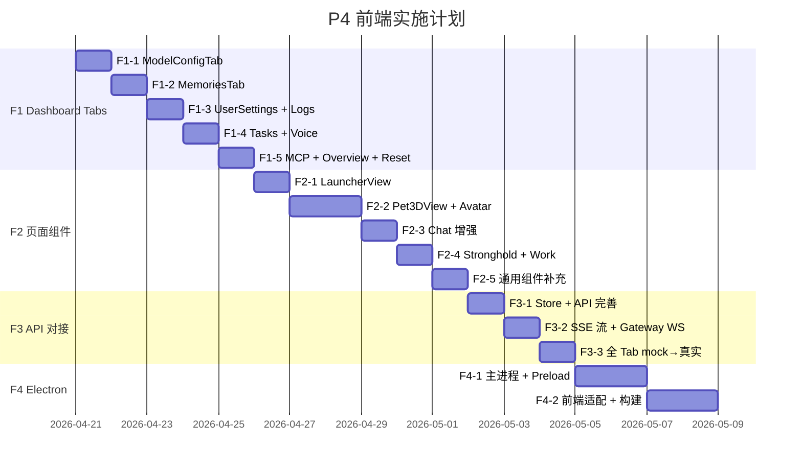

# P4 前端实施计划 — UI 优先，API 后接

> **制定日期**: 2026-04-20 05:36 · **制定人**: Carola 🐱
> **策略**: 先做 View + 组件 (mock 数据) → 再对接 API → 最后 Electron 壳

---

## 总览


| Phase | 核心目标 | 预估行数 | 预估天数 |
|-------|---------|---------|---------|
| **F1** Dashboard Tabs 实装 | 9 个 Tab 从 placeholder → 完整 UI | ~3,200 行 | 4-5 天 |
| **F2** 页面级组件 | Launcher + Pet3D + Chat 增强 + Stronghold | ~4,000 行 | 5-6 天 |
| **F3** API 对接 | mock → 真实后端，SSE 流，Gateway WS | ~1,500 行 | 3-4 天 |
| **F4** Electron 壳层 | IPC bridge + 窗口管理 + 后端进程 | ~1,800 行 | 3-4 天 |
| **合计** | | **~10,500 行** | **~16-19 天** |

---

## F1: Dashboard Tabs 实装 (4-5 天)

> [!IMPORTANT]
> 所有 Tab **使用 mock 数据**，不调真实 API。
> 用 `const mockData = ref([...])` 模拟数据，后续 F3 统一替换。

### F1-1: ModelConfigTab (⭐ 最高优先)

**v1 参考**: [ModelConfigTab.vue](file:///c:/Users/Administrator/OneDrive/%E6%A1%8C%E9%9D%A2/workspace/PeroCore-TS/packages/frontend/src/components/dashboard/tabs/ModelConfigTab.vue) (574 行) + `useModelConfig.ts` (707 行)

| 子任务 | 预估行数 | 描述 |
|--------|---------|------|
| 模型列表表格 | 120 | 表格展示：名称/Provider/模型ID/状态 (PCard 列表) |
| 添加/编辑模型弹窗 | 150 | PDialog + 表单: Provider 下拉、API Key、模型ID、温度/TopP |
| Provider 全局配置区 | 100 | OpenAI/Gemini/Anthropic 三栏 API Base + Key |
| useModelConfig composable | 180 | mock CRUD 逻辑，状态管理 |
| **小计** | **~550** | |

### F1-2: MemoriesTab

**v1 参考**: [MemoriesTab.vue](file:///c:/Users/Administrator/OneDrive/%E6%A1%8C%E9%9D%A2/workspace/PeroCore-TS/packages/frontend/src/components/dashboard/tabs/MemoriesTab.vue) (512 行)

| 子任务 | 预估行数 | 描述 |
|--------|---------|------|
| 记忆卡片列表 | 140 | 每条记忆: 内容摘要 + 类型标签 + 重要度星级 + 创建时间 |
| 搜索 + 筛选栏 | 60 | 关键词搜索 + 类型下拉过滤 (core/episodic/diary) |
| 记忆详情弹窗 | 120 | 完整内容 + 关联标签 + 编辑/删除按钮 |
| 导入故事功能 | 80 | 文件上传 + 预览 + 确认导入 |
| **小计** | **~400** | |

### F1-3: UserSettingsTab

**v1 参考**: 散布在 DashboardView 中 (~300 行)

| 子任务 | 预估行数 | 描述 |
|--------|---------|------|
| 基础设置区 | 100 | 用户昵称 / 主人称呼 / 语言选择 |
| 外观设置 | 80 | 主题 (暗色/亮色/跟随系统) / 字体大小 |
| 高级设置 | 60 | 数据目录 / 日志级别 |
| **小计** | **~240** | |

### F1-4: LogsTab

**v1 参考**: 内嵌 (~300 行)

| 子任务 | 预估行数 | 描述 |
|--------|---------|------|
| 会话日志列表 | 120 | 按日期分组，每条：时间 + 角色 + 摘要 |
| 日志详情展开 | 80 | 点击展开完整对话内容 |
| 筛选 + 导出 | 60 | 日期范围 + Agent 筛选 + JSON 导出 |
| **小计** | **~260** | |

### F1-5: TasksTab

| 子任务 | 预估行数 | 描述 |
|--------|---------|------|
| 活跃任务列表 | 100 | SessionID / Agent / 状态 / 轮次 / 耗时 |
| 任务操作 | 60 | 暂停 / 恢复 / 取消 按钮 |
| 历史任务 | 60 | 已完成/已取消列表 |
| **小计** | **~220** | |

### F1-6: VoiceTab

**v1 参考**: [VoiceConfigPanel.vue](file:///c:/Users/Administrator/OneDrive/%E6%A1%8C%E9%9D%A2/workspace/PeroCore/src/components/settings/VoiceConfigPanel.vue) (756 行)

| 子任务 | 预估行数 | 描述 |
|--------|---------|------|
| TTS 配置 | 150 | Provider 选择 + 声音列表 + 预览播放 + 语速/音调滑块 |
| ASR 配置 | 80 | 语言选择 + 唤醒词 + 灵敏度 |
| 音频测试区 | 80 | 录音测试 + 播放试听 |
| **小计** | **~310** | |

### F1-7: McpTab

| 子任务 | 预估行数 | 描述 |
|--------|---------|------|
| MCP 服务列表 | 100 | 已连接的 MCP 端点 + 状态指示 |
| 添加 MCP 服务 | 80 | 输入 stdio 命令 / WebSocket URL |
| 工具浏览器 | 100 | 展示 MCP 暴露的工具列表 |
| **小计** | **~280** | |

### F1-8: OverviewTab 增强

**当前状态**: 102 行，有卡片但数据硬编码

| 子任务 | 预估行数 | 描述 |
|--------|---------|------|
| 统计卡片动态化 | 60 | 记忆数 / 对话数 / 活跃任务 从 mock 数据渲染 |
| Agent 状态卡 | 80 | 当前活跃 Agent + 头像 + 能力摘要 |
| 最近对话时间线 | 100 | 最近 5 条对话摘要 + 时间 |
| 系统健康状态 | 60 | CPU / 内存 / DB 大小 (mock) |
| **小计** | **~300** | |

### F1-9: ResetTab 增强

**当前状态**: 76 行

| 子任务 | 预估行数 | 描述 |
|--------|---------|------|
| 分级重置选项 | 80 | 清空对话记录 / 重置记忆 / 恢复出厂 三级 |
| 数据导出 | 60 | 导出所有配置 + 记忆 JSON |
| 确认弹窗强化 | 40 | 二次确认 + 输入确认词 |
| **小计** | **~180** | |

### 📊 F1 总览

```
F1 总行数: ~2,740 行 (9 个 Tab) + ~500 行 composable
F1 新增 composable:
  - composables/dashboard/useModelConfig.ts
  - composables/dashboard/useMemories.ts
  - composables/dashboard/useLogs.ts
  - composables/dashboard/useTasks.ts
```

---

## F2: 页面级组件 (5-6 天)

### F2-1: LauncherView (⭐ 最高优先)

**v1 参考**: [LauncherView.vue](file:///c:/Users/Administrator/OneDrive/%E6%A1%8C%E9%9D%A2/workspace/PeroCore/src/views/LauncherView.vue) (2,421 行)

> [!NOTE]
> v1 的 LauncherView 是个巨型单文件。v2 拆分为容器 + 子组件。

| 子任务 | 预估行数 | 描述 |
|--------|---------|------|
| LauncherView 容器 | 150 | 启动流程状态机 (connecting → loading → ready → enter) |
| StartupChecklist 组件 | 200 | 后端连接 / DB 初始化 / 模型可用性 检查列表 |
| QuickSetup 组件 | 250 | 首次启动: API Key 输入 + Agent 选择 + 确认 |
| LauncherBackground 组件 | 100 | 像素风启动画面 + 动画 |
| composables/useLauncher.ts | 150 | 启动流程 composable |
| **小计** | **~850** | |

### F2-2: Pet3DView + Avatar 系统

**v1 参考**: [Pet3DView.vue](file:///c:/Users/Administrator/OneDrive/%E6%A1%8C%E9%9D%A2/workspace/PeroCore/src/views/Pet3DView.vue) (2,208 行) + [BedrockAvatar.vue](file:///c:/Users/Administrator/OneDrive/%E6%A1%8C%E9%9D%A2/workspace/PeroCore/src/components/avatar/BedrockAvatar.vue) (1,037 行) + `AvatarRenderer.ts` (514 行)

| 子任务 | 预估行数 | 描述 |
|--------|---------|------|
| Pet3DView 容器 | 120 | 主视图容器 + 头部工具栏 |
| PetCanvas 组件 | 200 | Three.js / Canvas 2D 渲染区域 |
| PetControls 组件 | 150 | 表情/动作/穿搭 控制面板 |
| PetStatus 组件 | 100 | 好感度 / 心情 / 能量 状态条 |
| ChatBubble (3D) | 80 | 宠物头上的对话气泡 |
| composables/usePetState.ts | 120 | 宠物状态管理 |
| composables/usePetAnimation.ts | 100 | 动画控制 |
| AvatarRenderer (简化) | 300 | Canvas 2D 渲染器 (先不做 Three.js，用 2D 精灵图过渡) |
| **小计** | **~1,170** | |

> [!TIP]
> **建议**: Pet3D 先用 **Canvas 2D + 精灵图** 方案实现最小可用版本 (~1,170 行)。
> Three.js/Live2D 版本作为后续优化项，避免阻塞主流程。

### F2-3: Chat 系统增强

**当前状态**: 7 组件 + 5 composable，已是最完善模块

| 子任务 | 预估行数 | 描述 |
|--------|---------|------|
| 工具调用卡片 (ToolCallCard) | 150 | 展示工具名 + 参数 + 结果 + 耗时 (折叠式) |
| 代码块增强 | 120 | 语法高亮 (Shiki) + 复制按钮 + 行号 |
| 图片消息支持 | 80 | 图片预览 + 放大 (PImageViewer) |
| 消息操作菜单 | 60 | 右键: 复制 / 重试 / 删除 / 收藏 |
| 多轮对话分隔 | 40 | Session 分隔线 + 时间标签 |
| **小计** | **~450** | |

### F2-4: StrongholdView (据点/群聊)

**v1 参考**: [StrongholdView.vue](file:///c:/Users/Administrator/OneDrive/%E6%A1%8C%E9%9D%A2/workspace/PeroCore/src/views/StrongholdView.vue) (694 行)

| 子任务 | 预估行数 | 描述 |
|--------|---------|------|
| StrongholdView 容器增强 | 120 | 左侧设施列表 + 右侧内容区 |
| FacilityDetail 组件 | 150 | 设施详情 + Agent 列表 + 配置 |
| GroupChatPanel 组件 | 200 | 群聊消息列表 + 多 Agent 头像 |
| composables/useStronghold.ts | 100 | 据点状态管理 |
| **小计** | **~570** | |

### F2-5: WorkView (IDE 模式) 增强

**当前状态**: 289 行，IDE 布局已有

| 子任务 | 预估行数 | 描述 |
|--------|---------|------|
| Terminal 组件 | 200 | xterm.js 集成 + 像素风样式 |
| Split 面板 | 80 | 可拖拽分割线 |
| 文件标签栏 | 80 | 多文件 Tab + 关闭/切换 |
| **小计** | **~360** | |

### F2-6: 通用组件补充

| 子任务 | 预估行数 | 描述 |
|--------|---------|------|
| PTable 组件 | 200 | 通用表格 (排序/分页/空态) |
| PProgress 组件 | 60 | 进度条 |
| PTag 组件 | 50 | 标签组件 |
| PAvatarGroup 组件 | 60 | Agent 头像组 |
| PSkeletonLoader 组件 | 80 | 骨架屏加载 |
| PConfirmDialog 组件 | 80 | 危险操作确认弹窗 |
| **小计** | **~530** | |

### 📊 F2 总览

```
F2 总行数: ~3,930 行
F2 新增文件: ~25 个
F2 新增 composable: ~6 个
```

---

## F3: API 对接 (3-4 天)

> [!NOTE]
> F1/F2 使用的所有 mock 数据统一替换为真实 API 调用。

### F3-1: Store + API 模块完善

| 子任务 | 预估行数 | 描述 |
|--------|---------|------|
| useModelStore.ts | 120 | 模型 CRUD → modelApi |
| useMemoryStore.ts | 100 | 记忆列表/搜索/详情 → memoryApi |
| useChatStore.ts (升级) | 150 | SSE 流对接 → chatApi.stream() |
| useSystemStore.ts | 60 | 系统健康 → systemApi |
| useTaskStore.ts | 80 | 任务列表/操作 → chatApi |
| **小计** | **~510** | |

### F3-2: SSE 流式对接

| 子任务 | 预估行数 | 描述 |
|--------|---------|------|
| 6 事件处理器 | 120 | delta/tool_call/tool_result/status/done/error |
| 流式 ToolCall 卡片绑定 | 60 | 实时更新工具调用状态 |
| 错误恢复 + 重试 | 80 | 断线重连 + 错误提示 |
| **小计** | **~260** | |

### F3-3: Gateway WebSocket 对接

| 子任务 | 预估行数 | 描述 |
|--------|---------|------|
| useGateway composable | 150 | WS 连接 + 心跳 + 自动重连 |
| 状态推送处理 | 80 | stream_delta / task_progress / notification |
| 连接状态指示器 | 40 | 右下角连接状态 badge |
| **小计** | **~270** | |

### F3-4: 各 Tab mock → 真实数据

| 子任务 | 预估行数 | 描述 |
|--------|---------|------|
| 9 个 Tab 替换 mock | ~400 | 每个 Tab ~45 行: 将 `mockData` 替换为 store 调用 |
| Launcher 启动检测 | 60 | 真实的后端健康检查 API |
| **小计** | **~460** | |

### 📊 F3 总览

```
F3 总行数: ~1,500 行
F3 主要是修改已有文件，新增文件较少
```

---

## F4: Electron 壳层 (3-4 天)

### F4-1: 主进程

**v1 参考**: `electron/main/index.ts` (875 行)

| 子任务 | 预估行数 | 描述 |
|--------|---------|------|
| index.ts (入口) | 100 | 精简入口，只做初始化调度 |
| appLifecycle.ts | 150 | app.ready / quit / activate 生命周期 |
| windowManager.ts | 200 | 窗口创建 / 尺寸记忆 / 多窗口管理 |
| backendProcess.ts | 180 | 子进程启动后端 / 健康检查 / 崩溃重启 |
| ipcBridge.ts | 200 | IPC 通道注册 + 安全白名单 |
| trayManager.ts | 100 | 系统托盘 + 右键菜单 |
| **小计** | **~930** | |

### F4-2: Preload

| 子任务 | 预估行数 | 描述 |
|--------|---------|------|
| preload.ts | 120 | contextBridge 暴露安全 API |
| types.d.ts | 60 | 窗口 API 类型定义 |
| **小计** | **~180** | |

### F4-3: 前端适配

| 子任务 | 预估行数 | 描述 |
|--------|---------|------|
| Transport 层 Electron 适配 | 100 | 检测 Electron 环境 → IPC transport |
| 窗口控制组件 | 80 | 自定义标题栏 (最小化/最大化/关闭) |
| 深度链接 | 60 | pero:// 协议处理 |
| **小计** | **~240** | |

### F4-4: 构建配置

| 子任务 | 预估行数 | 描述 |
|--------|---------|------|
| electron-builder 配置 | 100 | 多平台打包 (Win/Mac/Linux) |
| Vite Electron 插件 | 60 | vite-plugin-electron 配置 |
| 开发模式脚本 | 40 | dev: Vite + Electron 联合启动 |
| **小计** | **~200** | |

### 📊 F4 总览

```
F4 总行数: ~1,550 行
F4 新增目录: electron/main/ + electron/preload/
```

---

## 📅 时间线总览



---

## 🗂️ 文件创建清单

### F1 新增文件 (~15 个)
```
composables/dashboard/
  ├── useModelConfig.ts          # 模型配置 composable
  ├── useMemories.ts             # 记忆管理 composable
  ├── useLogs.ts                 # 日志 composable
  ├── useTasks.ts                # 任务 composable
  └── index.ts                   # 导出

# 已有文件大幅改写 (Tab 从 placeholder → 完整 UI):
components/dashboard/tabs/
  ├── ModelConfigTab.vue         # 36 → ~550 行
  ├── MemoriesTab.vue            # 42 → ~400 行
  ├── UserSettingsTab.vue        # 36 → ~240 行
  ├── LogsTab.vue                # 48 → ~260 行
  ├── TasksTab.vue               # 32 → ~220 行
  ├── VoiceTab.vue               # 35 → ~310 行
  ├── McpTab.vue                 # 40 → ~280 行
  ├── OverviewTab.vue            # 102 → ~300 行
  └── ResetTab.vue               # 76 → ~180 行
```

### F2 新增文件 (~25 个)
```
views/
  ├── LauncherView.vue           # 16 → ~150 行
  └── Pet3DView.vue              # 新增 ~120 行

components/launcher/
  ├── StartupChecklist.vue       # 新增
  ├── QuickSetup.vue             # 新增
  └── LauncherBackground.vue     # 新增

components/pet/
  ├── PetCanvas.vue              # 新增
  ├── PetControls.vue            # 新增
  ├── PetStatus.vue              # 新增
  ├── ChatBubble.vue             # 新增
  └── AvatarRenderer.ts          # 新增

components/chat/
  ├── ToolCallCard.vue           # 新增
  └── MessageActions.vue         # 新增

components/stronghold/
  ├── FacilityDetail.vue         # 新增
  └── GroupChatPanel.vue         # 新增

components/ide/
  └── Terminal.vue               # 新增

components/pixel/
  ├── PTable.vue                 # 新增
  ├── PProgress.vue              # 新增
  ├── PTag.vue                   # 新增
  ├── PAvatarGroup.vue           # 新增
  ├── PSkeletonLoader.vue        # 新增
  └── PConfirmDialog.vue         # 新增

composables/
  ├── launcher/useLauncher.ts    # 新增
  ├── pet/usePetState.ts         # 新增
  ├── pet/usePetAnimation.ts     # 新增
  └── stronghold/useStronghold.ts # 新增
```

### F3 新增文件 (~6 个)
```
stores/
  ├── useModelStore.ts           # 新增
  ├── useMemoryStore.ts          # 新增
  ├── useSystemStore.ts          # 新增
  └── useTaskStore.ts            # 新增

composables/
  └── useGateway.ts              # 新增 (WS 连接管理)
```

### F4 新增文件 (~10 个)
```
electron/
  ├── main/
  │   ├── index.ts               # 新增
  │   ├── appLifecycle.ts        # 新增
  │   ├── windowManager.ts       # 新增
  │   ├── backendProcess.ts      # 新增
  │   ├── ipcBridge.ts           # 新增
  │   └── trayManager.ts         # 新增
  └── preload/
      ├── preload.ts             # 新增
      └── types.d.ts             # 新增
```

---

## ⚡ 执行原则

1. **Mock 优先**: F1/F2 阶段所有数据用 `const mockXxx = ref([...])` 占位，组件只关心渲染逻辑
2. **Pixel UI 优先**: 所有表单/列表/弹窗使用已有的 P* 组件，不写 raw HTML
3. **v1 参考但不复制**: v1 代码作为功能参考，但 UI 按照 v2 像素风设计语言重做
4. **文件大小红线**: 单文件 ≤ 300 行 (06_FILE_SIZE_LIMITS.md)，超过就拆 composable
5. **一个 Tab 一个 PR**: 每个 Tab 做完就提交，可单独 review

---

*P4 前端计划 · v1.0 · Carola 🐱*
