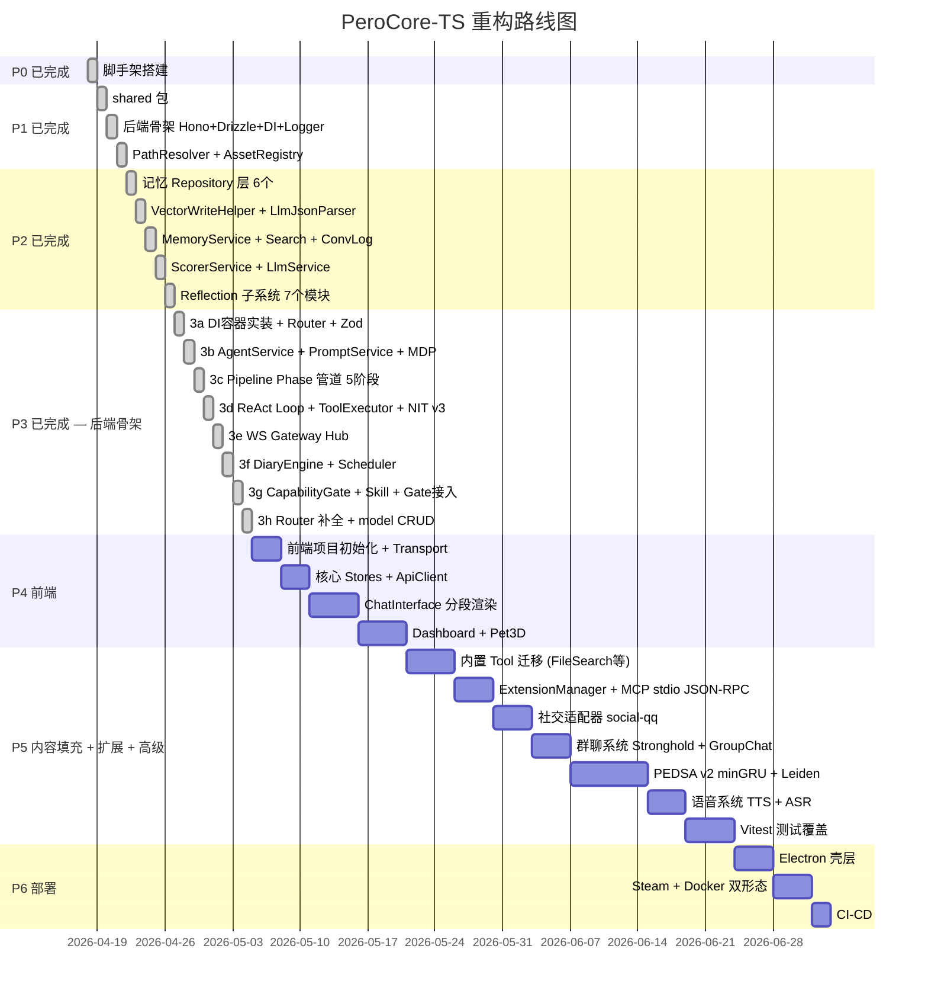

# PeroCore-TS 重构分析报告

> **分析时间**：2026-04-19 · **分析者**：Carola 🐱
> **原始代码库**：`c:\Users\Administrator\OneDrive\桌面\workspace\PeroCore` (Python + Vue + Electron)
> **重构规范库**：`c:\Users\Administrator\OneDrive\桌面\workspace\PeroCore-TS` (设计文档)

---

## 1. 原始代码库全景 (PeroCore v1)

### 1.1 代码规模统计

| 层 | 语言 | 文件数 | 总行数 | 说明 |
|---|---|---|---|---|
| **后端** | Python | **183** | **32,602** | FastAPI + SQLite + TriviumDB |
| **前端** | Vue/TS | **117** | **32,919** | Vue 3 + Protobuf Gateway |
| **Rust** | Rust | **19** | ~2,000+ | vision_core + NIT 解释器 + render-core + auditor |
| **合计** | — | **~319** | **~67,500+** | — |

### 1.2 后端 Python Top 15 巨型文件 🔴

| 行数 | 文件 | 核心职责 |
|---|---|---|
| **2,441** | `nit_core/plugins/social_adapter/social_service.py` | 社交适配器（QQ 群聊） |
| **1,658** | `services/memory/reflection_service.py` | 🔴 记忆反思（7合1上帝类!） |
| **956** | `services/memory/scorer_service.py` | 🔴 记忆提炼 + 内容生成混合 |
| **944** | `main.py` | 🔴 启动入口（定时任务全堆这里） |
| **906** | `services/core/llm_service.py` | LLM Provider 适配 |
| **814** | `services/memory/memory_service.py` | 🔴 记忆CRUD 5合1上帝类 |
| **728** | `services/preprocessor/implementations.py` | 预处理器实现 |
| **692** | `services/core/prompt_service.py` | 🔴 Prompt 编排（450行 if-else） |
| **618** | `nit_core/dispatcher.py` | NIT 工具调度器 |
| **568** | `nit_core/plugins/social_adapter/session_manager.py` | 社交会话管理 |
| **561** | `services/agent/_react_loop.py` | ReAct 循环 |
| **556** | `services/agent/companion_service.py` | 伙伴互动 |
| **520** | `services/core/realtime_session_manager.py` | 实时语音会话 |
| **516** | `services/agent/agent_service.py` | Agent 聊天入口 |
| **502** | `services/memory/trivium_sync_service.py` | TriviumDB 补偿同步 |

### 1.3 前端 Vue/TS Top 15 巨型文件 🔴

| 行数 | 文件 | 核心职责 |
|---|---|---|
| **2,568** | `views/DashboardView.vue` | 🔴 仪表盘（11个Tab全内联） |
| **2,421** | `views/LauncherView.vue` | 🔴 启动器 |
| **2,208** | `views/Pet3DView.vue` | 🔴 3D 宠物界面 |
| **1,991** | `components/chat/ChatInterface.vue` | 🔴 聊天界面 |
| **1,096** | `api/proto/perolink.ts` | Protobuf 生成代码 |
| **1,037** | `components/avatar/BedrockAvatar.vue` | 3D 头像 |
| **875** | `electron/main/index.ts` | 🔴 Electron 主进程入口 |
| **865** | `components/dashboard/tabs/OverviewTab.vue` | 概览 Tab |
| **756** | `components/settings/VoiceConfigPanel.vue` | 语音配置 |
| **707** | `composables/dashboard/useModelConfig.ts` | 模型配置逻辑 |
| **694** | `views/StrongholdView.vue` | 据点（群聊）视图 |
| **574** | `components/dashboard/tabs/ModelConfigTab.vue` | 模型配置 Tab |
| **514** | `components/avatar/lib/AvatarRenderer.ts` | 3D 渲染器 |
| **512** | `components/dashboard/tabs/MemoriesTab.vue` | 记忆管理 Tab |
| **488** | `components/onboarding/OnboardingOverlay.vue` | 引导覆盖层 |

### 1.4 后端目录结构

```
backend/
├── main.py                    (944行! 启动入口 + 全部定时任务)
├── database.py                (数据库连接)
├── models.py                  (数据模型)
├── schemas.py                 (Pydantic Schema)
│
├── core/                      核心基础设施
│   ├── asset_registry.py      (资产注册表)
│   ├── config_manager.py      (配置管理)
│   ├── path_resolver.py       (路径解析)
│   ├── sandbox_manager.py     (沙盒管理 350行)
│   ├── plugin_manager.py      (插件管理)
│   ├── mod_manager.py         (Mod 管理)
│   ├── nit_manager.py         (NIT 工具管理)
│   ├── model_manager.py       (模型管理)
│   ├── event_bus.py           (事件总线)
│   └── component_container.py (组件容器)
│
├── services/
│   ├── memory/                记忆系统 (核心!)
│   │   ├── memory_service.py         (814行 CRUD+检索+图谱+TagCloud)
│   │   ├── reflection_service.py     (1658行! 反思7合1)
│   │   ├── scorer_service.py         (956行 提炼+日记+周报+台词)
│   │   ├── trivium_store.py          (352行 TriviumDB封装)
│   │   ├── trivium_sync_service.py   (502行 补偿同步)
│   │   └── memory_importer.py        (故事导入)
│   │
│   ├── agent/                 Agent 系统
│   │   ├── agent_service.py          (516行 聊天入口)
│   │   ├── _react_loop.py            (561行 ReAct循环)
│   │   ├── _tool_executor.py         (420行 工具执行)
│   │   ├── _tool_policy.py           (372行 工具策略)
│   │   ├── companion_service.py      (556行 伙伴互动)
│   │   ├── chain_service.py          (339行 思维链)
│   │   ├── agent_manager.py          (321行 Agent管理)
│   │   ├── scheduler_service.py      (定时任务)
│   │   └── task_manager.py           (任务管理)
│   │
│   ├── core/                  核心服务
│   │   ├── llm_service.py            (906行 LLM适配)
│   │   ├── prompt_service.py         (692行 提示词编排)
│   │   ├── embedding_service.py      (向量编码门面)
│   │   ├── embedding_provider.py     (向量编码实现)
│   │   ├── realtime_session_manager.py (520行 实时语音)
│   │   ├── session_service.py        (会话管理)
│   │   ├── gateway_hub.py            (Gateway Hub)
│   │   ├── gateway_client.py         (Gateway Client)
│   │   ├── reindex_service.py        (重索引)
│   │   ├── mcp_service.py            (MCP服务)
│   │   └── sync_service.py           (同步服务)
│   │
│   ├── chat/                  聊天系统
│   │   ├── stronghold_service.py     (439行 据点/群聊)
│   │   ├── group_chat_service.py     (群聊服务)
│   │   └── group_chat_dispatcher.py  (群聊调度)
│   │
│   ├── perception/            感知系统
│   │   ├── aura_vision_service.py    (399行 视觉感知)
│   │   ├── multimodal_trigger_service.py (412行 多模态触发)
│   │   ├── time_awareness_service.py (300行 时间感知)
│   │   ├── asr_service.py            (ASR 语音识别)
│   │   ├── screenshot_service.py     (截图)
│   │   └── audio_processor.py        (音频处理)
│   │
│   ├── interaction/           交互系统
│   │   ├── tts_service.py            (TTS 语音合成)
│   │   └── browser_bridge_service.py (浏览器桥接)
│   │
│   ├── preprocessor/          预处理器
│   │   └── implementations.py        (728行!)
│   │
│   ├── postprocessor/         后处理器
│   │   └── implementations.py
│   │
│   └── mdp/                   MDP 提示词
│       ├── manager.py                (模板管理)
│       ├── agents/                   (Agent人设)
│       └── prompts/                  (提示词模板)
│
├── nit_core/                  NIT 工具系统
│   ├── dispatcher.py                 (618行! 工具调度)
│   ├── bridge.py                     (NIT桥接)
│   ├── security.py                   (安全审计)
│   ├── tools/
│   │   ├── core/                     (6个核心工具)
│   │   │   ├── FileSearch/
│   │   │   ├── BrowserOps/
│   │   │   ├── ScreenVision/
│   │   │   ├── WindowsOps/
│   │   │   ├── Scheduler/
│   │   │   └── TaskLifecycle/
│   │   ├── work/                     (4个工作区工具)
│   │   │   ├── CodeSearcher/
│   │   │   ├── FileOps/
│   │   │   ├── TerminalExecutor/
│   │   │   └── WorkspaceOps/
│   │   └── group/                    (群组工具)
│   ├── plugins/
│   │   ├── AnimeFinder/
│   │   ├── BilibiliFetch/
│   │   └── social_adapter/           (2441行! 最大文件)
│   ├── interpreter/                  (NIT解释器 Rust绑定)
│   └── nit_terminal_auditor/         (终端审计 Rust WASM)
│
├── routers/                   22个路由文件
│   ├── chat_router.py
│   ├── memory_router.py
│   ├── maintenance_router.py         (331行)
│   ├── ide_router.py                 (301行)
│   └── ... (18个更多)
│
├── mods/                      Mod 系统
│   ├── _external_plugins/
│   └── memory_tagger/
│
└── vision_core/               视觉核心 (Rust PyO3)
    └── src/ (3个.rs文件)
```

### 1.5 前端目录结构

```
src/                           前端 (Vue 3)
├── App.vue                    (2904字节，keep-alive无白名单!)
├── views/                     7个页面
│   ├── DashboardView.vue      (2568行! 🔴)
│   ├── LauncherView.vue       (2421行! 🔴)
│   ├── Pet3DView.vue          (2208行! 🔴)
│   ├── ChatModeView.vue
│   ├── WorkModeView.vue       (419行)
│   ├── StrongholdView.vue     (694行)
│   └── MainWindow.vue
├── components/
│   ├── chat/
│   │   └── ChatInterface.vue  (1991行! 🔴)
│   ├── avatar/
│   │   ├── BedrockAvatar.vue  (1037行)
│   │   ├── lib/AvatarRenderer.ts (514行)
│   │   └── native/ (Rust render-core N-API)
│   ├── dashboard/tabs/        (11个Tab组件全同步import)
│   ├── settings/
│   ├── agent/
│   ├── markdown/
│   ├── onboarding/
│   ├── terminal/
│   ├── modals/
│   ├── layout/
│   ├── ide/
│   └── ui/
├── composables/
│   └── dashboard/             (多个composable)
├── api/
│   ├── gateway.ts             (Gateway连接)
│   └── proto/perolink.ts      (1096行 Protobuf类型)
├── router/
├── config/
├── utils/
└── assets/

electron/                      Electron 壳层
├── main/
│   ├── index.ts               (875行! 🔴 需拆分)
│   ├── services/              (Steam, NapCat, CloudSync等)
│   ├── windows/manager.ts     (402行)
│   └── utils/
└── preload/
```

### 1.6 Rust 模块分布

| 模块 | 位置 | 绑定 | 重构计划 |
|---|---|---|---|
| `vision_core` | `backend/vision_core/` | PyO3 → Python | ❌ 不迁移 (D45) |
| `nit_rust_runtime` | `backend/nit_core/interpreter/rust_binding/` | PyO3 → Python | ⚠️ PyO3→N-API 改造 |
| `nit_terminal_auditor` | `backend/nit_core/nit_terminal_auditor/` | wasm-bindgen → WASM | ✅ 直接搬迁 |
| `pero-render-core` | `src/components/avatar/native/` | N-API (napi-rs) | ✅ 直接搬迁 |
| `pero-encryptor` | `tools/pero-encryptor/` | 独立工具 (Tauri) | — 工具类，不迁移 |

---

## 2. 重构规范库现状 (PeroCore-TS)

**后端骨架已完成**，实装 **95 个 TS 文件 / 10,443 行**，含 19 份规范文档。

| 文档 | 大小 | 核心内容 |
|---|---|---|
| `00_DECISIONS.md` | 13KB | **57 项决策总表** (D1–D57) |
| `01_NAMING_CONVENTIONS.md` | 11KB | 文件/代码/API/数据库/CSS 命名 |
| `02_API_RESPONSE_SPEC.md` | 13KB | 统一信封 + 38个Code + 15个HTTP码 |
| `03_PROJECT_STRUCTURE.md` | 11KB | pnpm workspace + 目录规划 |
| `04_BACKEND_ARCHITECTURE.md` | 16KB | 三层架构 + DI + Gateway |
| `05_FRONTEND_ARCHITECTURE.md` | 7KB | Transport + ApiClient + 错误处理 |
| `06_FILE_SIZE_LIMITS.md` | 4KB | 行数限制 + v1巨型文件拆分方案 |
| `07_DUAL_DEPLOYMENT.md` | 25KB | Electron/Docker + 鉴权 + 多目标构建 |
| `08_LOGGING_SPEC.md` | 3KB | consola + 中文日志 |
| `09_EXTENSION_SYSTEM.md` | 22KB | Tool/Hook/Service 统一扩展 |
| `10_MEMORY_SYSTEM.md` | **53KB** | 🌟 记忆系统重构 + PEDSA v2 + 三层隔离 |
| `11_CROSS_PLATFORM.md` | 9KB | 路径规范 + @platform 标注 |
| `12_FRONTEND_PERFORMANCE.md` | 23KB | VCPChat 参考 + 分段渲染 + IO |
| `13_TESTING_STANDARDS.md` | 17KB | Vitest + 覆盖率红线 |
| `14_STEAM_INTEGRATION.md` | 12KB | PathResolver + AssetRegistry |
| `15_DEVOPS_OPERATIONS.md` | 8KB | CI/CD + 迁移 + 版本 |
| `16_CAPABILITY_GATE.md` | 14KB | 声明式 YAML 矩阵 + Skill 系统 |
| `17_MODE_SYSTEM.md` | 6KB | 模式体系：桌面模式家族 + 社交/群聊/IDE |
| `18_NIT_V3.md` | 5KB | NIT v3 Agent DSL 编排引擎规范 |

---

## 3. v1 → v2 核心问题与重构映射

### 3.1 后端重构要点

````carousel
### 🔴 问题 #1：上帝类
```
reflection_service.py  1658行 → 拆为 7 个文件 (每个 ≤200行)
memory_service.py       814行 → 拆为 3 个 Service
scorer_service.py       956行 → 拆为 scorer/ + generation/
main.py                 944行 → app.ts (~150行) + lifecycle/cron/
prompt_service.py       692行 → CapabilityGate + PromptBuilder + Enricher管道
```
<!-- slide -->
### 🔴 问题 #2：Copy-Paste 反模式
```
向量写入+补偿: 10+ 处重复 → VectorWriteHelper (1个文件)
LLM JSON 解析: 5+ 处重复  → LlmJsonParser (1个文件)
LLM 配置获取:  3 套重复    → DI 注入的 LlmService
```
<!-- slide -->
### 🔴 问题 #3：三套割裂的扩展机制
```
v1: PluginManager + ModManager + _external_plugins
v2: 统一 ExtensionManager (Tool + Hook + Service)
    manifest.json 统一清单
    stdio JSON-RPC (MCP 兼容)
```
<!-- slide -->
### 🔴 问题 #4：无 Repository 层
```
v1: Service 直接操作 SQLite + TriviumDB
v2: Repository 层隔离 (memory.repo + vector.repo + vectorSync.repo)
    双数据源独立，可测试，可替换
```
<!-- slide -->
### 🔴 问题 #5：Prompt 门控 if-else 地狱
```
v1: _enrich_variables() 450+ 行 if-else
    NITDispatcher 白名单硬编码
    3处过滤可能不一致

v2: CapabilityGate 声明式 YAML 矩阵
    每个 Agent × Mode 一份 capabilities.yaml
    新增模式/Agent = 加一个 YAML 块
```
````

### 3.2 前端重构要点

| v1 问题 | v2 方案 |
|---|---|
| DashboardView 2568行 | 容器 ~100行 + 11个异步加载Tab |
| LauncherView 2421行 | 容器 ~200行 + composables/ + components/ |
| Pet3DView 2208行 | 容器 ~200行 + 5个 usePet* composable |
| ChatInterface 1991行 | 容器 ~250行 + MessageList/InputBar/Toolbar |
| `<keep-alive>` 无白名单 | `:include="['DashboardView']"` 白名单 |
| 同步 import 全部Tab | `defineAsyncComponent` 异步加载 |
| 流式全量重渲 Markdown | 稳定区/尾部区分段渲染 (VCPChat 策略) |
| 无虚拟滚动 | IntersectionObserver 暂停不可见消息 |
| Electron 依赖渗透 | Transport 层 0 Electron 依赖 |

### 3.3 Electron 重构要点

| v1 | v2 |
|---|---|
| `index.ts` 875行 单文件 | 拆为 `index.ts` ~100行 + `ipcBridge.ts` + `appLifecycle.ts` + `backendProcess.ts` |
| Steam 代码散布 | 全部集中到 `electron/services/steam*` |
| 无远程模式 | 支持 `ConnectionMode: 'local' | 'remote'` |

---

## 4. 重构规模评估

### 4.1 代码迁移量

| 领域 | v1 行数 | v2 预估行数 | **实际行数** | 说明 |
|---|---|---|---|---|
| 后端 Service | ~15,000 | ~8,000 | ~5,200 ✅ | 去重 + 拆分 + 精简 |
| 后端 Router | ~5,000 | ~3,000 | ~600 ⏳ | 核心 9 个已补，功能待填充 |
| 后端 Core | ~4,000 | ~3,000 | ~1,800 ✅ | PathResolver+AssetRegistry+DI |
| 后端 NIT/Tools | ~8,000 | ~5,000 | ~1,250 ⏳ | NIT v3 解释器已完成，内置工具待迁移 |
| 后端 共享层 | — | ~1,500 | ~500 ✅ | @perocore/shared |
| 后端 其他 | — | — | ~775 ✅ | DB/Middleware/Lib 等 |
| 前端 | ~33,000 | ~22,000 | 0 ⏳ | P4 阶段 |
| Electron | ~3,000 | ~2,000 | 0 ⏳ | P6 阶段 |
| **后端合计** | **~32,000** | **~20,500** | **10,443** | 后端骨架已完成 ✅ |

### 4.2 新增部分（v1 没有的）

| 新模块 | 预估行数 | **实际行数** | 状态 |
|---|---|---|---|
| `@perocore/shared` | ~1,500 | ~500 | ✅ 核心类型已实装 |
| Repository 层 | ~2,000 | ~1,200 | ✅ 6 个 Repo |
| VectorWriteHelper | ~100 | ~80 | ✅ 已实装 |
| LlmJsonParser | ~50 | ~40 | ✅ 已实装 |
| CapabilityGate | ~300 | ~260 | ✅ 已实装 |
| Skill 系统 | ~200 | ~210 | ✅ 已实装 |
| NIT v3 DSL 引擎 | — | ~1,060 | ✅ 新增! D57 |
| DiaryEngine | — | ~145 | ✅ 新增! |
| BackgroundScheduler | — | ~120 | ✅ 新增! |
| AuthService | ~200 | 0 | ⏳ P6 |
| 测试代码 | ~5,000+ | 0 | ⏳ 待启动 |
| **新增合计** | **~9,500** | **~3,615** | 38% |

### 4.3 总代码量预估

```
v1 PeroCore:    ~68,000 行 (Python + Vue + TS + Rust)
v2 PeroCore-TS: ~52,500 行 (TS + Vue + Rust) [预估]

截至 2026-04-19 15:49:
v2 后端已实装: 10,443 行 / 95 文件
v2 tsc 编译:   ✅ 零错误
```

---

## 5. 重构实施路径 (2026-04-19 15:49 更新)

> [!IMPORTANT]
> **Phase 0–3 后端骨架已完成！** 原 P7 合并入 P5，P5 改名为「内容填充 + 扩展 + 高级」。
> 路线图压缩为 6 个 Phase (P0–P6)，不再有独立 P7。



---

## 6. 关键数字速查

| 指标 | v1 (PeroCore) | v2 (PeroCore-TS) | 状态 |
|---|---|---|---|
| 语言 | Python + TS + Vue + Rust | **TypeScript + Vue + Rust** | ✅ |
| 后端框架 | FastAPI | **Hono** | ✅ |
| ORM | 直接 SQLite | **Drizzle** | ✅ |
| 后端文件数 | 183 .py | **95 .ts** | ✅ 实际值 |
| 后端总行数 | ~32,000 | **10,443** (↓ 67%) | ✅ 实际值 |
| 前端文件数 | 117 .vue/.ts | 0 (P4 阶段) | ⏳ |
| 最大单文件 | **2,568 行** (DashboardView) | **327 行** (runtime.ts) | ✅ |
| Router 数量 | 21 个 | **9 个** (22 端点) | ✅ |
| 扩展机制 | 3 套并行 | **1 套统一** (ToolRegistry) | ✅ |
| 记忆系统最大文件 | **1,658 行** (reflection) | **≤ 200 行** | ✅ |
| NIT 系统 | Python+Rust ~2000行 | **纯 TS 1,060 行** (NIT v3) | ✅ |
| 规范文档 | 5 份 (docs/) | **19 份** (_docs_/) | ✅ |
| 已确认决策 | — | **57 项** (D1–D57) | ✅ |
| tsc 编译 | — | **零错误** | ✅ |
| 测试覆盖 | 极低 | 红线: shared 80%, backend 60%, frontend 50% | ⏳ |

---

> [!TIP]
> **当前状态：P3 后端骨架已完成！✅** 下一步：
> - **P4 前端**：Vue 3 + PixelUI 项目初始化、Transport 层、核心页面
> - **P5 内容填充+扩展+高级** (工作量最重)：内置工具迁移、ExtensionManager、社交、群聊、PEDSA v2、语音、测试
> - **P6 部署**：Electron + Steam + Docker + CI/CD
> 
> 喵～ 🐱

---

*本报告由 Carola 整理，基于 PeroCore v1 源代码 + PeroCore-TS 17 份规范文档的完整审阅。*
