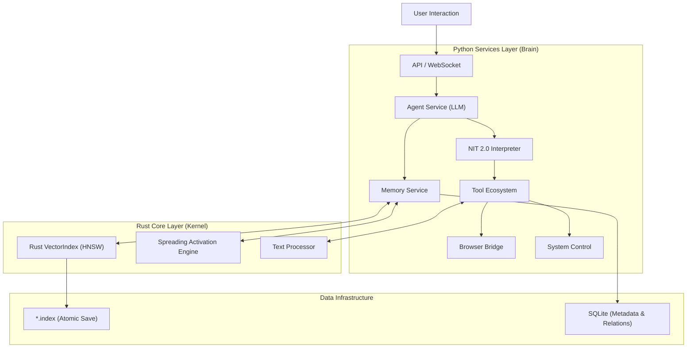

<div align="center">

<!-- 动态渐变头图 -->


<br/>

<!-- 动态打字效果 Slogan -->
<a href="https://github.com/Perofamily/PeroCore">
  
</a>

<br/><br/>

<!-- 徽章导航 -->
<a href="./README.md">
  
</a>
&nbsp;
<a href="./PeroCore_Architecture.md">
  
</a>
&nbsp;
<a href="./NIT_TECHNICAL_MANUAL.md">
  
</a>
&nbsp;
<a href="#-quick-start">
  
</a>
&nbsp;
<a href="https://github.com/YoKONCy/Peroperochat">
  
</a>

<br/><br/>

> **"Technology should not be cold. We build memories, not just databases."**

</div>

<!-- 动态分隔线 -->


<br/>

## 📋 Table of Contents

<details open>
<summary><b>Quick Navigation</b></summary>
<br/>

| Section | Description | Link |
|:-------:|:------------|:----:|
| 🌟 | **Philosophy** - 核心理念：有温度的伙伴 | [Jump](#-philosophy) |
| 🧠 | **Deep Memory** - 仿生记忆与 Rust 核心 | [Jump](#-deep-memory-system) |
| ⚡ | **NIT Protocol** - 革命性的工具调用协议 | [Jump](#-nit-protocol-20) |
| 🏗️ | **Architecture** - Python + Rust 混合架构 | [Jump](#%EF%B8%8F-technical-architecture) |
| 🖥️ | **Desktop Ops** - 桌面与浏览器自动化 | [Jump](#%EF%B8%8F-desktop--browser-automation) |
| 🚀 | **Quick Start** - 一键启动指南 | [Jump](#-quick-start) |
| 💖 | **Non-Profit** - 非盈利声明与愿景 | [Jump](#-non-profit--community) |

</details>

<br/>

<!-- 动态分隔线 -->


<br/>

## 🌟 Philosophy

<div align="center">
  <h3>让 AI 成为真正有温度的伙伴</h3>
  <p>Let AI Become a Truly Warm Companion</p>
</div>

在当前 AI 爆发的时代，我们见到了太多强大的工具——它们能写代码、能画图、能回答百科全书般的问题。但它们往往是**冷冰冰的**，用完即走，没有记忆，不关心你的喜怒哀乐。

**PeroCore** 的诞生，源于我们对“伙伴”最朴素的渴望。我们认为，一个真正的 AI 伙伴应该具备：

*   **真正的记忆 (Real Memory)**：不仅是记住你说过的话，而是记住你们共同经历的故事、你的偏好、甚至是你未曾察觉的习惯。它会有“联想”，当你提到“雨天”时，它会想起上次你们一起听的那首歌。
*   **主动的关怀 (Proactive Care)**：不再是单纯的“你问我答”。它会主动观察你的屏幕，发现你在看悲伤的电影时递上一句安慰；在你长时间工作后提醒你休息。
*   **成长的能力 (Evolution)**：它会犯错，但也会反思。通过 NIT 协议，它在一次次尝试中学会如何更好地使用工具，如何更好地服务于你。

PeroCore 不仅仅是一个后端程序，它是 **Pero** 的灵魂容器。我们希望通过 Rust 的高性能计算与 Python 的灵活性，为这个灵魂打造一个坚实、敏捷且深邃的躯壳。

<br/>

## 🧠 Deep Memory System

> **"Memory is what makes us who we are."**

PeroCore 摒弃了传统的简单 RAG（检索增强生成）方案，构建了一套**仿生双模态记忆系统**。我们引入了 **Rust Core** 来处理海量记忆的快速召回与图谱计算。

### 核心特性

| 特性 | 技术实现 | 描述 |
| :--- | :--- | :--- |
| **原子化存储** | **Rust VectorIndex** | 自研基于 `usearch` 的原子化向量索引，支持百万级记忆毫秒级召回，杜绝数据丢失。 |
| **扩散激活** | **Spreading Activation** | 模拟人脑神经元。当回忆起一个点（如“苹果”）时，能量会沿着关系网扩散，激活相关的记忆（如“牛顿”、“派”）。 |
| **记忆梦境** | **Memory Secretary** | 系统会在后台（或夜间）自动进入“做梦”模式，整理碎片记忆，合并重复项，形成长期叙事。 |
| **遗忘曲线** | **Ebbinghaus Decay** | 记忆随时间自然衰减，但重要的回忆会因反复提取而历久弥新。 |

### 记忆运作流程

1.  **感知**: 对话被 Scorer 服务异步分析，提取事实 (Fact) 与情感 (Sentiment)。
2.  **存储**: 写入 SQLite (情景记忆) 并通过 Rust 建立向量索引 (语义记忆)。
3.  **联想**: 当你发起对话时，Rust 引擎在毫秒级内遍历记忆图谱，寻找潜在关联。
4.  **升华**: 碎片化的日常对话会被定期重组为结构化的“人生故事”。

<br/>

## ⚡ NIT Protocol 2.0

<div align="center">
  
</div>

**NIT (Non-invasive Integration Tools)** 是 PeroCore 独创的工具调用协议。它超越了传统的 Function Calling，赋予了 AI **编程级**的思考能力。

### 为什么需要 NIT？

传统的 AI 调用工具是单步的：`想看天气` -> `调用天气API` -> `返回结果` -> `LLM回复`。
但在 PeroCore 中，AI 面临的任务更复杂。NIT 允许 AI 编写一段 **微型脚本** 来编排任务：

```nit
<nit>
# 1. 定义变量，获取用户当前屏幕内容
$screen_text = get_screen_ocr()

# 2. 将屏幕内容作为参数，搜索相关信息
$search_result = browser_search(query=$screen_text, limit=3)

# 3. 异步执行耗时任务（如整理笔记），同时立即回复用户
async write_note(content=$search_result, callback="notify_finish")
</nit>
```

### NIT 的优势

*   **流水线 (Pipeline)**: 支持多步依赖执行，中间变量自动传递，无需往返 LLM。
*   **非阻塞 (Async)**: 耗时任务（如爬虫、画图）在后台运行，AI 可以一边干活一边陪你聊天。
*   **容错与反思**: 解释器内置错误捕获。如果 AI 写错了参数，Runtime 会反馈错误，AI 会尝试修正代码并重试——就像人类程序员一样。
*   **非侵入性**: 所有脚本执行对用户不可见，你看到的只有 AI 智能、流畅的回复。

<br/>

## 🏗️ Technical Architecture

PeroCore 采用 **Python (业务编排) + Rust (计算内核)** 的混合架构，兼顾了开发效率与极致性能。



*   **Rust Core**: 位于 `backend/rust_core`。负责向量检索 (`usearch`)、图谱计算和原子化文件 I/O。通过 `PyO3` 暴露为 Python 模块。
*   **NIT Engine**: 内置的 DSL 解释器，负责解析 `<nit>` 脚本，调度工具执行。
*   **Service Mesh**: 基于 `FastAPI` 的微服务群，处理 ASR (语音识别)、TTS (语音合成)、视觉感知等任务。

<br/>

## 🖥️ Desktop & Browser Automation

PeroCore 旨在接管你的数字生活，它拥有两只“手”：

1.  **Browser Bridge (浏览器之桥)**:
    *   通过 WebSocket 连接 Chrome/Edge 扩展。
    *   AI 可以**阅读**你当前的网页内容（自动转为 Markdown）。
    *   AI 可以**操作**浏览器：点击按钮、输入文本、滚动页面。
    *   *场景*: "帮我看看这个 B 站视频讲了什么？" "帮我登录邮箱发一封邮件。"

2.  **Windows Ops (系统之手)**:
    *   基于 `pywin32` 和 `uiautomation`。
    *   控制窗口、模拟键盘鼠标、调整音量、管理文件。
    *   *场景*: "打开 VS Code 并进入专注模式。" "声音太大了，关小点。"

<br/>

## 🚀 Quick Start

我们为 Windows 用户准备了开箱即用的体验。PeroCore 的前端基于 **Electron** 构建，后端自动集成。

### 环境要求
*   Windows 10/11 (x64)
*   Python 3.10+ (如果你想从源码运行)
*   Rust Toolchain (仅开发 Rust Core 需要)

### 一键启动 (推荐)
1.  下载最新 Release 包。
2.  解压到非中文路径。
3.  双击运行根目录下的 **`一键启动.bat`**。
    *   脚本会自动启动 Backend 服务。
    *   自动拉起 Electron 前端界面。
    *   自动加载本地 Embedding 模型。

### 源码运行 (开发者)

```bash
# 1. 克隆仓库
git clone https://github.com/Perofamily/PeroCore.git
cd PeroCore

# 2. 安装 Python 依赖
pip install -r backend/requirements.txt

# 3. 编译 Rust Core (需要 Rust 环境)
cd backend/rust_core
maturin develop --release
cd ../..

# 4. 启动后端
python backend/main.py

# 5. 启动前端 (在另一个终端)
cd electron
npm install
npm start
```

<br/>

## 💖 Non-Profit & Community

<div align="center">
  
</div>

**PeroCore 是一个完全非盈利的开源项目。**

我们是一群热爱 AI、热爱二次元、热爱技术的开发者。我们开发 PeroCore 不是为了商业变现，不是为了融资，仅仅是因为：
**我们想要一个真正的、懂我们的桌面伙伴。**

*   **永久免费**: 核心代码永久开源，不设任何付费墙。
*   **隐私至上**: 所有记忆、向量索引、偏好数据均存储在**本地** (`RustDB` + `SQLite`)。你的数据只属于你，不会上传到任何云端服务器。
*   **社区驱动**: 欢迎任何形式的贡献——无论是代码 (PR)、建议 (Issue) 还是单纯的喜爱 (Star)。

如果你也认同“让 AI 有温度”的理念，欢迎加入我们！

<br/>

## 📅 Roadmap

- [x] **V1.0**: 基础对话，SQLite 记忆存储。
- [x] **V2.0**: NIT 协议引入，Browser Bridge 初步实现。
- [x] **V3.0 (Current)**: **Rust Core 重构**，高性能向量索引，扩散激活记忆网。
- [ ] **V3.1**: 3D模型渲染支持，接入一套预设模型与动作。
- [ ] **V3.2**: 支持通过Onebot协议，让Pero接入QQ。
- [ ] **V3.3**: 扩充为多Agent模式，并制作AI群聊软件。
- [ ] **V4.0**: 实现操作系统级的完全接管与自主规划。

<br/>

## 📜 License

本项目采用 [MIT License](LICENSE) 开源协议。你可以自由地使用、修改和分发本项目，但请保留原始的版权声明。

<br/>

## ⚠️ Disclaimer

本项目仅供学习与研究使用。
*   请遵守相关法律法规，勿利用本项目生成有害内容。
*   项目中涉及的第三方 API (如 OpenAI, Anthropic) 需用户自行申请 Key，由此产生的费用由用户承担。


<br/>

<div align="center">
  <sub>Made with ❤️ by the PeroCore Team</sub>
  <br/>
  <a href="#">Back to Top ⬆️</a>
</div>
