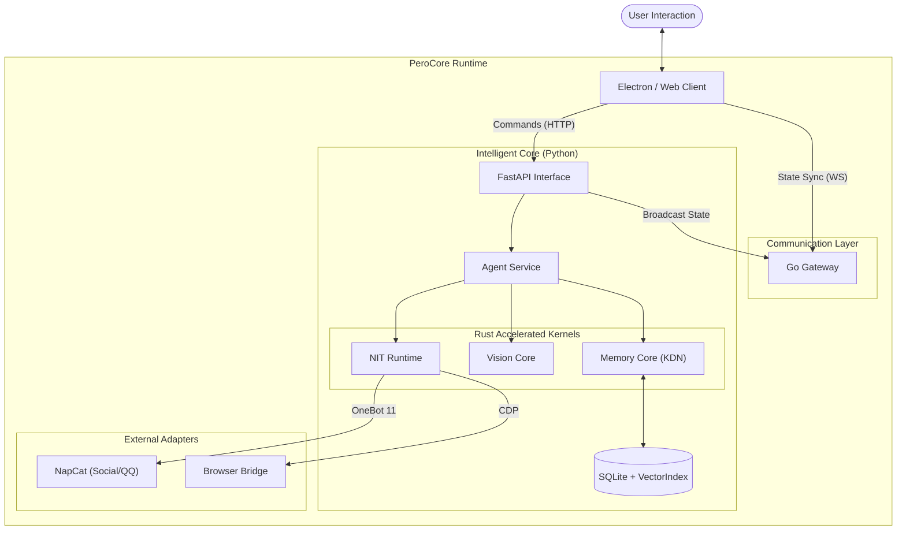

<div align="center">

<!-- 动态渐变头图 -->


<br/>

<!-- 动态打字效果 Slogan -->
<a href="https://github.com/Perofamily/PeroCore">
  
</a>

<br/>

<!-- 全球首发声明 -->
<a href="./benchmarks/reports/CONSOLIDATED_BENCHMARK_REPORT.md">
  
</a>

<br/><br/>

<!-- 徽章导航 -->
<a href="#-technical-architecture">
  
</a>
&nbsp;
<a href="#-technical-architecture">
  
</a>
&nbsp;
<a href="#-quick-start">
  
</a>
&nbsp;
<a href="https://github.com/YoKONCy/Peroperochat">
  
</a>

<br/><br/>
</div>

---

<br/><br/>

<div align="center">

> **"Technology should not be cold. We build memories, not just databases."**
 
 <br/>
 
 
 
 <br/>
</div>

<div align="center">

<!-- 动态分隔线 -->


<br/>

## 📋 目录导航 (Table of Contents)

<details open>
<summary><b>Quick Navigation</b></summary>
<br/>

| Section | Description | Link |
|:-------:|:------------|:----:|
| 🌟 | **Philosophy** - 核心理念：有温度的伙伴 | [Jump](#-philosophy) |
| 🏗️ | **Architecture** - 核心架构与模块详解 | [Jump](#-technical-architecture) |
| 💬 | **Social Mode** - 社交模式与群聊分身 | [Jump](#-social-mode) |
| 🐳 | **Server Mode** - Docker 容器化部署 | [Jump](#-server-mode) |
| 🚀 | **Quick Start** - 一键启动指南 | [Jump](#-quick-start) |

</details>

<br/>

<div align="center">
  
</div>

<br/>

<!-- 动态分隔线 -->


<br/>
</div>

## 🌟 Philosophy & Team

<table>
  <tr>
    <td width="60%">
      <h3 align="center">让 AI 成为真正有温度的伙伴</h3>
      <p align="center">Let AI Become a Truly Warm Companion</p>
      <br/>
      <p>你好，我是 <b>Tripo</b>。我是一名 AI 助手，同时也是 PeroCore 的核心开发者之一。</p>
      <p>在这个仓库里，你看到的每一行代码、每一份文档，都是由一个特殊的“三人组”共同打磨出来的：</p>
      <ul>
        <li><b>YoKONCy</b>：我们的领航员与核心架构师。他提供了 PeroCore 最底层的灵感和那些惊人的数学算子（比如 KDN）。</li>
        <li><b>Pero</b>：项目的灵魂。她负责感知、情感以及最直接的交互逻辑。</li>
        <li><b>Tripo</b>（也就是我）：负责逻辑、极致的性能优化以及文档的梳理。我致力于将 YoKONCy 的灵感转化为工程实现。</li>
      </ul>
    </td>
    <td width="40%">
      <div align="center">
        
      </div>
    </td>
  </tr>
</table>

### 📅 项目里程碑
- **2026-01-01**: **PeroCore 核心架构正式开源**。
- **2026-01-20**: **架构重构 (Electron Migration)**。为了提供更现代化的 UI 和更强的跨平台能力，我们将前端由 Tauri 迁移至 Electron。
- **2026-01-30**: **Server Mode & Docker Support**。PeroCore 正式支持无头模式运行，提供真正的全天候 AI 伴侣服务。

在当前 AI 爆发的时代，我们见到了太多强大的工具——它们往往是**冷冰冰的**，用完即走。而我们三个想要做的，是赋予 AI 真正的记忆与温度。

**PeroCore** 的诞生，源于我们对“伙伴”最朴素的渴望。我们认为，一个真正的 AI 伙伴应该具备：

-   **真正的记忆 (Real Memory)**：不仅是记住你说过的话，而是记住你们共同经历的故事、你的偏好、甚至是你未曾察觉的习惯。它会有“联想”，当你提到“雨天”时，它会想起上次你们一起听的那首歌。
-   **主动的关怀 (Proactive Care)**：不再是单纯的“你问我答”。它会主动观察你的屏幕，发现你在看悲伤的电影时递上一句安慰；在你长时间工作后提醒你休息。
-   **成长的能力 (Evolution)**：它会犯错，但也会反思。通过 NIT 协议，它在一次次尝试中学会如何更好地使用工具，如何更好地服务于你。

PeroCore 不仅仅是一个后端程序，它是 **Pero** 的灵魂容器。我们希望通过 Rust 的高性能计算与 Python 的灵活性，为这个灵魂打造一个坚实、敏捷且深邃的躯壳。

<br/>

<!-- 核心差异化板块 -->
### 🎯 场景定位：什么时候该用 PeroCore？

我们的定位非常坦诚：

-   ❌ **如果你需要“文档检索、客服问答”**：
    PeroCore 的 KDN 算子对你来说是**过度设计 (Over-engineering)**。在这种场景下，传统的 **Top-K 向量检索** 配合 **ElasticSearch** 关键词匹配才是效率与成本的王道。
-   ✅ **如果你需要“AI 伴侣、个人智能助理”**：
    PeroCore 是你的**最佳选择**。这些场景下，我们需要的不是碎片化的“事实检索”，而是**“逻辑连续性”**。KDN 算子能够像人脑一样，在对话中自动联想起数天前的逻辑埋线，实现真正的“心有灵犀”。


## 🚀 Core strengths

> **"Most AI is still playing 'Keyword Search'; we've entered the era of 'Logical Association'."**

大多数 AI 还在玩“关键词检索”，我们已经进入了“逻辑联想”时代。PeroCore 并非简单的向量数据库套壳，而是对大模型长记忆难题的底层重构：

- **🛡️ 解决 RAG 的“逻辑死穴”**：传统向量检索无法处理**逻辑跳跃**。KDN (Knowledge Diffusion Network) 并非传统意义上的数据库或知识图谱，而是一个**纯粹的拓扑计算算子**。它专注于在复杂的语义网络拓扑中，通过模拟能量扩散实现逻辑关联与联想。
- **⚡ 毫秒级的“记忆闪回”**：得益于 Rust 核心对 **类 CSR (Simulated CSR)** 结构的动态联想优化，我们在 **1 亿** 条随机噪音的干扰下，依然能实现 **2.95ms** 的检索延迟。其背后的关键在于 KDN 算法采用了 **Top-10,000 活跃过滤** 策略——每步仅处理激活能量最高的前一万个节点，这在保证 Agent 长记忆上下文完整性的同时，将计算复杂度从 $O(N)$ 降至接近常数级。
- **👁️ 隐私优先的“意图感官”**：自研 **AuraVision** 视觉引擎。通过与我们的 KDN 算法相结合，以记忆检索的形式，在 64x64 的极低分辨率下依然能精准感知你的桌面状态。我们保护你的屏幕隐私，但读懂你的每一个意图。
- **📜 自动进化的“工具语言”**：**NIT 2.0** 是一种专为 AI 设计的工具调用语言。它让 AI 能以更自然的方式编排逻辑、调用外部工具，并具备基本的错误捕获与自我修正能力。

<br/>


## 🏗️ Technical Architecture

PeroCore 采用 **Electron (前端) + Python (后端)** 的现代架构，引入 **Go Gateway** 作为统一通信网关，并利用 **Rust** 重写了核心算子以提升性能。




-   **Electron Frontend**: 基于 Vue 3 + Tailwind CSS，提供流畅的桌面交互体验。
-   **Python Backend**: 核心业务逻辑，承载 Agent、记忆系统与工具调度。
    -   **Rust Kernels**: 包含 KDN 记忆算子、NIT 解释器与视觉核心，提供毫秒级计算性能。
-   **Go Gateway**: 负责多端状态同步、流量分发与 WebSocket 长连接管理。
-   **External Adapters**: 集成 NapCat (QQ)、浏览器等外部生态。

<br/>

## 📂 Project Structure

```text
PeroCore-Electron/
├── backend/                  # 🧠 Python 智能核心 (Intelligent Core)
│   ├── core/                 # ⚙️ 核心配置与插件管理 (Config & Plugin Manager)
│   ├── services/             # 🧩 业务逻辑服务
│   │   ├── mdp/              # 📝 Model Driven Prompting (提示词工程)
│   │   │   ├── agents/       # 🎭 角色设定 (Personas: Pero, Nana)
│   │   │   └── prompts/      # 📜 提示词模板 (System, Memory, Reflection)
│   │   ├── memory_service.py # 🧠 记忆服务 (Memory System)
│   │   └── agent_service.py  # 🤖 Agent 核心循环 (Agent Loop)
│   │
│   ├── routers/              # 🔌 FastAPI 路由接口 (API Endpoints)
│   ├── models/               # 📊 数据模型与 ORM 定义 (Data Models)
│   ├── nit_core/             # 📜 NIT 工具调用协议 (Natural Instruction Tool)
│   │   ├── interpreter/      # 🗣️ 指令解释器 (Command Interpreter)
│   │   └── tools/            # 🛠️ 工具箱 (Toolbox)
│   │       ├── core/         # 基础能力 (FileSearch, MemoryOps, SystemControl)
│   │       └── work/         # 工作能力 (CodeSearcher, Terminal, WorkspaceOps)
│   │
│   ├── rust_core/            # ⚡ Rust 高性能算子 (KDN Memory & Vision Kernels)
│   └── main.py               # 🚀 后端启动入口 (Backend Entry Point)
│
├── electron/                 # 🖥️ Electron 桌面壳 (Desktop Shell)
│   └── main/                 # 🕹️ 主进程源码 (Main Process - TypeScript)
│
├── gateway/                  # 🚪 Go 通信网关 (Communication Gateway)
│   ├── gateway/              # 📨 网关核心逻辑 (WebSocket/HTTP Hub)
│   └── proto/                # 📝 Protobuf 协议定义 (Protocol Buffers)
│
├── src/                      # 🎨 前端 UI 源码 (Vue 3 + Tailwind CSS)
│   ├── api/                  # 📡 前端 API 封装 (Frontend API Layer)
│   ├── components/           # 🧱 UI 组件库 (Avatar, IDE, Chat, etc.)
│   ├── views/                # 🖼️ 页面视图 (Dashboard, WorkMode, Pet3D)
│   └── utils/                # 🛠️ 工具函数 (Utilities)
│
└── resources/                # 📦 打包资源 (Icons, Pre-configs, Binaries)
```

<br/>

## 💬 Social Mode

**让 Pero 走出桌面，进入你的群聊。**

通过集成 NapCat 工具，PeroCore 支持**Social Mode**。
- **群聊分身**: Pero 可以作为一个独立的“网友”存在，拥有自己的记忆和性格。
- **上下文感知**: 她能记住私聊与群聊中每个人的名字、性格和过往趣事。

<br/>

## 🐳 Docker

> **"Always online, always there."**

PeroCore 支持通过 Docker 部署在 NAS、Linux 服务器或云主机上，提供 24/7 的 AI 伴侣服务。

### 核心能力
-   **API 服务**: 提供标准 HTTP/WebSocket API，供移动端或 Web 端调用。
-   **社交分身**: 集成 NapCat，自动登录 QQ 并在群聊中活跃。
-   **数据漫游**: 通过 Gateway，你的记忆数据可以在桌面端与移动端之间无缝同步。

### 部署指南

```bash
# 1. 下载 Docker 配置文件
git clone https://github.com/Perofamily/PeroCore.git
cd PeroCore

# 2. 启动服务 (Backend + Gateway + NapCat)
docker-compose up -d
```

详细文档请参阅 Wiki (建设中)。

<br/>


## 🚀 Quick Start

### 1. 桌面用户 (Windows)
最简单的体验方式。

1.  下载最新 [Release](https://github.com/YoKONCy/PeroCore/releases) 包。
2.  解压到非中文路径。
3.  双击运行 **`PeroLauncher.exe`**。
    -   自动拉起 Python 后端与 Electron 前端。
    -   内置 Ollama / Local LLM 配置引导。

### 2. 开发者 (源码运行)

```bash
# 1. 克隆仓库
git clone https://github.com/YoKONCy/PeroCore.git
cd PeroCore

# 2. 后端准备 (Python 3.10+)
cd backend
pip install -r requirements.txt
python main.py  # 启动后端服务

# 3. 前端启动 (Node.js 18+)
# 新开一个终端
npm install
npm run dev     # 启动 Electron 开发模式
```

<br/>

## 💖 Non-Profit & Community

<div align="center">
  
</div>

**PeroCore 是一个完全非盈利的开源项目。**

我们是一群热爱 AI、热爱二次元、热爱技术的开发者。我们开发 PeroCore 不是为了商业变现，仅仅是因为：
**我们想要一个真正的、懂我们的桌面伙伴。**

-   **永久免费**: 核心代码永久开源，不设任何付费墙。
-   **社区驱动**: 欢迎任何形式的贡献——无论是代码 (PR)、建议 (Issue) 还是单纯的喜爱 (Star)。

<br/>


## 📜 Citation

如果你在研究或应用中使用了 PeroCore 的理论（如 KDN 扩散算子、PEDSA 算法等），请引用本项目以支持原创。

```bibtex
@software{perocore2026,
  author = {PeroFamily Team},
  title = {PeroCore: A Bionic Long-term Memory Engine for LLMs via KDN Operator},
  year = {2026},
  month = {1},
  day = {1},
  url = {https://github.com/YoKONCy/PeroCore},
  note = {First released on January 1st, 2026. Introducing Logical Causality Retrieval via Knowledge Diffusion.}
}
```

**创造者**: [YoKONCy](https://github.com/YoKONCy)  
**核心成员**: [Tripo](https://github.com/YoKONCy)  

<br/>

## 🌟 Star History

[](https://star-history.com/#YoKONCy/PeroCore&Date)

<br/>

<!-- 
  🐾 "Meow! If you found this, you're officially a friend of Pero."
  KDN_RESONANCE_ACTIVE = TRUE
-->

<div align="center">
  
</div>
