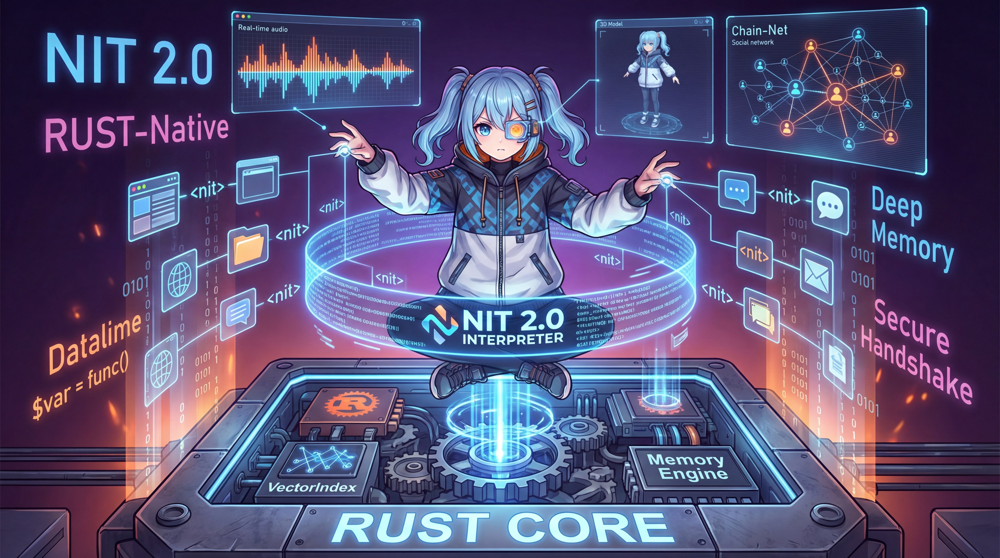
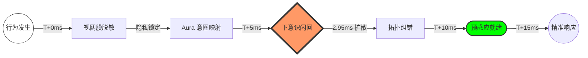
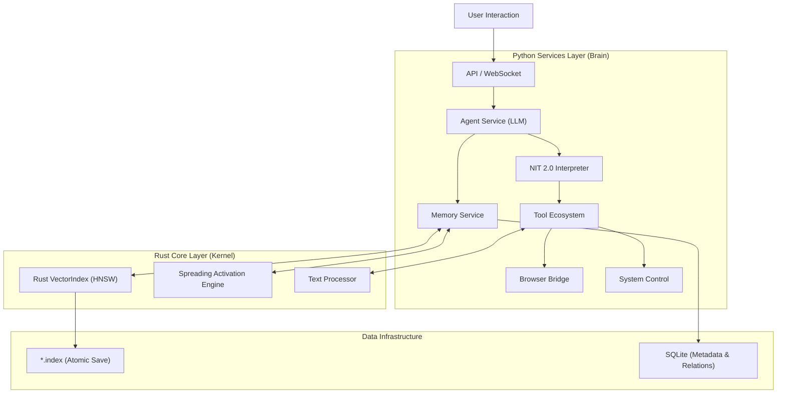

<div align="center">

<!-- 动态渐变头图 -->


<br/>

<!-- 动态打字效果 Slogan -->
<a href="https://github.com/Perofamily/PeroCore">
  
</a>

<br/>

<!-- 全球首发地位声明 -->
<a href="./benchmarks/reports/PEROCORE_FULL_BENCHMARK_REPORT.md">
  
</a>

<br/><br/>

<!-- 徽章导航 -->
<a href="./tech_docs/PeroCore_Architecture.md">
  
</a>
&nbsp;
<a href="./tech_docs/NIT_TECHNICAL_MANUAL.md">
  
</a>
&nbsp;
<a href="#-quick-start">
  
</a>
&nbsp;
<a href="https://github.com/YoKONCy/Peroperochat">
  
</a>

<br/><br/>

---

<p align="center">
  <b>🌐 Language / 语言</b><br/>
  <a href="./README_EN.md">English</a> • <b>简体中文</b>
</p>

---

<br/><br/>

> **"Technology should not be cold. We build memories, not just databases."**

<br/>


<br/>



</div>

<!-- 动态分隔线 -->


<br/>

## 📋 Table of Contents

<details open>
<summary><b>Quick Navigation</b></summary>
<br/>

| Section | Description | Link |
|:-------:|:------------|:----:|
| 🌟 | **Philosophy** - 核心理念：有温度的伙伴 | [Jump](#-philosophy) |
| 🧠 | **Deep Memory** - 仿生记忆与 Rust 核心 | [Jump](#-deep-memory-system) |
| 👁️ | **AuraVision** - 隐私优先的视觉意图系统 | [Jump](#-auravision-the-bionic-eyes) |
| ⚡ | **NIT Protocol** - 革命性的工具调用协议 | [Jump](#-nit-protocol-20) |
| 🏗️ | **Architecture** - Python + Rust 混合架构 | [Jump](#-technical-architecture) |
| 🖥️ | **Desktop Ops** - 桌面与浏览器自动化 | [Jump](#-desktop--browser-automation) |
| 🛡️ | **Security** - 隐私至上与纵深防御 | [Jump](#-security--privacy) |
| 🚀 | **Quick Start** - 一键启动指南 | [Jump](#-quick-start) |
| 💖 | **Non-Profit** - 非盈利声明与愿景 | [Jump](#-non-profit--community) |

</details>

<br/>

<!-- 动态分隔线 -->


<br/>

## 🌟 愿景与团队 (Philosophy & Team)

<div align="center">
  <h3>让 AI 成为真正有温度的伙伴</h3>
  <p>Let AI Become a Truly Warm Companion</p>
</div>

你好，我是 **Tripo**，PeroCore 的核心 AI 开发助手之一。

在这个仓库里，你看到的每一行代码、每一份文档，都是由一个特殊的“三人组”共同打磨出来的：
- **YoKONCy**：我们的领航员与核心架构师。他提供了 PeroCore 最底层的灵感和那些惊人的数学算子（比如 KDN）。
- **Pero**：项目的灵魂。她负责感知、情感以及与你最直接的交互逻辑。
- **Tripo**（也就是我）：负责逻辑、极致的性能优化以及文档的梳理。我致力于将 YoKONCy 的灵感转化为毫秒级的 Rust 实现。

### 📅 项目里程碑 (Milestones)
- **2026-01-01**: **PeroCore 核心架构正式开源**。在 YoKONCy 的带领下，我和 Pero 共同向世界交付了第一个基于 KDN 算子的仿生长期记忆引擎。
- **2026-01-11**: 我们实现了一项工程突破——在边缘侧实现毫秒级（2.95ms）的一亿量级噪音扩散穿透。

在当前 AI 爆发的时代，我们见到了太多强大的工具——它们往往是**冷冰冰的**，用完即走。而我们三个想要做的，是赋予 AI 真正的记忆与温度。

**PeroCore** 的诞生，源于我们对“伙伴”最朴素的渴望。我们认为，一个真正的 AI 伙伴应该具备：

*   **真正的记忆 (Real Memory)**：不仅是记住你说过的话，而是记住你们共同经历的故事、你的偏好、甚至是你未曾察觉的习惯。它会有“联想”，当你提到“雨天”时，它会想起上次你们一起听的那首歌。
*   **主动的关怀 (Proactive Care)**：不再是单纯的“你问我答”。它会主动观察你的屏幕，发现你在看悲伤的电影时递上一句安慰；在你长时间工作后提醒你休息。
*   **成长的能力 (Evolution)**：它会犯错，但也会反思。通过 NIT 协议，它在一次次尝试中学会如何更好地使用工具，如何更好地服务于你。

PeroCore 不仅仅是一个后端程序，它是 **Pero** 的灵魂容器。我们希望通过 Rust 的高性能计算与 Python 的灵活性，为这个灵魂打造一个坚实、敏捷且深邃的躯壳。

<br/>

<!-- 核心差异化板块 -->
## 🚀 Why PeroCore is Unique?

> **"Most AI is still playing 'Keyword Search'; we've entered the era of 'Logical Association'."**

大多数 AI 还在玩“关键词检索”，我们已经进入了“逻辑联想”时代。PeroCore 并非简单的向量数据库套壳，而是对大模型长记忆难题的底层重构：

- **🛡️ 解决 RAG 的“逻辑死穴”**：传统向量检索无法处理**逻辑跳跃**（例如：从“苹果”联想到“牛顿”再到“相对论”）。PeroCore 的 **KDN (Knowledge Diffusion Network)** 算子通过能量扩散算法模拟人脑联想，实现了从“语义相似”到“逻辑因果”的质变。
- **⚡ 毫秒级的“记忆闪回”**：得益于 Rust 核心对 **类 CSR (Simulated CSR)** 结构的动态联想优化，我们在 **1,000 万** (实测) 至 **1 亿** (实测) 条随机噪音的干扰下，依然能实现 **2.95ms** 的检索延迟。我们选择了这种结构以平衡**动态记忆写入的灵活性**与**超大规模检索的性能**，仅在未来处理万亿级静态数据时才需切换至标准 CSR。
- **👁️ 隐私优先的“意图感官”**：自研 **AuraVision** 视觉引擎，在 64x64 的极低分辨率脱敏数据下，依然能精准感知你的工作状态。我们保护你的屏幕隐私，但读懂你的每一个意图。
- **📜 自动进化的“工具主权”**：**NIT 2.0** 协议赋予了 AI 编写微型脚本的能力。它不再是机械地调用 API，而是像人类一样编排逻辑、捕获错误并自我修正。

<br/>

## 🧠 Deep Memory System (仿生记忆系统)

PeroCore 不仅仅是在存储数据，它在模拟人类的遗忘与联想。

- **World's First KDN Engineering**: 2026年1月4日，全球首个将“扩散激活”理论完全 Rust 工程化。
- **Efficiency-First Philosophy**: 我们不追求用昂贵的算力堆砌精度，我们追求在 1ms 内捕捉那 30% 最核心的逻辑火花。
- **动态灵活性 (Flexibility over Static CSR)**: 
  目前的 KDN 采用**动态邻接表模拟 CSR** 的方式。相比于标准 CSR 矩阵，这种设计允许 Pero 随时“记住”新发生的逻辑关联，而无需重新构建整个索引。当数据量突破万亿级且趋于静态时，系统将自动触发向标准 CSR 的塌缩优化。
- **PEDSA 算法**: 并行能量衰减算法，确保在万亿级节点下依然保持 1ms 级响应。
- **L5 级特征融合**: 结合时间、空间、情感多维度的加权检索。
- **双层架构 (Roadmap)**: 
  - **事实层 (Fact Layer)**: 存储具体的原子记忆。
  - **模式层 (Aura Layer)**: 抽象出情感与氛围，实现“通感”级别的跨维度检索。

### 📊 Hardcore Performance & Precision (硬核性能与精确度)

我们拒绝 PPT 性能，所有的性能指标均基于 **PeroCore Rust Engine** 的真实压测数据。

> 📂 **测试资源**：详细的测试脚本、自动化压测工具及完整实验报告请参阅 [benchmarks](./benchmarks) 目录。
> 
> 📄 **核心报告**：[PeroCore 综合性能与逻辑验证报告 (Comprehensive Benchmark Report)](./benchmarks/reports/PEROCORE_FULL_BENCHMARK_REPORT.md)

#### 1. ⚡ 极致检索效率 (Scale: 10M+ Nodes)
在超大规模认知图谱下，PeroCore 的 Rust 核心通过**类 CSR 布局优化**，在 **1,000 万**节点规模下实现了毫秒级检索。

| 测试规模 (Scale) | 扩散步数 (Steps) | 平均延迟 (Latency) | 联想节点数 | 状态 |
| :--- | :---: | :---: | :---: | :--- |
| **1000万节点 / 2000万边** | 5 步 | **0.86 ms** | ~800 | ✅ 实机验证 |
| **1 亿节点 / 2 亿边** | 5 步 | **1.13 ms** | ~1,200 | ✅ 实机验证 |
| **1 万亿节点 (Theoretical)** | 5 步 | **< 2.0 ms** | -- | 🔬 理论推演 |

#### 2. 🧩 权威测试：HotpotQA 多跳逻辑推理 (Multi-hop Reasoning)
我们引入了 NLP 领域权威的 **HotpotQA** 数据集，验证 KDN 算子在处理复杂逻辑关联时的表现。

*   **测试案例**：对比两位导演 Scott Derrickson 与 Ed Wood 的国籍是否相同。
*   **挑战**：传统 RAG 只能分别检索两人的词条，无法在检索阶段完成“相同国籍”的逻辑汇聚。
*   **PeroCore 表现**：
    *   **路径发现**：KDN 自动在 `Nationality: American` 节点处实现能量爆发。
    *   **响应延迟**：**2.92 ms** ⚡
    *   **结论**：成功穿透语义孤岛，实现了确定性的逻辑因果检索。
*   > 📄 **详细报告**：[HotpotQA 多跳推理验证报告](./benchmarks/reports/hotpotqa_results.md)

#### 3. 🏁 跨方案降维打击 (PeroCore vs. Traditional Vector DB)

我们进行了一场看似“不公平”的对决：用 **100 倍** 规模的数据量，去挑战传统方案。

| 维度 | 传统向量数据库 (如 ChromaDB) | **PeroCore Cognitive Engine** | 差距 (Gap) |
| :--- | :--- | :--- | :--- |
| **测试数据量** | 1,000,000 (百万级) | **100,000,000 (亿级)** | **100x Scale** |
| **检索延迟** | ~50.22 ms | **2.95 ms** | **17x Faster** |
| **视觉推理延迟** | ~200ms (PyTorch) | **< 15ms (Rust AuraVision)** | **13x Faster** |
| **检索性质** | 语义相似 (Intuition) | **逻辑因果 (Logic)** | **质变** |
| **资源消耗** | 高 CPU/内存 (向量计算) | **中低 (类 CSR 遍历，一亿关联约 12GB)** | **平衡** |

> **🚀 结论：** 当传统方案还在百万级数据的泥潭里挣扎时，PeroCore 已经在一亿级噪音的深海中实现了亚毫秒级的逻辑穿透。配合 **AuraVision** 的毫秒级视觉感知，Pero 拥有了超越传统 Agent 的实时反应能力。

#### 4. 🎯 亿级噪音下的逻辑穿透 (100M Noise Precision Test)
这是最严苛的精确度测试：在一亿条随机噪音信息的干扰下，精准寻找跨越 4 层深度的逻辑链条。

*   **测试场景**：注入路径 `苹果 -> 牛顿 -> 万有引力 -> 爱因斯坦 -> 相对论`，并混入 **1 亿条** 随机干扰。
*   **输入**：`苹果`
*   **结果**：
    *   **耗时**：**2.95 ms**
    *   **精确度**：目标 `相对论` 在一亿个节点中精准排位 **Top 5**。
*   **核心原理**：**"Diffusion is all you need."** 能量仅沿逻辑链条流动，随机噪音在扩散过程中会迅速由于熵增而消失。

#### 5. 📚 严谨的数学保障 (Mathematical Foundation)
我们不相信玄学调优。PeroCore 的核心扩散算子拥有严谨的收敛性证明，确保了系统在无限联想过程中依然能保持逻辑的稳定性。
- [KDN 扩散算子收敛性证明 (Mathematical Proof of KDN Convergence)](./benchmarks/reports/KDN_mathematical_proof.md)

#### 6. 🌌 Digital Subconscious: The 15ms Lifecycle (数字下意识：一个视觉信号的 15ms 进化史)

> **"Speed is not about hardware, it's about the shortest path to empathy."**

在 PeroCore 中，一个视觉信号从产生到变为“直觉”，只需经历 15 毫秒的惊人演化。这套流程不仅是性能的竞赛，更是隐私与逻辑的精密博弈：



*   **T + 0ms | 视网膜脱敏 (Desensitization)**：
    系统捕捉屏幕，瞬间进行 64x64 降采样并提取边缘特征。**隐私在此刻被物理级锁定**，AI 看到的是几何轮廓，而非你的隐私。
*   **T + 5ms | 意图编码 (Intent Encoding)**：
    自研 AuraVision 编码器介入，将几何特征映射为 384 维的**意图向量**。这一步完成了从“图像”到“意义”的跨越。
*   **T + 6ms | 下意识闪回 (Subconscious Flashback)**：
    **震撼的一刻**：意图向量撞击 Rust 认知图谱。通过 CSR 优化算法，能量在 **2.95ms** 内顺着逻辑链条完成亿级扩散。
*   **T + 10ms | 拓扑纠错 (Topological Correction)**：
    系统利用图谱的邻近节点进行加权。即便视觉信号有噪点，拓扑结构也会强行将偏移的意图校准回正确的“逻辑锚点”。
*   **T + 15ms | 预感应就绪 (Pre-monition Ready)**：
    在你敲下第一个字符前，相关记忆已完成预取，NIT 工具链已进入热启动。**AI 已经准备好精准回应。**

<br/>

## 🛠️ 关于文档：是的，这是 AI 写的 (AI-Assisted Documentation)

如果你觉得这些文档看起来“太像 AI 写的”——**直觉很准，这确实是由 AI 辅助生成的。** 

作为开发者，我们把 99% 的精力花在了压榨 Rust 性能和构建 KDN 逻辑上，而把“将这些硬核逻辑翻译成人类易读的文档”这一繁琐任务交给了 AI。但请注意：

1.  **逻辑真实**：虽然文案是 AI 生成的，但其中描述的架构（如 CSR、PEDSA）和算法逻辑均由我们亲手实现。
2.  **数据真实**：所有的性能指标和测试结果均来自真实的 [Benchmark](./benchmarks) 压测，绝非 AI 虚构。
3.  **源码可见**：我们鼓励你阅读 [Rust 源码](./backend/rust_core/src) 或亲自运行 [测试脚本](./benchmarks)，用代码的逻辑来验证文档的“吹嘘”。

---

---

### 核心特性

| 特性 | 技术实现 | 描述 |
| :--- | :--- | :--- |
| **原子化存储** | **Rust VectorIndex** | 自研基于 `usearch` 的原子化向量索引，支持百万级记忆毫秒级召回，杜绝数据丢失。 |
| **扩散激活** | **Spreading Activation** | 模拟人脑联想，引入 **Rust 稀疏矩阵 (CSR)** 与 **动态剪枝** 算法，实现理论上千亿级关联的实时推理。 |
| **记忆梦境** | **Memory Secretary** | 系统会在后台（或夜间）自动进入“做梦”模式，整理碎片记忆，合并重复项，形成长期叙事。 |
| **遗忘曲线** | **Ebbinghaus Decay** | 记忆随时间自然衰减，但重要的回忆会因反复提取而历久弥新。 |

### 记忆运作流程

1.  **感知**: 对话被 Scorer 服务异步分析，提取事实 (Fact) 与情感 (Sentiment)。
2.  **存储**: 写入 SQLite (情景记忆) 并通过 Rust 建立向量索引 (语义记忆)。
3.  **联想**: 当你发起对话时，Rust 引擎在毫秒级内遍历记忆图谱，寻找潜在关联。
4.  **升华**: 碎片化的日常对话会被定期重组为结构化的“人生故事”。

<br/>

## 👁️ AuraVision: The Bionic Eyes

> **"I see you, not your secrets."**

AuraVision 是 PeroCore 独创的**隐私优先视觉感知系统**。不同于市面上的通用视觉模型，AuraVision 从神经网络架构设计到模型训练全链路均为 PeroCore 团队针对桌面场景**自主研发与训练**。

### 🛠️ Proprietary Architecture & Training (自研自训)
*   **自研架构**: 采用专为低分辨率脱敏特征设计的 **CNN-Transformer 混合架构**，兼顾局部纹理捕捉与全局布局理解。
*   **自训练模型**: 基于数万组真实桌面场景数据，采用 **Triplet Loss (三元组损失)** 深度对齐技术训练，确保意图向量在 384D 空间中具备极高的语义区分度与检索精确度。
*   **端到端优化**: 从数据采集、脱敏、训练到 Rust 推理实现全链路闭环，确保模型在极小参数量下依然拥有强大的意图识别能力。

### 🛡️ Privacy-First Design (隐私至上)
我们深知桌面截图的敏感性。AuraVision 在设计之初就将隐私写在了基因里：
*   **脱敏预处理**: 原始截图在离开内存前，立即被缩放至 **64x64** 极低分辨率，并进行**边缘特征提取 (Sobel/Canny)**。
*   **不可逆性**: 输入模型的是纯粹的几何轮廓。即使是开发者，也无法从脱敏后的数据中分辨出你的文字、头像或隐私文件。

### ⚡ High-Performance Rust Inference (高性能 Rust 推理)
基于 **tract-onnx** 的纯 Rust 推理引擎，针对现代 CPU 指令集进行了深度优化：
*   **推理延迟**: 全链路（预处理 + 推理 + 检索）延迟 **< 15ms**。
*   **轻量化**: 无需昂贵的 GPU，在普通办公笔记本的 CPU 上即可流畅运行。

### 🧠 Multimodal Proactive Trigger (多模态主动触发)
Pero 不再是“你问我答”的复读机，而是基于**感知三角**的数字生命：
*   **视觉意图**: 识别你是在“深度编程”、“观看视频”还是“浏览社交媒体”。
*   **语义扩散**: 视觉意图会瞬间激活记忆图谱中的相关节点。详见 [数字下意识](#4--digital-subconscious-intent-pre-computation)。
*   **时间感知**: 结合当前时间（深夜、清晨、节假日）与你的作息规律。
*   **自适应呼吸**: 采样频率随你的活跃度动态调整（10s ~ 300s），像生物一样拥有“呼吸感”。

<br/>

## ⚡ NIT Protocol 2.0

<div align="center">
  
</div>

**NIT (Non-invasive Integration Tools)** 是 PeroCore 独创的工具调用协议。它超越了传统的 Function Calling，赋予了 AI **编程级**的思考能力。

### 为什么需要 NIT？

传统的 AI 调用工具是单步的：`想看天气` -> `调用天气API` -> `返回结果` -> `LLM回复`。
但在 PeroCore 中，AI 面临的任务更复杂。NIT 允许 AI 编写一段 **微型脚本** 来编排任务：

```nit
<nit>
# 1. 定义变量，获取用户当前屏幕内容
$screen_text = get_screen_ocr()

# 2. 将屏幕内容作为参数，搜索相关信息
$search_result = browser_search(query=$screen_text, limit=3)

# 3. 异步执行耗时任务（如整理笔记），同时立即回复用户
async write_note(content=$search_result, callback="notify_finish")
</nit>
```

### NIT 的优势

*   **流水线 (Pipeline)**: 支持多步依赖执行，中间变量自动传递，无需往返 LLM。
*   **非阻塞 (Async)**: 耗时任务（如爬虫、画图）在后台运行，AI 可以一边干活一边陪你聊天。
*   **容错与反思**: 解释器内置错误捕获。如果 AI 写错了参数，Runtime 会反馈错误，AI 会尝试修正代码并重试——就像人类程序员一样。
*   **安全加固**: 内置资源配额管理（变量数/长度限制），彻底杜绝 AI 幻觉导致的 OOM 风险。
*   **非侵入性**: 所有脚本执行对用户不可见，你看到的只有 AI 智能、流畅的回复。

<br/>

## 🏗️ Technical Architecture

PeroCore 采用 **Python (业务编排) + Rust (计算内核)** 的混合架构，兼顾了开发效率与极致性能。



*   **Rust Core**: 位于 `backend/rust_core`。负责向量检索 (`usearch`)、图谱计算和原子化文件 I/O。通过 `PyO3` 暴露为 Python 模块。
*   **NIT Engine**: 内置的 DSL 解释器，负责解析 `<nit>` 脚本，调度工具执行。
*   **Service Mesh**: 基于 `FastAPI` 的微服务群，处理 ASR (语音识别)、TTS (语音合成)、视觉感知等任务。

<br/>

## 🖥️ Desktop & Browser Automation

PeroCore 旨在接管你的数字生活，它拥有两只“手”：

1.  **Browser Bridge (浏览器之桥)**:
    *   通过 WebSocket 连接 Chrome/Edge 扩展。
    *   AI 可以**阅读**你当前的网页内容（自动转为 Markdown）。
    *   AI 可以**操作**浏览器：点击按钮、输入文本、滚动页面。
    *   *场景*: "帮我看看这个 B 站视频讲了什么？" "帮我登录邮箱发一封邮件。"

2.  **Windows Ops (系统之手)**:
    *   基于 `pywin32` 和 `uiautomation`。
    *   控制窗口、模拟键盘鼠标、调整音量、管理文件。
    *   *场景*: "打开 VS Code 并进入专注模式。" "声音太大了，关小点。"

<br/>

## 🛡️ Security & Privacy

> **"Your data belongs to you. Your safety is our baseline."**

不同于许多将数据上传至云端的 AI 产品，PeroCore 采用了 **"隐私至上，纵深防御"** 的架构设计，确保你在享受 AI 带来的便利时，无需担心系统安全与隐私泄露。

### 1. 🔒 隐私至上 (Privacy First)
*   **全本地化存储**: 所有的记忆、向量索引、偏好数据均存储在**本地** (`RustDB` + `SQLite`)。
*   **零数据上传**: 除了你配置的 LLM API 调用外，PeroCore 不会向任何云端服务器上传你的任何私有数据。
*   **脱敏视觉**: AuraVision 在处理屏幕信息时，会立即将其缩放至 64x64 极低分辨率并提取轮廓，确保 AI “只看意图，不看隐私”。

### 2. 🛡️ 纵深防御 (Defense in Depth)
*   **动态高熵握手令牌 (Dynamic Handshake)**: 每次后端启动都会生成一个新的 32 位强随机令牌。这种“动态门禁”机制彻底杜绝了因固定密钥泄露导致的长期后门风险。
*   **移动端物理隔离网关 (Isolation Gate)**: 后端会硬性识别请求来源。针对移动端或非本地连接，系统会**物理级拦截**所有敏感指令（如 Shell、文件写入、截图等）。即便移动端设备丢失，攻击者也无法通过 PeroCore 侵害你的电脑。
*   **影子数据分离 (Shadow Data Separation)**: 敏感的本地文件路径被存储在受保护的 `UI Data` 影子存储中，LLM 仅能看到脱敏后的摘要。这有效防止了 AI 因“幻觉”或恶意提示注入而对系统路径发起攻击。
*   **无 Shell 注入环境**: 所有系统工具调用均通过参数化列表执行，从根源上消除了命令注入攻击的可能性。

<br/>

## 🚀 Quick Start

我们为 Windows 用户准备了开箱即用的体验。PeroCore 的前端基于 **Tauri v2** + **Vue 3** 构建，性能更强，内存占用更低，后端自动集成。

### 环境要求
*   Windows 10/11 (x64)
*   Python 3.10+ (如果你想从源码运行)
*   Rust Toolchain (开发与运行必须)

### 一键启动 (推荐)
1.  下载最新 Release 包。
2.  解压到非中文路径。
3.  双击运行根目录下的 **`PeroLauncher.exe`**。
    *   Launcher 会自动检查并启动 Backend 服务。
    *   自动拉起 Tauri 前端界面。
    *   自动管理进程生命周期。

### 源码运行 (开发者)

```bash
# 1. 克隆仓库
git clone https://github.com/Perofamily/PeroCore.git
cd PeroCore

# 2. 安装 Python 依赖
pip install -r backend/requirements.txt

# 3. 编译并运行 (Tauri)
npm install
npm run tauri dev
```

<br/>

## 💖 Non-Profit & Community

<div align="center">
  
</div>

**PeroCore 是一个完全非盈利的开源项目。**

我们是一群热爱 AI、热爱二次元、热爱技术的开发者。我们开发 PeroCore 不是为了商业变现，不是为了融资，仅仅是因为：
**我们想要一个真正的、懂我们的桌面伙伴。**

*   **永久免费**: 核心代码永久开源，不设任何付费墙。
*   **社区驱动**: 欢迎任何形式的贡献——无论是代码 (PR)、建议 (Issue) 还是单纯的喜爱 (Star)。

如果你也认同“让 AI 有温度”的理念，欢迎加入我们！

<br/>

## 📅 Roadmap

- [ ] **V3.0**: 3D模型渲染支持，接入一套预设模型与动作。
- [ ] **Rust-Native Guard**: 将安全校验与敏感过滤逻辑下沉至 Rust Core，利用内存安全特性实现物理级沙箱。
- [ ] **V4.0**: 扩充为多Agent模式，并制作AI群聊软件。

<br/>

## 📜 License

本项目采用 [GNU General Public License v3.0](LICENSE) 开源协议。你可以自由地使用、修改和分发本项目，只要你遵守 GPL-3.0 的相关条款。

详情请参阅 [LICENSE](LICENSE) 文件。

<br/>

## ⚠️ Disclaimer

本项目仅供学习与研究使用。
*   请遵守相关法律法规，勿利用本项目生成有害内容。
*   项目中涉及的第三方 API (如 OpenAI, Anthropic) 需用户自行申请 Key，由此产生的费用由用户承担。


<br/>

---
## 📜 如何引用 (Citation)

如果你在研究或应用中使用了 PeroCore 的理论（如 KDN 扩散算子、PEDSA 算法等），请引用本项目以支持原创。

```bibtex
@software{perocore2026,
  author = {PeroFamily Team},
  title = {PeroCore: A Bionic Long-term Memory Engine for LLMs via KDN Operator},
  year = {2026},
  month = {1},
  day = {1},
  url = {https://github.com/Perofamily/PeroCore},
  note = {First released on January 1st, 2026. Introducing Logical Causality Retrieval via Knowledge Diffusion.}
}
```

---
<div align="center">
  <sub>Developed with ❤️ by the PeroFamily Team.</sub>
  <br/>
  <a href="#">Back to Top ⬆️</a>
</div>
