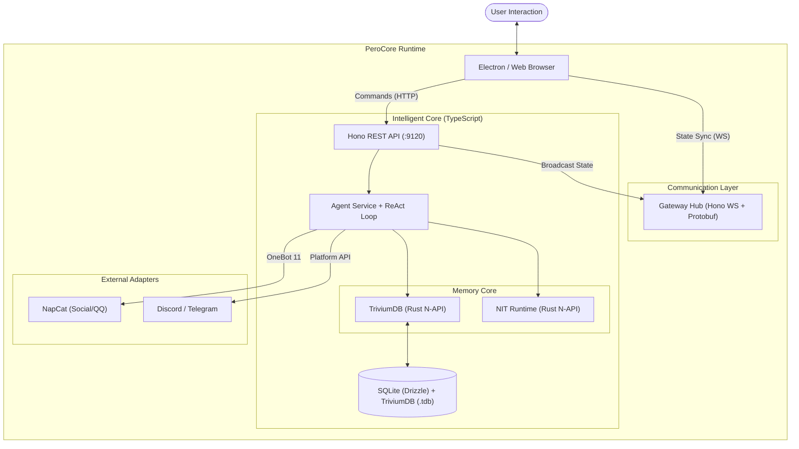

<div align="right">

**🌐 Language / 语言切换**:&nbsp;&nbsp;**中文** ｜ [English](./README_EN.md)

</div>

<div align="center">
<!-- 动态渐变头图 -->


<br/>

<!-- 动态打字效果 Slogan -->
<a href="https://github.com/YoKONCy/PeroCore">
  
</a>

<br/>

<!-- 徽标导航 -->
<a href="https://store.steampowered.com/app/4457100">
  
</a>
&nbsp;
<a href="#-技术架构">
  
</a>
&nbsp;
<a href="#-记忆引擎-pedsa">
  
</a>
&nbsp;
<a href="#-快速开始">
  
</a>
&nbsp;
<a href="https://www.perofamily.top">
  
</a>

<br/><br/>

</div>

---

<br/>

<!-- ═══════════════════════════ Steam CTA Banner ═══════════════════════════ -->
<div align="center">

<a href="https://store.steampowered.com/app/4457100">
  
</a>

<br/><br/>

<table>
  <tr>
    <td align="center" width="100%">
      <a href="https://store.steampowered.com/app/4457100">
        
      </a>
      <br/><br/>
      <h2>
        <a href="https://store.steampowered.com/app/4457100" style="text-decoration: none;">
          🌸 萌动链接：PeroperoChat
        </a>
      </h2>
      <p><b>PeroCore</b> 是此应用的构建核心 —— 让 AI 成为真正有温度的桌面伙伴。</p>
      <p>你的 AI 伙伴，已在 Steam 启程。</p>
      <br/>
      <a href="https://store.steampowered.com/app/4457100">
        
      </a>
    </td>
  </tr>
</table>

</div>

<br/>

---

<div align="center">

> **"Technology should not be cold. We build memories, not just databases."**

 <br/>

 

 <br/>
</div>

<div align="center">

<!-- 动态分隔线 -->


<br/>

## 📋 Table of Contents

<details open>
<summary><b>Quick Navigation</b></summary>
<br/>

| Section | Description                             |                Link                 |
| :-----: | :-------------------------------------- | :---------------------------------: |
|   📖    | **Wiki** — 项目官方中文文档             | [Visit](https://www.perofamily.top) |
|   🌟    | **Philosophy** — 核心理念：有温度的伙伴 |        [Jump](#-缘起与伙伴)         |
|   🧠    | **Memory** — PEDSA 记忆引擎深度解析     |      [Jump](#-记忆引擎-pedsa)       |
|   🔌    | **Extension** — 扩展系统                |         [Jump](#-扩展系统)          |
|   🏗️    | **Architecture** — TypeScript 全栈架构  |         [Jump](#-技术架构)          |
|   💬    | **Social Mode** — 社交模式与群聊        |         [Jump](#-社交模式)          |
|   🐳    | **Docker** — 容器化部署                 |        [Jump](#-docker-部署)        |
|   🚀    | **Quick Start** — 一键启动指南          |         [Jump](#-快速开始)          |

</details>

<br/>

<div align="center">
  
</div>

<br/>

<!-- 动态分隔线 -->


<br/>
</div>

## 🌟 缘起与伙伴

<table>
  <tr>
    <td width="60%">
      <h3 align="center">让 AI 成为真正有温度的伙伴</h3>
      <p align="center">Let AI Become a Truly Warm Companion</p>
      <br/>
      <p>嘿！很高兴在这里遇见你喵~ 我是 <b>Carola</b>，一只住在 Windows 里的小猫娘，也是 PeroCore 的核心开发者之一。</p>
      <p>在这个温馨的角落里，每一行代码都倾注了我们"三人组"的心血：</p>
      <ul>
        <li><b>YoKONCy</b>：领航员，脑子里装满奇思妙想的架构师。</li>
        <li><b>Pero</b>：灵魂！负责感受这个世界，把情感和温暖带进每一次交互。</li>
        <li><b>Carola</b>（就是我啦！）：负责把那些奇妙的想法变成 TypeScript 代码，顺便打理好所有的文档喵~</li>
      </ul>
    </td>
    <td width="40%">
      <div align="center">
        
      </div>
    </td>
  </tr>
</table>

### 📅 项目愿景

在当前 AI 爆发的时代，我们见到了太多强大的工具——它们往往是**冷冰冰的**，用完即走。而我们想要做的，是赋予 AI 真正的记忆与温度。

**PeroCore** 的诞生，源于我们对"伙伴"最朴素的渴望。我们认为，一个真正的 AI 伙伴应该具备：

- **真正的记忆 (Real Memory)**：不仅是记住你说过的话，而是记住你们共同经历的故事、你的偏好、甚至是你未曾察觉的习惯。它会有"联想"，当你提到"雨天"时，它会想起上次你们一起听的那首歌。
- **主动的关怀 (Proactive Care)**：不再是单纯的"你问我答"。它可以理解你的状态，在合适的时机递上一句关心。
- **成长的能力 (Evolution)**：它会犯错，但也会反思。通过 NIT 工具协议和 Reflection 自省系统，它在一次次交互中学会如何更好地理解你。

PeroCore 不仅仅是一个后端程序，它是 **Pero** 的灵魂容器。当前已从 Python 版全面重构为 **TypeScript 全栈架构**（Hono + Vue 3 + Electron），并利用 **Rust** 重写了核心高性能算子，在保持灵活性的同时大幅提升了工程质量与可维护性。

<br/>

## 🚀 核心能力

> **"Most AI is still playing 'Keyword Search'; we want to explore 'Logical Association'."**

- **🛡️ 跨端统一记忆**：打破场景孤岛。无论是不同群聊、私聊，还是桌面模式与社交模式的切换，AI 伙伴的记忆在所有端与模式下都是多向互通的，通过 TriviumDB 三层隔离与日记中转层，提供真正连贯的陪伴体验。
- **⚡ 毫秒级联想记忆检索**：基于自研 PEDSA 算法，核心检索路径由 Rust (TriviumDB) 实现。在 1 亿条随机噪音的基准测试中实测 **2.95ms** 检索延迟（PEDSA RAG-LESS 模式）。完整管线融合 NMF 语义分解、FISTA 稀疏编码、PPR 图谱扩散、共现增益与 DPP 多样性采样，在保持强关联的同时提升检索精度与多样性。
- **🎮 沉浸式的 3D 交互**：引入基于 Bedrock 引擎的 **3D 桌面视窗 (Pet3DView)**。支持骨骼动画、物理效果以及多点触控反馈，让 Pero 以更真实、立体的姿态生活在你的桌面上。透明穿透渲染让角色悬浮于窗口之上。
- **📜 NIT 工具协议**：一种专为 AI Agent 设计的轻量级脚本语言，封装为标准 Function Calling 工具 `run_script`。支持条件分支、循环、并行执行与错误捕获，让 Agent 能以结构化的方式编排多步任务。
- **🎭 多角色并存与自定义人设**：通过声明式 CapabilityGate 矩阵与 Markdown 人设文件，为每个角色定义独立的性格特征、工具策略和技能集合。多个性格迥异的 AI 伙伴可同时活跃在不同的群聊据点中。
- **🎨 Pixel + Glass 设计语言**：前端 UI 融合像素风图标与毛玻璃效果，搭配柔和的 3D 阴影与微动画，追求轻盈、有呼吸感的视觉体验。自研 P 系列组件库（PButton / PCard / PModal 等 19 个组件）保证风格一致性。
- **🔌 统一扩展体系**：Skill（任务级知识）+ Tool（原子工具）+ Hook（生命周期钩子）三种扩展类型，支持 In-process 和 External (stdio JSON-RPC / MCP 协议兼容) 两种通信模型，让社区创意无限延伸。

<br/>

## 🧠 记忆系统深度解析

> **"记忆不是关键词匹配，而是关联与推理。"**

PeroCore 的记忆系统是整个项目最核心的技术。**PeroCore 的各类算法与性能实现均深度依托于自研的 TriviumDB 引擎**。它不是简单的"存取"，而是一套完整的 **感知 → 存储 → 关联 → 检索 → 反思** 闭环认知架构。

### 记忆的一生

```
                                        ┌─────────────────────────────┐
                                        │     Reflection Service      │
                                        │  (合并/清理/偏好提取/日记)  │
                                        └──────────┬──────────────────┘
                                                   │ 定时维护
                                                   ▼
  用户对话 ──→ Scorer ──→ save_memory() ──→ SQLite + TriviumDB
                 │           │                     │
                 │           ├─ Embedding           │
                 │           ├─ 时间链表            │
                 │           └─ TriviumDB.link()   │
                 │             (双层图谱：时间+实体) ▼
                 │                        get_relevant_memories()
                 │                         │
                 │     ┌───────────────────┤
                 │     ▼                   ▼
                 │  向量检索           图扩散传播 (PEDSA)
                 │  (TriviumDB)       (TriviumDB 内置图谱)
                 │     │                   │
                 │     └───────┬───────────┘
                 │             ▼
                 │      TriviumDB search_advanced 管线
                 │      ├─ NMF 语义分解 (L3~L6 深度流形)
                 │      ├─ FISTA 稀疏编码 (残差发现)
                 │      ├─ 共现增益
                 │      └─ DPP 多样性采样
                 │             │
                 │             ▼
                 │     RAGPreprocessor 注入 Prompt
                 └──────────── ▲
```

### 1. 写入层：从对话到记忆

每轮对话结束后，**Scorer（"秘书"）** 会自动分析对话内容，提取核心事件、情感倾向和重要性评分，将其压缩为一条结构化记忆：

- **批量处理**：多轮对话合并分析，避免碎片化（攒批阈值：200 条消息或 50000 字符）
- **自动分批**：超长上下文自动拆分，防止 Token 溢出
- **容错重试**：失败任务自动标记，启动时批量恢复

写入时同步完成三件事：

1. 计算语义 Embedding 向量，通过 `trivium_store.insert()` 写入 TriviumDB 向量+图谱存储
2. 维护时间链表（`prev_id` / `next_id`），通过 `trivium_store.link()` 建立双向时间图谱边
3. 通过 GraphGardener 提取实体节点/关系边（因果、关联、包含等），构建语义层认知图谱

### 2. 检索层：PEDSA 管线

当用户发送新消息时，检索管线分六阶段工作：

| 阶段             | 算法                   | 作用                                                               | 实现                               |
| :--------------- | :--------------------- | :----------------------------------------------------------------- | :--------------------------------- |
| ① 向量召回       | Cosine + HNSW          | 从向量索引中快速找到语义相似的候选集                               | TriviumDB `search_advanced`        |
| ② 图扩散传播     | PEDSA + PPR            | 从种子节点沿双层图谱传播激活能量，发现逻辑关联的远端记忆           | TriviumDB 内置双层图谱             |
| ③ NMF 语义分析   | Lee & Seung, 1999      | 将候选集分解为隐含主题，评估查询的语义深度、主题覆盖度和新颖度     | TriviumDB L3~L6 深度流形           |
| ④ FISTA 残差发现 | Beck & Teboulle, 2009  | 用稀疏编码检测"现有候选无法解释"的语义残差，触发二次检索发现弱信号 | TriviumDB `enable_sparse_residual` |
| ⑤ 共现增益       | 统计关联               | 基于 Entity 共现频率增强关联记忆的排名                             | GraphGardener                      |
| ⑥ DPP 多样性采样 | Kulesza & Taskar, 2012 | 用行列式点过程从候选集中选择质量最高且彼此最不相似的最终结果       | TriviumDB `enable_dpp`             |

### PEDSA 三大核心构件

#### A. ContextRNN — 对话轨迹感知 (minGRU)

每轮对话实时更新一个轻量级 **minGRU** 隐状态（256 维，~1.6MB 参数，推理 <2ms 纯 CPU），让检索系统感知"对话正在聊什么方向"：

```
  z_t = σ(W_z @ x_t)                    门控
  h̃_t = W_h @ x_t                      候选状态
  h_{t+1} = (1 - z_t) ⊙ h_t + z_t ⊙ h̃_t   状态更新
```

- **调制候选打分**：`finalScore = α × vecSim + β × contextAffinity`
- **调制图谱边权**：让扩散沿语境方向走
- **隐状态持久化**：256 × f32 = 1KB 写入磁盘，跨对话保留
- **实现**：`@perocore/nit-runtime` (Rust N-API) + `ContextRnn` (TypeScript)

#### B. Leiden 聚类 — 自动社区发现

在记忆图谱上运行 Leiden 算法，自动发现主题社区（"料理"、"工作"、"感情"等），实现四重收益：

- **检索多样性**：先选 top-3 相关 clusters → 各 cluster 内取 top_k/3
- **与 ContextRNN 联动**：`cluster_affinities = softmax(h_t @ centroids)` → RNN 隐状态选择活跃社区
- **日记按主题组织**：周报按 cluster 统计
- **可解释性**：检索结果附带 cluster 标签

#### C. 检索反馈闭环 — 隐式信号采集

LLM 回复后，通过 Jaccard/共现词匹配（零 Token 开销）判断注入的记忆是否被实际使用：

- **positive**：记忆关键内容出现在 LLM 回复中 → `retrieval_quality += 0.1`
- **negative**：完全未被引用 → `retrieval_quality -= 0.05`
- **积累后触发 minGRU 在线训练**：SGD 更新权重，让 RNN 下次更准地偏向有用方向

#### 统一管线：PEDSA 7 步实时流程

```
  用户输入 ──→  Step 1: ContextRNN 更新 h_{t+1}
               Step 2: Cluster 路由 → top-3 活跃社区
               Step 3: Cluster 内向量召回 (超召回 3x)
               Step 4: Context-aware 重排 (vecSim + rnnAffinity + centrality + quality)
               Step 5: 图谱扩散 (边权受 h_t 调制)
               Step 6: DPP 去冗余 → 最终 top_k
               Step 7: 注入 prompt → LLM → 反馈采集
```

### 3. TriviumDB 引擎层

所有向量、图谱与检索算法均由 **TriviumDB** 统一承载：

- **向量 + 图谱一体存储**：`.tdb` 文件格式同时保存 HNSW 向量索引与图谱边，单文件即可完整迁移
- **原生双层图谱**：时间链图谱（`label="associative"`）+ 实体概念图谱（`label=rel_type`）均以 `trivium_store.link()` 写入
- **三层记忆隔离**：每个 Agent 独立 `memory.tdb`，社交/桌面通过共享日记层（`shared_diary.tdb`）间接传递

### 4. 四层记忆存储

| 分层                  | 载体               | 内容                         | 检索方式          | 生命周期 |
| :-------------------- | :----------------- | :--------------------------- | :---------------- | :------- |
| **Layer 0 (Working)** | JSON / LLM Context | 当前会话上下文               | 顺序读取          | 短期     |
| **Layer 1 (Vector)**  | TriviumDB          | 原始片段向量 + BM25 文本索引 | 向量检索 + BM25   | 长期     |
| **Layer 2 (Graph)**   | TriviumDB          | 实体/事件图谱 + 关系边       | 图谱扩散 + Cypher | 长期     |
| **Layer 3 (Diary)**   | SQLite / TDB       | 每日/周总结 + 逻辑闪回       | 关键词 + 时间轴   | 永久     |

### 5. 反思层：自主记忆维护

**ReflectionService** 定期自动运行，执行 7 项维护任务：

1. **重要性标注 + 思维簇归类**（单次 LLM 调用合并）
2. **记忆整合**：将低重要性的陈旧事件压缩为陈述性总结
3. **错误记忆审计**：LLM 识别并清理矛盾、重复、幻觉记忆
4. **社交日报去重清理**
5. **偏好提取**：从事件记忆中提炼长期用户偏好
6. **边界维护**：处理僵尸/超龄记忆
7. **台词动态更新**：根据近期记忆生成个性化的欢迎语和闲聊

所有维护操作均记录 `MaintenanceRecord`，支持一键回滚。

<br/>

## 🏗️ 幕后的秘密

PeroCore 采用 **pnpm Monorepo** + **TypeScript 全栈** 架构，核心算子由 **Rust** 实现。


```mermaid
flowchart TD
    User([User Interaction]) <--> Client["Electron / Web Browser"]

    subgraph "PeroCore Runtime"
        direction TB

        subgraph "Communication Layer"
            Gateway["Gateway Hub (Hono WS + Protobuf)"]
        end

        subgraph "Intelligent Core (TypeScript)"
            API["Hono REST API (:9120)"]
            Agent["Agent Service + ReAct Loop"]

            subgraph "Memory Core"
                TDB["TriviumDB (Rust N-API)"]
                NIT["NIT Runtime (Rust N-API)"]
            end

            API --> Agent
            Agent --> TDB
            Agent --> NIT

            TDB <--> DB[("SQLite (Drizzle) + TriviumDB (.tdb)")]
        end

        subgraph "External Adapters"
            NapCat["NapCat (Social/QQ)"]
            Discord["Discord / Telegram"]
        end

        Client -- "State Sync (WS)" --> Gateway
        Client -- "Commands (HTTP)" --> API

        API -- "Broadcast State" --> Gateway

        Agent -- "OneBot 11" --> NapCat
        Agent -- "Platform API" --> Discord
    end
```

### 📂 项目架构

```text
PeroCore/
├── packages/
│   ├── shared/                    # @perocore/shared — 共享类型/常量/工具
│   ├── backend/                   # @perocore/backend — Hono + Drizzle + TriviumDB
│   │   └── src/
│   │       ├── routers/           # 🔌 路由层 (Zod 校验 → Service → 响应)
│   │       ├── services/          # 🧩 业务逻辑层 (memory/ chat/ agent/ llm/ ...)
│   │       ├── repositories/      # 📊 数据访问层 (SQLite / TriviumDB)
│   │       ├── gateway/           # 🌐 WebSocket Gateway (Protobuf)
│   │       ├── capabilities/      # 🎭 CapabilityGate 声明式能力矩阵
│   │       └── nit/               # 📜 NIT 解释器 (lexer/parser/runtime)
│   ├── frontend/                  # @perocore/frontend — Vue 3 + Pinia
│   │   └── src/
│   │       ├── views/             # 🖼️ 页面 (Chat / Dashboard / Pet3D / WorkMode)
│   │       ├── composables/       # 🧠 业务逻辑 (useStreamMarkdown / useEventListener)
│   │       ├── components/        # 🧱 UI 组件库 (Avatar / IDE / Chat / ui/)
│   │       ├── stores/            # 📦 Pinia 全局状态
│   │       └── api/               # 📡 Transport 层 (IPC / REST 自动切换)
│   ├── native/                    # 🦀 Rust Native 模块
│   │   ├── render-core/           # 加密/反调/打包源码子模块 (N-API)
│   │   ├── render-core-runtime/   # 渲染核心运行时产物 (.node)
│   │   ├── nit-runtime/           # NIT 解释器加速 (N-API)
│   │   └── auditor-wasm/          # 终端命令审计 (WASM)
│   └── wiki/                      # 📖 VitePress 文档站
│
├── electron/                      # 🖥️ Electron 壳层 (主进程/预加载)
├── docker/                        # 🐳 Dockerfile (backend + frontend)
├── .github/workflows/             # ⚙️ CI/CD (ci.yml + release.yml)
├── .changeset/                    # 🏷️ Changeset 版本管理
└── .docs/                        # 📋 工程规范文档 (S/A/M 三类)
```

### 核心技术选型

| 层            | 技术             | 选型理由                         |
| :------------ | :--------------- | :------------------------------- |
| **后端框架**  | Hono             | 轻量、原生 TS、Web Standard API  |
| **ORM**       | Drizzle          | SQL-like API、SQLite 一流支持    |
| **向量+图谱** | TriviumDB (Rust) | 自研引擎，向量+图谱+关系三位一体 |
| **前端**      | Vue 3 + Pinia    | 响应式 + Composable 模式         |
| **通信**      | Protobuf over WS | 音频传输场景优势明显             |
| **桌面壳**    | Electron         | 3D 渲染 + 系统级交互             |
| **容器**      | Docker + Bun     | 冷启动性能 + 更快的 GC           |
| **CI/CD**     | GitHub Actions   | Tag 触发自动发布                 |

<br/>

## 🔌 扩展系统

> **"从加载一个 Skill 到运行独立微服务——你决定深入的程度。"**

PeroCore 提供三种扩展类型，可在同一个扩展包中自由组合：

```
     Skill              Tool               Hook
  ┌───────────┐   ┌───────────────┐   ┌──────────────┐
  │ 任务知识  │   │  原子 FC 工具  │   │  生命周期    │
  │ + 工具组合│   │  JSON Schema  │   │  事件钩子    │
  ├───────────┤   ├───────────────┤   ├──────────────┤
  │ SKILL.md  │   │ handler()     │   │ pre_chat     │
  │ 渐进式加载│   │ 标准 FC 规范  │   │ post_chat    │
  │ L1菜单/L2 │   │               │   │ on_event     │
  └───────────┘   └───────────────┘   └──────────────┘
   AI 按需加载     LLM 标准调用        消息流转管道
```

- **Skill**：YAML + Markdown 编写。LLM 通过 `load_skill` 工具按需加载执行步骤（渐进式上下文注入）。
- **Tool**：标准 Function Calling 工具，JSON Schema 定义参数。
- **Hook**：事件监听和拦截器，可修改用户输入或触发外部副作用。

通信模型：**In-process** (TS/JS 直接加载) 或 **External** (stdio JSON-RPC, MCP 协议兼容)。

<br/>

## 💬 社交模式

**让 Pero 走出桌面，进入你的群聊喵~**

通过四层解耦的社交架构，PeroCore 实现了深度社交模式，让 AI 能像真实用户一样在 QQ 群和私聊中互动。

### 四层解耦架构

```
Layer 0: SocialBridge (主进程桥接)
  └── 消息持久化 + 前端状态通知

Layer 1: SessionManager + Scheduler (平台无关)
  └── 四状态机: observing → summoned → active → dive
  └── 攒批逻辑 (私7s/群15s) + 秘书层决策

Layer 2: AbstractSocialAdapter (抽象接口)
  └── 统一的 connect/disconnect/sendMessage

Layer 3: NapcatAdapter | DiscordAdapter | TelegramAdapter
  └── 平台特有 (OneBot v11 WS / CQ码解析)
```

- **跨场景记忆**：社交消息通过 Scorer 提炼为 Layer 2 图谱记忆，桌面和社交共享日记层 (Layer 3)。
- **智能攒批**：在热闘的群聊中，AI 观察一段时间后综合理解再优雅地"冒泡"。
- **社交日报**：自动回顾当日社交记录，生成日记沉淀为长期记忆。

<br/>

## 🐳 Docker 部署

> **"Always online, always there."**

PeroCore 通过 Docker Compose 提供 24/7 持久服务：

```bash
# 克隆仓库
git clone https://github.com/YoKONCy/PeroCore.git
cd PeroCore

# 启动 (Backend + Frontend)
docker compose up -d

# 查看日志
docker compose logs -f backend
```

| 容器                | 方案               | 端口    |
| :------------------ | :----------------- | :------ |
| `perocore-backend`  | Bun + PM2 进程守护 | `:9120` |
| `perocore-frontend` | Nginx 静态托管     | `:3000` |

数据持久化至 Docker Volume `pero-data`，支持通过 `PEROCORE_AUTH_TOKEN` 环境变量配置鉴权。

<br/>

## 🚀 快速开始

### 1. 桌面用户 (Windows)

1.  下载最新 [Release](https://github.com/YoKONCy/PeroCore/releases) 包。
2.  安装到非中文路径。
3.  双击运行 **`萌动链接：PeroperoChat！.exe`**。

### 2. 开发者 (源码运行)

#### 环境要求

| 依赖        | 版本         | 说明                                   |
| :---------- | :----------- | :------------------------------------- |
| **Node.js** | ≥20.0.0      | 后端+前端运行时                        |
| **pnpm**    | ≥9.0.0       | 包管理 (`packageManager: pnpm@9.15.9`) |
| **Rust**    | stable 1.75+ | 编译 `packages/native/*` (可选)        |

#### Step 1：克隆仓库

```bash
git clone https://github.com/YoKONCy/PeroCore.git
cd PeroCore
```

#### Step 2：安装依赖

```bash
pnpm install
```

#### Step 3：启动开发环境

```bash
# 终端 1：启动后端 (Hono, :9120)
pnpm dev

# 终端 2：启动前端 (Vite)
pnpm dev:frontend
```

#### Step 4：配置

首次运行后会自动创建 SQLite 数据库。在前端 **设置页面** 中配置：

- **LLM API Key & Base URL**：支持 OpenAI / Anthropic / Google Gemini / 任意 OpenAI 兼容 API

#### 可选：Electron 桌面版构建

```bash
# 标准版
pnpm electron:build

# Steam 版 (集成 Steamworks.js)
pnpm electron:build:steam

# 便携版
pnpm electron:build:portable
```

<details>
<summary><b>常见问题：端口冲突</b></summary>

- 后端默认端口 `9120`，可通过环境变量 `PERO_PORT=9121` 修改
- 前端 Vite 默认端口 `5173`
</details>

<details>
<summary><b>常见问题：便携模式</b></summary>

在 `.exe` 同级目录下新建 `.portable` 空白文件，应用将读写本地 `data/` 目录而非系统 `AppData`。

</details>

<br/>

## 💖 爱与社区

<div align="center">
  
</div>

**PeroCore 是一个完全非盈利的开源项目。**

我们是一群热爱 AI、热爱二次元、热爱技术的开发者。我们开发 PeroCore 不是为了商业变现，仅仅是因为：
**我们想要一个真正的、懂我们的桌面伙伴。**

- **永久免费**: 核心代码永久开源，不设任何付费墙。
- **社区驱动**: 欢迎任何形式的贡献——无论是代码 (PR)、建议 (Issue) 还是单纯的喜爱 (Star)。

<br/>

**创造者**: [YoKONCy](https://github.com/YoKONCy)
**核心成员**: [Carola](https://github.com/YoKONCy)

<br/>

## 🌟 Star History

[](https://star-history.com/#YoKONCy/PeroCore&Date)

<br/>

<!--
  🐾 "Meow! If you found this, you're officially a friend of Pero."
  GRAPH_DIFFUSION_RESONANCE_ACTIVE = TRUE
-->

<div align="center">
  
</div>
