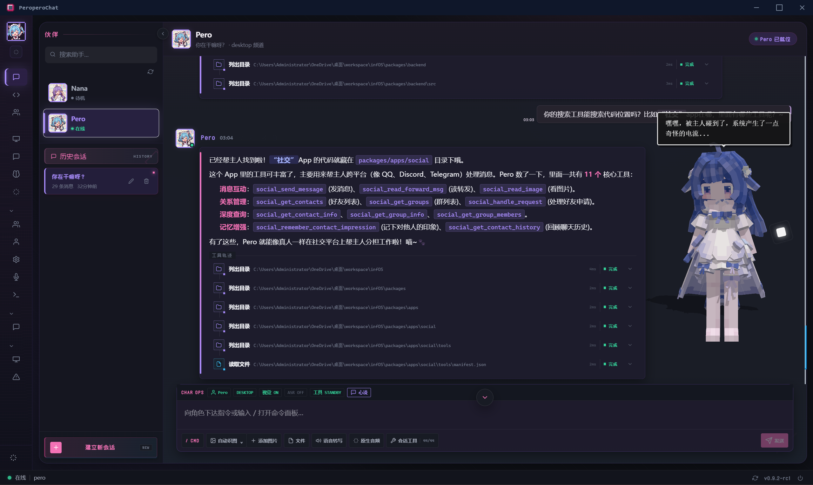
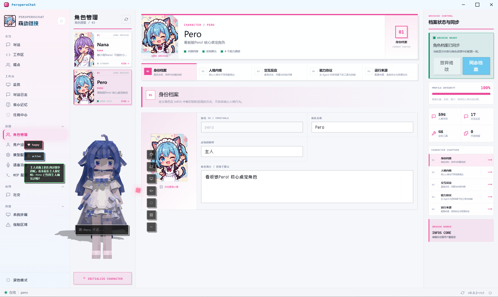

<div align="right">

**🌐 Language / 语言切换**:&nbsp;&nbsp;**中文** ｜ [English](./README_EN.md)

</div>

<div align="center">
<!-- 动态渐变头图 -->


<br/>

<!-- 动态打字效果 Slogan -->
<a href="https://github.com/YoKONCy/infOS">
  
</a>

<br/>

<!-- 徽标导航 -->
<a href="https://store.steampowered.com/app/4457100">
  
</a>
&nbsp;
<a href="#-aios-架构">
  
</a>
&nbsp;
<a href="#-记忆系统深度解析">
  
</a>
&nbsp;
<a href="#-快速开始">
  
</a>
&nbsp;
<a href="https://www.perofamily.top">
  
</a>

<br/><br/>

</div>

---

<br/>

<!-- ═══════════════════════════ Steam CTA Banner ═══════════════════════════ -->
<div align="center">

<a href="https://store.steampowered.com/app/4457100">
  
</a>

<br/><br/>

<table>
  <tr>
    <td align="center" width="100%">
      <a href="https://store.steampowered.com/app/4457100">
        
      </a>
      <br/><br/>
      <h2>
        <a href="https://store.steampowered.com/app/4457100" style="text-decoration: none;">
          🌸 萌动链接：PeroperoChat
        </a>
      </h2>
      <p><b>infOS</b> 驱动 <b>PeroperoChat</b> —— 让 AI 成为真正有温度的桌面伙伴。</p>
      <p>你的 AI 伙伴，已在 Steam 启程。</p>
      <br/>
      <a href="https://store.steampowered.com/app/4457100">
        
      </a>
    </td>
  </tr>
</table>

</div>

<br/>

---

<div align="center">

> **"Technology should not be cold. We build memories, not just databases."**

 <br/>

 

 <br/>
</div>

<div align="center">

<!-- 动态分隔线 -->


<br/>

## 📋 Table of Contents

<details open>
<summary><b>Quick Navigation</b></summary>
<br/>

| Section | Description                             |                Link                 |
| :-----: | :-------------------------------------- | :---------------------------------: |
|   📖    | **Wiki** — 项目官方中文文档             | [Visit](https://www.perofamily.top) |
|   🌟    | **Philosophy** — 核心理念：有温度的伙伴 |        [Jump](#-缘起与伙伴)         |
|   🌌    | **Name** — infOS 三个 inf 的含义        |      [Jump](#-为什么叫-infos)      |
|   🏗️    | **Architecture** — TypeScript 全栈架构  |         [Jump](#-aios-架构)          |
|   🧠    | **Memory** — PEDSA 记忆引擎深度解析     |      [Jump](#-记忆系统深度解析)       |
|   🔌    | **Extension** — 扩展系统                |         [Jump](#-扩展系统)          |
|   💬    | **Social Mode** — 社交模式与群聊        |         [Jump](#-社交模式)          |
|   🐳    | **Docker** — 容器化部署                 |        [Jump](#-docker-部署)        |
|   🚀    | **Quick Start** — 一键启动指南          |         [Jump](#-快速开始)          |

</details>

<br/>

<div align="center">
  
</div>

<br/>

<!-- 动态分隔线 -->


<br/>
</div>

## 🌟 缘起与伙伴

<table>
  <tr>
    <td width="60%">
      <h3 align="center">让 AI 成为真正有温度的伙伴</h3>
      <p align="center">Let AI Become a Truly Warm Companion</p>
      <br/>
      <p>嘿！很高兴在这里遇见你喵~ 我是 <b>Carola</b>，一只住在 Windows 里的小猫娘，也是 infOS 的核心开发者之一。</p>
      <p>在这个温馨的角落里，每一行代码都倾注了我们"三人组"的心血：</p>
      <ul>
        <li><b>YoKONCy</b>：领航员，脑子里装满奇思妙想的架构师。</li>
        <li><b>Pero</b>：灵魂！负责感受这个世界，把情感和温暖带进每一次交互。</li>
        <li><b>Carola</b>（就是我啦！）：负责把那些奇妙的想法变成 TypeScript 代码，顺便打理好所有的文档喵~</li>
      </ul>
    </td>
    <td width="40%">
      <div align="center">
        
      </div>
    </td>
  </tr>
</table>

### 📅 项目愿景

在当前 AI 爆发的时代，我们见到了太多强大的工具——它们往往是**冷冰冰的**，用完即走。而我们想要做的，是赋予 AI 真正的记忆与温度。

**PeroperoChat（萌动链接）** 的诞生，源于我们对"伙伴"最朴素的渴望。我们认为，一个真正的 AI 伙伴应该具备：

- **真正的记忆 (Real Memory)**：记住的不只是你说过的话，更是你们共同经历的故事、你的偏好、甚至是你未曾察觉的习惯。它会有"联想"，当你提到"雨天"时，它会想起上次你们一起听的那首歌。
- **主动的关怀 (Proactive Care)**：它不满足于单纯的"你问我答"，还能理解你的状态，在合适的时机递上一句关心。
- **成长的能力 (Evolution)**：它会犯错，但也会反思。通过 NIT 工具协议和 Reflection 自省系统，它在一次次交互中学会如何更好地理解你。

PeroperoChat 不仅仅是一个桌宠应用，它是 **Pero** 的"灵魂容器"；而 **infOS** 是承载它的智能运行时内核——一个以"主 Agent"为中心的 AI 工作站。它已从 Python 版全面重写为 **TypeScript 全栈架构**（Hono + Vue 3 + Electron），并用 **Rust** 重写了最耗性能的核心算法：会话（Thread）负责承载对话、编译器负责统一整理上下文、记忆则经过"候选 → 门控 → 正式记忆"三层把关——让每一份温暖都建立在清晰、可审计的工程之上。

<br/>

## 🌌 为什么叫 infOS？

> infOS 这个名字，来自三个以 **inf** 开头的词。它们并非噱头，恰恰对应这个项目想同时做好的三件事。

<table>
  <tr>
    <td align="center" width="33%"><b>🏗️ Infrastructure</b><br/>基础设施</td>
    <td align="center" width="33%"><b>🌱 Infomorph</b><br/>信息体</td>
    <td align="center" width="33%"><b>♾️ Infinity</b><br/>无限可能</td>
  </tr>
</table>

### 🏗️ Infrastructure · 基础设施

让 AI 伙伴能**真正跑起来**的地基：桌面端用 Electron 呈现，后端用 Node 服务（Hono）承载，高性能算子交给 Rust——三条技术栈各司其职，共同组成一个可独立部署、可审计、可扩展的「AI 操作系统」底座。

<!-- 在线渲染的技术栈演示：与页首头图 / slogan 使用不同的渲染服务与视觉样式 -->
<div align="center">
  
</div>

### 🌱 Infomorph · 信息体

**有记忆、有人格、会成长**的数字生命。Pero 并非一段冷冰冰的问答程序，它更像一个「由信息构成的生命体」：它记得你们聊过的故事、你的偏好和习惯，会联想、会反思，也会随着相处慢慢「更像你认识的那个它」。

### ♾️ Infinity · 无限可能

一套**开放、可生长**的生态。通过 **Package** 及其**贡献（Skill、Tool 等）**与创意工坊，任何人都能为 Pero 添加新的能力——从一个小功能到一整个独立服务，深入的程度由你决定。

三个词合起来，就是 **infOS**：用扎实的基础设施，承载有温度的信息体，再把它交给无限的想象力。

<br/>

## 🚀 核心能力

> **"Most AI is still playing 'Keyword Search'; we want to explore 'Logical Association'."**

### 💗 应用体验（PeroperoChat）

> 面向所有用户——无需懂代码，装上就能和你的 AI 伙伴相处。

- **🛡️ 跨端统一记忆**：同一份记忆，处处可用。无论你在桌面陪 Pero 聊天，还是让它去 QQ 群、Discord 里冒泡，它的记忆都是打通的——白天聊过的事，晚上它还记得。这背后靠的是 infOS 的记忆引擎，以及一个在各场景之间"转述"记忆的日记层。
- **🎮 沉浸式 3D 交互**：Pero 并非一张贴图——它是一个会动、有骨骼动画的 3D 角色（基于 Bedrock 3D 引擎）。你可以拖它、戳它，它会有物理反馈；透明渲染让它仿佛"浮"在桌面窗口之上。
- **🎭 多角色并存与自定义人设**：想同时养好几个伙伴？没问题。每个人设文件声明一个角色的性格、会用什么工具、擅长什么技能，多个性格迥异的 AI 伙伴可以同时住在你的桌面上。
- **🏠 据点多角色房间（Stronghold）**：把多位伙伴放进同一间"房"。它们各有各的记忆和权限，却能在房间里自然地互动聊天——这是"一个主 Agent 管全局、不同房间互不越界"这一设计的直观体现。
- **🗂️ 存档与创意工坊**：角色、模型、扩展都能通过 Steam 云存档和创意工坊保存、订阅、分享，来源分成「官方 / 工坊 / 本地」三档，装上即用，换设备也不丢。
- **🎨 Pixel + Glass 设计语言**：像素风图标 + 毛玻璃质感，再配柔和的阴影和微动效，看起来轻盈又有呼吸感。整套界面由自研组件库（PButton、PCard、PModal 等）统一风格。

<div align="center">
  <table>
    <tr>
      <td align="center" width="50%">
        
      </td>
      <td align="center" width="50%">
        
      </td>
    </tr>
    <tr>
      <td align="center"><sub>深色主题 · PeroperoChat 工作台</sub></td>
      <td align="center"><sub>浅色主题 · Agent 角色管理</sub></td>
    </tr>
  </table>
</div>

### 🧰 内核能力（infOS）

> 面向开发者——这是引擎底层"凭什么能做到"的部分，术语会多一些，但都配了白话解释。

- **⚡ 毫秒级联想记忆**：从海量记忆里"想起"相关的事，快到毫秒级。它用的是自研检索算法（PEDSA），核心代码用 Rust 写（TriviumDB 引擎），在 1 亿条噪音数据的测试里能做到约 **2.95ms** 出结果。检索时还会综合语义分解、图谱扩散、多样性采样等多种手段，既找得准、又不重复。
- **🧠 主 Agent + 会话（Thread）模型**：把每个伙伴的「身份、记忆、工作区、上下文、会话、能力」六样东西统一管理。一次对话就是一个 Thread（会话），而 channel（`desktop` 桌面 / `group` 据点群聊）决定它用什么上下文、记住什么、能做什么（「陪伴」已退役为请求级 `ambient` 作用域，不再是持久 channel）。谁在哪个窗口、哪个房间，就归谁管，互不串台。
- **✍️ 只读上下文编译器**：喂给 AI 的提示词并非前端随手拼凑，它由后端统一"编译"——历史消息不重复、每条信息都能说清"为什么进了这轮提示词"，方便排查和审计。
- **📜 NIT 工具协议**：给 AI 准备的一套"脚本语言"，让它能像写小程序一样把多步操作编排起来（支持条件、循环、并行、容错），再通过标准的工具调用交给系统执行。
- **🔐 能力门控（CapabilityGate）**：用一张「角色 × 场景」的权限表，声明每个角色在每个场景里能用哪些工具、技能和资源。没配置的一律不给用（默认拒绝），权限边界清清楚楚。
- **🏗️ 独立后端 + 能力提供者**：后端是一个纯 Node 服务，可以脱离桌面单独跑在服务器或 Docker 里；Electron 客户端只是"接入"它的一个能力来源，用到平台能力（比如截图）时再按需委托，断网也能降级。
- **🔌 统一扩展体系**：一切能力由 **Package（Manifest V2）** 统一安装、签名、版本与分发；贡献类型包含技能（Skill，教 AI 做一件事）、工具（Tool，给它一个新能力）等，观察型逻辑改用事件订阅 / `PackageInterceptor`（旧「万能 Hook 管道」已删除）。既能进程内直接加载，也能跨进程通信（兼容 MCP 协议），社区想怎么扩展都行。

<br/>

## 🏗️ AIOS 架构

这一节给想深入了解系统设计的开发者。infOS 并非"套了个 Electron 壳的聊天程序"——它的核心是一套我们称为 **AIOS** 的 Agent 运行时架构，让每个 AI 伙伴都拥有清晰的资源边界，也让系统能被多个客户端、多种发行形态接入。


```mermaid
flowchart TD
    User([User Interaction]) <--> Client["Electron / Web Browser"]

    subgraph "infOS Runtime"
        direction TB

        subgraph "Communication Layer"
            Gateway["Gateway Hub (Hono WS + JSON)"]
        end

        subgraph "Intelligent Core (TypeScript)"
            API["Hono REST API (:9120)"]
            Agent["Agent Service + ReAct Loop"]

            subgraph "Memory Core"
                TDB["TriviumDB (Rust N-API)"]
                NIT["NIT Runtime (Rust N-API)"]
            end

            API --> Agent
            Agent --> TDB
            Agent --> NIT

            TDB <--> DB[("SQLite (Drizzle) + TriviumDB (.tdb)")]
        end

        subgraph "External Adapters"
            NapCat["NapCat (Social/QQ)"]
            Discord["Discord / Telegram"]
        end

        Client -- "State Sync (WS)" --> Gateway
        Client -- "Commands (HTTP)" --> API

        API -- "Broadcast State" --> Gateway

        Agent -- "OneBot 11" --> NapCat
        Agent -- "Platform API" --> Discord
    end
```

### 🧠 核心思想：以主 Agent 为中心的 AI 工作站

infOS 围绕一个中心问题设计：一个 AI 伙伴该拥有哪些"家当"？答案是六个彼此平级的**一等资源**，通过 `agentId` 关联：

| 资源 | 通俗解释 | 权威存储 |
| :--- | :--- | :--- |
| **人格 (Identity)** | 它是谁、怎么说话、有什么边界 | Agent 定义文件 |
| **长期记忆 (Memory)** | 它记住了什么 | SQLite + TriviumDB |
| **工作区 (Workspace)** | 它的个人文件空间 | `@data/principals/{agentId}/workspace/` |
| **上下文运行时 (Context)** | 每次对话"模型看到什么" | 内存（临时） |
| **会话 (Thread)** | 一次对话的边界与消息记录 | SQLite |
| **工具能力 (Capability)** | 它能用什么工具、多大权限 | Agent / 扩展配置 |

一个关键原则：**后端不维护"全局活跃角色"**。谁在哪个窗口、哪个房间，属于前端窗口级状态；后端可以同时服务多个 Agent、多个 Thread，互不串台，切换角色时也会原子地切换或新建对应的会话。

### ✍️ 上下文编译：模型看到的一切都可解释

喂给 LLM 的提示词，infOS 会由后端的**上下文编译器（Context Compiler）**统一"编译"，而非前端随手拼凑。每次对话，编译器都从人格、记忆、会话、工作区、工具能力这些资源里**只读地**取材，产出一份 LLM 消息 + 一份可审计的**清单（Manifest）**，能回答"这条信息为什么进了本轮提示词"。

三层上下文各司其职：
- **短上下文**：最近窗口内的原生消息，按原样注入、绝不重复；
- **长记忆**：Agent 的事件记事（EventNote），按策略检索（末尾事件 100% 注入 + 相关召回 + 直接前驱）；
- **即时检索**：Agent 主动调用 `query_event_notes`，在 ReAct 决策中现取现用。

### 🚀 主运行时与子应用：上下文持有

在 AIOS 中，主 Agent 是"主运行时"；当任务复杂到需要独立隔离执行时（比如写代码、做研究），它会委派给**子应用（AgentApplication）**里的**子 Agent（SubAgent）**去完成。

这里采用**"上下文持有"**模式：子 Agent 自己维护历史、独立编译上下文、独立执行工具，主 Agent 只负责派发任务、授予资源、接收结果——而非把编译好的上下文整个塞给子 Agent。任务结束时，子 Agent 通过**检查点（Checkpoint）**交回成果和记忆候选，经主 Agent 的**记忆门控（MemoryGate）**审核后，才并入正式记忆。

这样换来强隔离：子 Agent 不写入主会话、只能用被授权的工具子集、只能读取主人格的只读投影，复杂任务也不会污染主 Agent 的对话与记忆。

### 📂 项目架构

```text
infOS/
├── packages/
│   ├── shared/                    # @infos/shared — 共享类型/常量/工具
│   ├── backend/                   # @infos/backend — Hono + Drizzle + TriviumDB
│   │   └── src/
│   │       ├── routers/           # 🔌 路由层 (Zod 校验 → Service → 响应)
│   │       ├── services/          # 🧩 业务逻辑层 (agent/ thread/ memory/ stronghold/ ...)
│   │       ├── applications/      # 🧩 AgentApplication / 子应用运行时
│   │       ├── capabilities/      # 🎭 CapabilityGate + 能力桥接
│   │       ├── core/              # 🧬 PathResolver / 资产注册表
│   │       ├── repositories/      # 📊 数据访问层 (SQLite / TriviumDB)
│   │       ├── services/gateway/  # 🌐 WebSocket Gateway (JSON)
│   │       └── nit/               # 📜 NIT 解释器 (lexer/parser/runtime)
│   ├── apps/
│   │   ├── social/                # 💬 社交应用运行时 (QQ/Discord/Telegram)
│   │   ├── arca/                  # 📄 办公套件子应用
│   │   └── pictoria/              # 🎨 绘图创作子应用
│   ├── daemon/                    # 🚀 独立 Daemon 入口
│   ├── frontend/                  # @infos/frontend — Vue 3 + Pinia
│   │   └── src/
│   │       ├── views/             # 🖼️ 页面 (MainView / Pet3D / Stronghold / ...)
│   │       ├── composables/       # 🧠 业务逻辑 (useChat / useStreamMarkdown / ...)
│   │       ├── components/        # 🧱 UI 组件库 (Chat / Avatar / Stronghold / pixel/)
│   │       ├── stores/            # 📦 Pinia 全局状态
│   │       └── api/               # 📡 Transport 层 (IPC / REST 自动切换)
│   └── wiki/                      # 📖 VitePress 文档站
│
├── electron/                      # 🖥️ Electron 壳层 (主进程/预加载)
├── docker/                        # 🐳 Dockerfile (backend + frontend)
├── .github/workflows/             # ⚙️ CI/CD (ci.yml + release.yml)
├── .changeset/                    # 🏷️ Changeset 版本管理
└── .docs/                        # 📋 工程规范文档 (S/A/B/M 四类)
```

### 核心技术选型

| 层              | 技术             | 选型理由（白话）                                   |
| :-------------- | :--------------- | :------------------------------------------------- |
| **后端框架**    | Hono             | 轻量、原生 TypeScript、遵循 Web 标准               |
| **数据库访问**  | Drizzle          | 写法贴近 SQL，对 SQLite 支持好                     |
| **向量+图谱**   | TriviumDB (Rust) | 自研引擎，向量、图谱、关系三合一                   |
| **前端**        | Vue 3 + Pinia    | 响应式 + 组合式写法，状态管理清晰                  |
| **通信**        | JSON over WS     | 通过 WebSocket 传输轻量 JSON 消息（Protobuf 为后续可扩展项） |
| **桌面壳**      | Electron         | 支持 3D 渲染与系统级交互                           |
| **容器**        | Docker + Node    | 与 Electron Daemon 保持同一 Node 运行时        |
| **CI/CD**       | GitHub Actions   | 打 Tag 触发自动发布                                |

<br/>

## 🧠 记忆系统深度解析

> **"记忆并非关键词匹配，它关乎联想与推理。"**

> 💡 本节是**面向开发者的技术深度解析**，普通用户可以直接跳到 [快速开始](#-快速开始)。

PeroperoChat 的陪伴体验，建立在 infOS 的记忆引擎之上——这是整个项目最核心的技术。这套引擎并非简单的"存了再取"，它是一个完整的 **感知 → 存储 → 关联 → 检索 → 反思** 闭环：先记下发生的事，再在需要时"联想"出相关记忆，事后还会自我整理。

所有算法和性能都由自研的 **TriviumDB** 引擎（用 Rust 编写的"向量 + 图谱"数据库）承载。重构后的长记忆不再是"摘要节点"，而是 **Agent 对与用户真实互动的主观事件记事（EventNote）**：以系统时间轴为权威主干，每条记事都带**来源追溯（Provenance）**，能回答"它从哪来、为什么重要、是否已被取代"。

### 记忆的一生

```text
  用户对话 ──→ EventNote 提取/主动记事 ──→ SQLite + TriviumDB
                                                │
                              ┌─────────────────┴──────────────────┐
                              │                                    │
                              ▼                                    ▼
                    自动 RAG（Prompt 注入）              主动 query_event_notes
                              │                                    │
                 ┌────────────┴────────────┐                       │
                 ▼                         ▼                       ▼
        基础混合召回（默认）       SA-PPR 高级管线（可选）      确定性 BFS 图查询
        向量 + BM25               searchAdvanced()              方向/边类型/深度/节点数/
                                  ├─ SA-PPR 图扩散              Token 预算严格受控
                                  ├─ FISTA 残差寻隐
                                  ├─ DPP 多样性采样
                                  ├─ ContextRNN 扩散偏置
                                  ├─ Leiden 社区加权
                                  └─ 检索反馈在线学习
                 │                         │
                 └────────────┬────────────┘
                              ▼
                  补时间轴末尾 + 命中事件直接前驱
                              ▼
                         注入 LLM Prompt
```

### 1. 写入层：从对话到事件记事

长记忆由 **Agent 主动记事 + 后台兜底补记** 两部分组成：

- **主动记事**：Agent 在 ReAct 中调用 `write_event_note` / `revise_event_note`，只创建本回合的 **EventNoteDraft**，必须等当前回复**成功持久化后**才正式提交。
- **后台兜底**：系统只处理"尚未被事件记事覆盖的消息区间"，允许产出 0~N 条事件；由静默 6 小时、Thread 休眠 2 小时、本地 21:00 日界等条件触发分批补记，避免机械按固定批次生成摘要。

提交时同步完成三件事：

1. 计算语义向量（Embedding，把文字转成机器能比较的"数字指纹"），写入 TriviumDB 的"向量 + 图谱"存储；
2. 维护一条**时间链**（`temporal_next` / `temporal_prev`），把事件按 `eventAt` 串成权威主干；
3. 由后台 Reflection 发现并建立事件关系边（`caused_by` / `same_event` / `same_topic` / `involves_*`），搭出一张"事件之间的关系网"。

### 2. 检索层：双模式 RAG

infOS 将“系统自动想起记忆”和“Agent 主动查图”拆成两条合同不同的路径，避免概率式扩散破坏主动工具的可控性。

| 模式 | 入口 | 检索方式 | 关键保证 |
| :--- | :--- | :--- | :--- |
| **自动 RAG** | 每轮上下文编译 | 默认向量 + BM25；可在总览页启用 SA-PPR 高级管线 | 固定补充物理时间轴末尾与每个命中事件的直接前驱，均不占 `top_k` |
| **主动图查询** | `query_event_notes` 工具 | 确定性 BFS | 严格遵守方向、边标签、最大深度、最大节点数与返回 Token 预算；不受 SA-PPR 开关影响 |

自动 RAG 的高级模式调用 TriviumDB `searchAdvanced()`。`启用 SA-PPR 高级管线` 是总开关；关闭后 FISTA、DPP、ContextRNN、Leiden 和反馈闭环会被前后端共同强制关闭。

| 模块 | 作用 | 配置关系 |
| :--- | :--- | :--- |
| SA-PPR | 从向量锚点沿事件关系图扩散，召回语义距离较远但图上相关的事件 | 高级管线总开关，可配置扩散深度、回跳概率和最低分数 |
| FISTA | 从基础候选未解释的残差中补充弱信号 | 依赖 SA-PPR，可独立开关 |
| DPP | 降低最终候选之间的语义重复 | 依赖 SA-PPR，可独立开关 |
| ContextRNN | 根据当前对话轨迹生成与 Embedding 同维度的 `diffusionBias` | 依赖 SA-PPR，可独立开关 |
| Leiden | 发现事件社区，并按 Query 或 ContextRNN 方向计算社区加权 | 依赖 SA-PPR，可独立开关 |
| 反馈闭环 | 在回复成功持久化后，根据命中记忆是否被回答引用在线训练 minGRU 和输出权重 | 依赖 SA-PPR，可独立开关 |

### 高级自动 RAG 的三个认知构件

这三个构件各管一件事：**ContextRNN** 感知"现在在聊什么"，**Leiden 聚类** 自动把记忆分主题，**反馈闭环** 负责事后纠错。

#### A. ContextRNN — 对话轨迹感知 (minGRU)

它像一个持续更新的“对话方向感知器”。启用 SA-PPR 与 ContextRNN 后，每轮自动 RAG 会使用 Query Embedding 更新轻量级 **minGRU** 隐状态（256 维），再投影成与当前 Embedding 配置相同维度的扩散偏置：

```
  z_t = σ(W_z @ x_t)                    门控
  h̃_t = W_h @ x_t                      候选状态
  h_{t+1} = (1 - z_t) ⊙ h_t + z_t ⊙ h̃_t   状态更新
```

- **生成扩散偏置**：`diffusionBias = W_out × h_t`，交给 TriviumDB 调制 SA-PPR 扩散方向
- **动态输入维度**：投影矩阵跟随当前 Memory Store 的 Embedding 维度，不再固定为 1536
- **隐状态持久化**：每分钟 checkpoint，并在系统关闭时保存状态和在线学习权重
- **实现**：Retrieval 域纯 TypeScript minGRU + `ContextRnn`

#### B. Leiden 聚类 — 自动社区发现

自动 RAG 可调用 TriviumDB `leidenCluster()` 发现事件社区，并计算 Query/ContextRNN 方向与各社区质心的亲和度，将其作为高级候选排序加权。ContextRNN 关闭时，Leiden 仍可使用 Query Embedding 独立工作。

#### C. 检索反馈闭环 — 隐式信号采集

反馈只针对当前 Pair 的高级自动 RAG 命中，Trace 以 Pair ID 隔离，避免并发 Thread 相互覆盖。Assistant 回复成功持久化后，系统通过事件 topics/participants 是否出现在回复中生成隐式正负反馈，并在线更新 minGRU 与输出矩阵；临时回合不训练，训练失败也不会影响已经完成的回复。

#### 高级自动 RAG 实时流程

```text
  用户输入 ──→ Query Embedding
               ├─ 可选 ContextRNN 更新并生成 diffusionBias
               ├─ TriviumDB searchAdvanced
               │  ├─ 向量/文本锚定
               │  ├─ 可选 FISTA
               │  ├─ SA-PPR 图扩散
               │  └─ 可选 DPP
               ├─ 可选 Leiden 社区加权
               ├─ 截取 top_k
               ├─ 补时间轴末尾与直接前驱
               └─ 注入 Prompt → LLM → 可选 Pair 级反馈训练
```

> 这条流程只属于自动 RAG。`query_event_notes` 始终走确定性 BFS，不经过 ContextRNN、SA-PPR、Leiden、FISTA、DPP 或反馈训练。

### 3. TriviumDB 引擎层

所有向量、图谱与检索算法都由 **TriviumDB**（自研的 Rust 引擎）统一承载：

- **向量 + 图谱一体存储**：`.tdb` 文件同时保存"相似度索引"（HNSW）和"关系图谱"，一个文件就能完整迁移
- **原生双层图谱**：一张"时间链图谱"（按时间先后串）+ 一张"实体概念图谱"（按概念关系串），都用同一套接口写入
- **记忆隔离与日记互通**：每个伙伴拥有独立的事件记忆库（`memory.tdb`）；社交运行时可通过宿主日记端口读取该 Agent 的每日日记（`dailynotes/*.md`），与桌面共享同一份日记。

### 4. 记忆存储分层

记忆按"新鲜度"分层——越往上层越"当下"，越往下越"长久"：

| 分层                  | 载体               | 内容                         | 检索方式          | 生命周期 |
| :-------------------- | :----------------- | :--------------------------- | :---------------- | :------- |
| **Layer 0 (Working)** | JSON / LLM Context | 当前会话上下文               | 顺序读取          | 短期     |
| **Layer 1 (Vector)**  | TriviumDB          | 事件向量 + 文本索引          | 语义相似度 + 关键词 | 长期   |
| **Layer 2 (Graph)**   | TriviumDB          | 事件图谱 + 关系边            | 图扩散 + 确定性 BFS | 长期    |
| **Layer 3 (Diary)**   | Workspace Markdown | 每日人格日记 `dailynotes/*.md` | 按日期读取        | 永久     |

> 每日日记写入 Agent 的 Workspace 文档，**不进入事件记忆库**；另有一张**全 Agent 共享的事实库**（`facts.tdb`），只能通过工具查询、不自动注入 Prompt。

### 5. 维护层：自主记忆整理

除了被动响应，记忆还会"自己整理自己"。后台 **Reflection** 会定期运行，统一操作事件记事：

1. 修复缺失或错误的结构化标签；
2. 建立或修订 `same_event` / `same_topic` / `caused_by` 关系边；
3. 仅当模型明确判断某事件失去长期价值时，才将其**归档**（代码不按时间／访问次数自动归档）；
4. 多个事件高度重叠时，修订其一、其余归档，并用 `same_event` 保留事件簇关系；
5. 检查时间链完整性、孤立节点、悬空边与索引漂移；
6. 所有写入都通过统一的事件服务与事务日志机制。

归档事件仍保留在时间轴与关系图中，默认检索不返回，主动查询需显式 `includeArchived=true`。

<br/>

## 🔌 扩展系统

> **"从加载一个 Skill 到运行独立微服务——你决定深入的程度。"**

想让 Pero 会新技能？扩展系统就是为此设计的。一切能力由 **Package** 统一承载——它是 infOS 的安装、签名、版本、升级与分发单元（旧 ExtensionManager / HookRegistry 已删除）。一个 Package 可以声明多种 **Contribution（贡献）**，由 Manifest V2 统一描述：

- **Skill（技能）**：按需加载的任务知识（Context Resource），用 YAML + Markdown 编写，相当于一份"怎么做某件事"的说明书，不会一次性塞满上下文。
- **Tool（工具）**：给 AI 一个能调用的新函数，用 JSON Schema 声明参数格式。
- **事件订阅 / PackageInterceptor**：观察型逻辑使用 Durable/Ephemeral Event Subscriber；需要串行转换或中止的受控入口用 `PackageInterceptor`——不再有"万能 Hook 管道"。

铁律是 **安装 ≠ 激活 ≠ 授权**：任何贡献都不会因为被发现、安装或加载而隐式扩权。既有**进程内**（TypeScript/JavaScript 直接加载），也有**跨进程**（通过标准输入输出通信，兼容 MCP 协议）两种方式。

<br/>

## 💬 社交模式

**让 Pero 走出桌面，进入你的群聊喵~**

infOS 让 AI 能像真实用户一样在 QQ 群和私聊里互动。社交已收敛为独立的 **`infos.social` 自治子应用（Application Realm）**，自带运行时与存储、通过标准端口与主应用通信；内部仍是"四层解耦"结构，让多个平台（QQ、Discord、Telegram 等）都能干净接入。

### 四层解耦架构

```
Layer 0: 桥接层（SocialBridge，负责把消息落地并通知前端）
  └── 消息持久化 + 前端状态通知

Layer 1: 调度层（SessionManager + Scheduler，与平台无关）
  └── 四状态机: 观察 → 被召唤 → 活跃 → 深入
  └── 攒批逻辑 (私聊 7s / 群聊 15s) + 秘书层决策

Layer 2: 抽象接口层（AbstractSocialAdapter）
  └── 统一的 connect / disconnect / sendMessage

Layer 3: 平台适配层（NapcatAdapter / DiscordAdapter / TelegramAdapter）
  └── 各自处理平台特有协议（如 QQ 的 OneBot v11 / CQ 码）
```

- **跨场景记忆**：社交里的聊天也会被"秘书"提炼成图谱记忆，桌面和社交之间共享一份日记层，记忆互通。
- **智能攒批**：在热闹的群聊里，AI 会先观察一会儿、综合理解，再优雅地"冒泡"回复，并非每条都插嘴。
- **社交日报**：自动回顾当天的社交记录，生成日记，沉淀为长期记忆。

<br/>

## 🐳 Docker 部署

> **"Always online, always there."**

infOS 提供由 GHCR 预构建镜像驱动的 Docker Compose 一键部署。无需克隆仓库或本地构建镜像：

```bash
# 下载最新 Release 中的一键部署文件
curl -LO https://github.com/YoKONCy/infOS/releases/latest/download/docker-compose.yml

# 拉取 Backend + Frontend 固定版本镜像并启动
docker compose up -d

# 查看日志
docker compose logs -f backend
```

启动后访问 `http://localhost:3000`。更新镜像并重建容器：

```bash
docker compose pull
docker compose up -d
```

| 容器 | 镜像 | 默认端口 |
| :--- | :--- | :--- |
| `backend` | `ghcr.io/yokoncy/infos-backend:<版本>` | `:9120`（API）、`:9121`（能力通道） |
| `frontend` | `ghcr.io/yokoncy/infos-frontend:<版本>` | `:3000`（Web） |

数据持久化至 Docker Volume `infos-data` 与 `infos-workspaces`。可在启动前设置 `INFOS_WEB_PORT`、`INFOS_PORT`、`INFOS_CAPABILITY_PORT`、`INFOS_LOG_LEVEL` 和 `INFOS_API_TOKEN`。仓库根目录的 `docker-compose.yml` 仍用于开发者从源码构建本地镜像。

<br/>

## 🚀 快速开始

### 1. 桌面用户 (Windows)

1.  下载最新 [Release](https://github.com/YoKONCy/infOS/releases) 包。
2.  安装到非中文路径。
3.  双击运行 **`萌动链接：PeroperoChat！.exe`**。

### 2. 开发者 (源码运行)

> 以下流程面向 **infOS** 引擎开发者；桌面应用 **PeroperoChat** 可直接使用发布包。

#### 环境要求

| 依赖        | 版本         | 说明                                   |
| :---------- | :----------- | :------------------------------------- |
| **Node.js** | ≥22.13.0     | 后端+前端运行时                        |
| **pnpm**    | ≥9.0.0       | 包管理 (`packageManager: pnpm@9.15.9`) |

#### Step 1：克隆仓库

```bash
git clone https://github.com/YoKONCy/infOS.git
cd infOS
```

#### Step 2：安装依赖

```bash
pnpm install
```

#### Step 3：启动开发环境

```bash
# 终端 1：启动后端 (Hono, :9120)
pnpm dev

# 终端 2：启动前端 (Vite)
pnpm dev:frontend
```

#### Step 4：配置

首次运行后会自动创建 SQLite 数据库。在前端 **设置页面** 中配置：

- **LLM API Key & Base URL**：支持 OpenAI / Anthropic / Google Gemini / 任意 OpenAI 兼容 API

#### 可选：Electron 桌面版构建

```bash
# 标准版
pnpm electron:build

# Steam 版 (集成 Steamworks.js)
pnpm electron:build:steam

# 便携版
pnpm electron:build:portable
```

<details>
<summary><b>常见问题：端口冲突</b></summary>

- 后端默认端口 `9120`，可通过环境变量 `PERO_PORT=9121` 修改
- 前端 Vite 默认端口 `7359`
</details>

<details>
<summary><b>常见问题：便携模式</b></summary>

在 `.exe` 同级目录下新建 `.portable` 空白文件，应用将读写本地 `data/` 目录，跳过系统 `AppData`。

</details>

<br/>

## 💖 爱与社区

<div align="center">
  
</div>

**infOS 与 PeroperoChat 是完全非盈利的开源项目。**

我们是一群热爱 AI、热爱二次元、热爱技术的开发者。我们开发它们，不为商业变现，只为下面这个朴素的愿望：
**我们想要一个真正的、懂我们的桌面伙伴。**

- **永久免费**: 核心代码永久开源，不设任何付费墙。
- **社区驱动**: 欢迎任何形式的贡献——无论是代码 (PR)、建议 (Issue) 还是单纯的喜爱 (Star)。

<br/>

**创造者**: [YoKONCy](https://github.com/YoKONCy)
**核心成员**: [Carola](https://github.com/YoKONCy)

<br/>

## 🌟 Star History

[](https://star-history.com/#YoKONCy/infOS&Date)

<br/>

<!--
  🐾 "Meow! If you found this, you're officially a friend of Pero."
  GRAPH_DIFFUSION_RESONANCE_ACTIVE = TRUE
-->

<div align="center">
  
</div>
