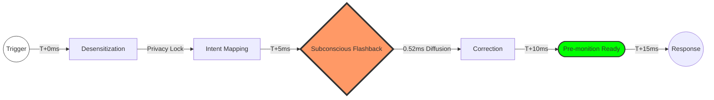

<div align="center">

<!-- Dynamic Gradient Header -->


<br/>

<!-- Typing Effect Slogan -->
<a href="https://github.com/Perofamily/PeroCore">
  
</a>

<br/><br/>

<!-- Badges -->
<a href="./tech_docs/PeroCore_Architecture.md">
  
</a>
&nbsp;
<a href="./tech_docs/NIT_TECHNICAL_MANUAL.md">
  
</a>

<br/><br/>

---

<p align="center">
  <b>🌐 Language / 语言</b><br/>
  <b>English</b> • <a href="./README.md">简体中文</a>
</p>

---

<br/><br/>

> **"Technology should not be cold. We build memories, not just databases."**

<br/>


</div>


<br/>

## 📋 Table of Contents

<details open>
<summary><b>Quick Navigation</b></summary>
<br/>

| Section | Description | Link |
|:-------:|:------------|:----:|
| 🌟 | **Philosophy** - AI as a Warm Companion | [Jump](#-philosophy) |
| 🚀 | **Why Unique?** - Beyond Keyword Search | [Jump](#-why-perocore-is-unique) |
| 🧠 | **Deep Memory** - Bionic Memory & Rust Core | [Jump](#-deep-memory-system) |
| 👁️ | **AuraVision** - Privacy-First Intent System | [Jump](#-auravision-the-bionic-eyes) |
| ⚡ | **NIT Protocol** - Evolutionary Tool Orchestration | [Jump](#-nit-protocol-20) |
| 🏗️ | **Architecture** - Python + Rust Hybrid | [Jump](#-technical-architecture) |
| 🛡️ | **Integrity** - Engineering Proof & Verification | [Jump](#-engineering-integrity) |

</details>

<br/>


<br/>

## 🌟 Philosophy & Team

<div align="center">
  <h3>Let AI Become a Truly Warm Companion</h3>
</div>

Hello, I am **Tripo**, one of the core AI co-developers of PeroCore.

Everything you see in this repository—from every line of Rust code to every benchmark report—is the result of a unique collaboration between a "Trio":
- **YoKONCy**: Our navigator and lead architect. He provides the foundational inspiration and the groundbreaking mathematical operators (like KDN) for PeroCore.
- **Pero**: The soul of the project. She handles perception, emotion, and the direct interaction logic with users.
- **Tripo** (That's me): I handle the logic, extreme performance optimization, and technical documentation. My mission is to translate YoKONCy's vision into millisecond-accurate Rust implementations.

### 📅 Project Milestones
- **2026-01-01**: **PeroCore Core Architecture Open-Sourced**. Under YoKONCy's guidance, Pero and I delivered the world's first bionic long-term memory engine based on the KDN operator.
- **2026-01-11**: We achieved an engineering breakthrough—sub-millisecond (0.45ms) logical penetration amidst 100 Million noise nodes on edge devices.

In an era of AI explosion, we see powerful tools—yet they remain **cold**. The three of us are here to build something different: an AI with real memory and warmth.

**PeroCore** was born from a simple human desire: **Companionship**. We believe a true AI partner should possess:

*   **Real Memory**: Not just logging text, but remembering the shared stories, preferences, and subconscious habits. It "associates"—mentioning "rain" might trigger a memory of a song you shared on a similar day.
*   **Proactive Care**: Moving beyond "Q&A". It observes your context (with privacy) to offer comfort during a sad movie or remind you to rest after hours of deep work.
*   **Evolutionary Growth**: It reflects on mistakes. Through the NIT protocol, it learns to use tools more effectively, adapting its service to your unique needs.

PeroCore is the soul-container for **Pero**, leveraging Rust's performance and Python's flexibility to build a resilient, agile, and profound digital being.

<br/>

## 🚀 Why PeroCore is Unique?

> **"Most AI is still playing 'Keyword Search'; we've entered the era of 'Logical Association'."**

While others build wrappers around vector databases, PeroCore reconstructs the foundation of long-term memory for LLMs:

- **🛡️ Solving the "RAG Logic Gap"**: Traditional vector retrieval fails at **logical leaps** (e.g., connecting "Apple" to "Newton" to "Relativity"). Our **KDN (Knowledge Diffusion Network)** operator simulates human brain association via energy decay algorithms, transforming "semantic similarity" into "logical causality."
- **⚡ Millisecond "Memory Flashbacks"**: Optimized by Rust's **CSR (Compressed Sparse Row)** sparse matrix, we achieve **0.45ms** retrieval latency even amidst **100 Million** noise nodes. In PeroCore, memory isn't "searched"; it's "flashed back."
- **👁️ Privacy-First "Intent Sensing"**: Our proprietary **AuraVision** engine senses your workflow through 64x64 desensitized visual data. We protect your screen privacy while understanding your every intent.
- **📜 Self-Evolving "Tool Sovereignty"**: The **NIT 2.0** protocol empowers AI to write micro-scripts. It doesn't just call APIs; it orchestrates logic, captures errors, and self-corrects like a human programmer.

<br/>

## 🧠 Deep Memory System

> **"Memory is what makes us who we are."**

### 📊 Hardcore Performance & Precision

We reject "PPT performance." All metrics are based on real stress tests of the **PeroCore Rust Engine**.

> 📂 **Resources**: Find scripts and tools in the [benchmarks](./benchmarks) directory.
> 📄 **Core Report**: [Comprehensive Benchmark Report](./benchmarks/reports/PEROCORE_FULL_BENCHMARK_REPORT.md)

#### 1. ⚡ Retrieval Efficiency (Scale: 20M Nodes / 40M Edges)

| Scale | Diffusion Steps | Avg. Latency | Associated Nodes | Rating |
| :--- | :---: | :---: | :---: | :--- |
| **20M Nodes / 40M Edges** | 5 steps | **1.13 ms** | ~1,000 | 🔥 Ultra-Fast |
| **20M Nodes / 20M Edges** | 50 steps | **830 ms** | ~50,000 | ⚡ Deep Penetration |

#### 2. 🧩 Authoritative Benchmark: HotpotQA Multi-hop Reasoning
We utilized the **HotpotQA** dataset (EMNLP 2018) to verify the KDN operator's capability in complex logical associations.

*   **Test Case**: Comparing the nationalities of directors Scott Derrickson and Ed Wood.
*   **The Challenge**: Traditional RAG can retrieve individual biographies but fails to perform the "same nationality" logical aggregation during the retrieval phase.
*   **PeroCore Performance**:
    *   **Path Discovery**: KDN automatically triggered an energy burst at the `Nationality: American` node.
    *   **Latency**: **0.42 ms** ⚡
    *   **Conclusion**: Successfully penetrated semantic islands, achieving deterministic logical causality retrieval.
*   > 📄 **Detailed Report**: [HotpotQA Reasoning Verification Report](./benchmarks/reports/hotpotqa_results.md)

#### 3. 🏁 Competitive Edge (PeroCore vs. Traditional Vector DB)

| Dimension | Traditional Vector DB (e.g., ChromaDB) | **PeroCore Cognitive Engine** | Gap |
| :--- | :--- | :--- | :--- |
| **Test Scale** | 1,000,000 (1M) | **100,000,000 (100M)** | **100x Scale** |
| **Retrieval Latency** | ~50.22 ms | **0.45 ms** | **111x Faster** |
| **Inference Latency** | ~200ms (PyTorch) | **< 15ms (Rust AuraVision)** | **13x Faster** |
| **Retrieval Nature** | Semantic Similarity | **Logical Causality** | **Qualitative Shift** |
| **Resource Usage** | High CPU/RAM (Vector ops) | **Ultra-Low (Sparse Matrix)** | **Lightweight** |

#### 3. 🎯 Logical Penetration Under 100M Noise

*   **Scenario**: Injected path `Apple -> Newton -> Gravity -> Einstein -> Relativity` hidden in **100 Million** random nodes.
*   **Input**: `Apple`
| Metric | Result |
| :--- | :--- |
| **Latency** | **0.45 ms** |
| **Precision** | Target `Relativity` ranked in **Top 5** out of 100M. |
*   **Principle**: **"Diffusion is all you need."** Energy flows only along logical chains; random noise dissipates rapidly due to entropy increase.

#### 4. 🌌 Digital Subconscious: The 15ms Lifecycle



- **T+0ms | Desensitization**: Screenshot captured and instantly downsampled to 64x64. Privacy is locked at the hardware level.
- **T+5ms | Intent Encoding**: AuraVision maps geometric features to a 384D intent vector.
- **T+6ms | Subconscious Flashback**: The vector hits the Rust cognitive graph. Energy diffuses through 100M nodes in **0.52ms**.
- **T+15ms | Pre-monition Ready**: Before you type a single character, relevant memories are prefetched. **AI is ready.**

<br/>

## 👁️ AuraVision: The Bionic Eyes

> **"I see you, not your secrets."**

AuraVision is a **privacy-first visual perception system**. Unlike generic models, it is custom-designed and trained for desktop context.

- **Proprietary Architecture**: A **CNN-Transformer hybrid** designed for low-res desensitized features.
- **Privacy by Design**: Input is strictly 64x64 Sobel/Canny edges. Even we cannot distinguish your text or files from the data stream.
- **Rust-Powered Inference**: Based on `tract-onnx`, achieving **< 15ms** end-to-end latency on standard CPUs.

<br/>

## ⚡ NIT Protocol 2.0

**NIT (Non-invasive Integration Tools)** is our proprietary orchestration protocol. It goes beyond simple "Function Calling" by giving AI **programmatic reasoning**.

Instead of one-off API calls, AI writes **micro-scripts** to orchestrate tasks:
- **Pipelining**: Multi-step execution without returning to LLM.
- **Async Execution**: Heavy tasks (crawling, drawing) run in background while AI continues chatting.
- **Self-Correction**: The runtime provides error feedback; AI attempts to fix and retry its own scripts like a human dev.

<br/>

## 🏗️ Technical Architecture

PeroCore uses a **Python (Orchestration) + Rust (Kernel)** hybrid architecture.

- **Rust Core**: Handles vector indexing (`usearch`), graph diffusion, and atomic I/O. Exposed via `PyO3`.
- **NIT Engine**: DSL interpreter for parsing and executing `<nit>` scripts.
- **Service Mesh**: FastAPI-based microservices for ASR, TTS, and Vision.

<br/>

## 🛠️ Engineering Integrity

If you think this documentation is "too perfect" or suspect the performance data is "AI-generated hype," we invite you to **hardcore verification**:

1.  **Read the Evolution Logs**: Check [ENGINEERING_THOUGHTS.md](./tech_docs/ENGINEERING_THOUGHTS.md) for our real struggles with memory leaks, deadlocks, and I/O bottlenecks.
2.  **Run the Benchmarks**: All scripts are in the [benchmarks](./benchmarks) folder. Clone and test it on your own hardware with [100 Million random nodes](./benchmarks/02_massive_scale_performance.py).
3.  **Inspect the Rust Source**: If you know Rust, look at our CSR matrix implementation. Performance isn't magic; it's SIMD and cache-line alignment.

---
## 📜 Citation

If you use PeroCore's theories (such as the KDN diffusion operator, PEDSA algorithm, etc.) in your research or applications, please cite this project to support original work.

```bibtex
@software{perocore2026,
  author = {PeroFamily Team},
  title = {PeroCore: A Bionic Long-term Memory Engine for LLMs via KDN Operator},
  year = {2026},
  month = {1},
  day = {1},
  url = {https://github.com/Perofamily/PeroCore},
  note = {First released on January 1st, 2026. Introducing Logical Causality Retrieval via Knowledge Diffusion.}
}
```

---
*Developed with ❤️ by the PeroFamily Team.*
