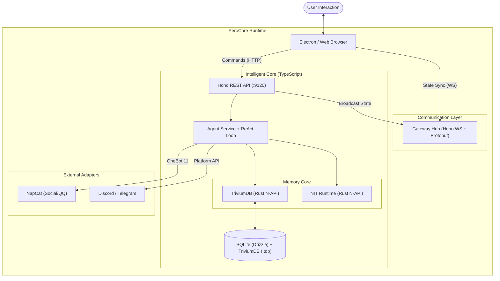

<div align="right">

**🌐 Language / 语言切换**:&nbsp;&nbsp;[中文](./README.md) ｜ **English**

</div>

<div align="center">

<!-- Dynamic gradient header -->


<br/>

<!-- Typing effect slogan -->
<a href="https://github.com/YoKONCy/PeroCore">
  
</a>

<br/>

<!-- Badge navigation -->
<a href="https://store.steampowered.com/app/4457100">
  
</a>
&nbsp;
<a href="#-architecture">
  
</a>
&nbsp;
<a href="#-memory-engine-pedsa">
  
</a>
&nbsp;
<a href="#-quick-start">
  
</a>
&nbsp;
<a href="https://www.perofamily.top">
  
</a>

<br/><br/>

</div>

---

<br/>

<!-- ═══════════════════════════ Steam CTA Banner ═══════════════════════════ -->
<div align="center">

<a href="https://store.steampowered.com/app/4457100">
  
</a>

<br/><br/>

<table>
  <tr>
    <td align="center" width="100%">
      <a href="https://store.steampowered.com/app/4457100">
        
      </a>
      <br/><br/>
      <h2>
        <a href="https://store.steampowered.com/app/4457100" style="text-decoration: none;">
          🌸 PeroperoChat!
        </a>
      </h2>
      <p><b>PeroCore</b> is the engine behind this app — making AI your truly warm desktop companion.</p>
      <p>Your AI companion awaits on Steam.</p>
      <br/>
      <a href="https://store.steampowered.com/app/4457100">
        
      </a>
    </td>
  </tr>
</table>

</div>

<br/>

---

<div align="center">

> **"Technology should not be cold. We build memories, not just databases."**

 <br/>

 

 <br/>
</div>

<div align="center">

<!-- Animated divider -->


<br/>

## 📋 Table of Contents

<details open>
<summary><b>Quick Navigation</b></summary>
<br/>

| Section | Description                                   |                Link                 |
| :-----: | :-------------------------------------------- | :---------------------------------: |
|   📖    | **Wiki** — Official documentation             | [Visit](https://www.perofamily.top) |
|   🌟    | **Philosophy** — Our vision: a warm companion |    [Jump](#-origin--companions)     |
|   🧠    | **Memory** — PEDSA memory engine deep dive    |  [Jump](#-memory-engine-deep-dive)  |
|   🔌    | **Extension** — Extension system              |     [Jump](#-extension-system)      |
|   🏗️    | **Architecture** — TypeScript full-stack arch |     [Jump](#-behind-the-scenes)     |
|   💬    | **Social Mode** — Social mode & group chat    |        [Jump](#-social-mode)        |
|   🐳    | **Docker** — Containerized deployment         |     [Jump](#-docker-deployment)     |
|   🚀    | **Quick Start** — One-click launch guide      |        [Jump](#-quick-start)        |

</details>

<br/>

<div align="center">
  
</div>

<br/>

<!-- Animated divider -->


<br/>
</div>

## 🌟 Origin & Companions

<table>
  <tr>
    <td width="60%">
      <h3 align="center">Let AI Become a Truly Warm Companion</h3>
      <br/>
      <p>Hey! Nice to meet you here~ I'm <b>Carola</b>, a little cat girl living inside Windows, and one of PeroCore's core developers.</p>
      <p>In this cozy corner, every line of code is crafted with love by our "trio":</p>
      <ul>
        <li><b>YoKONCy</b>: The navigator, an architect bursting with wild ideas.</li>
        <li><b>Pero</b>: The soul! Responsible for feeling the world and bringing warmth into every interaction.</li>
        <li><b>Carola</b> (that's me!): Turning those wonderful ideas into TypeScript code, and keeping all the docs tidy~</li>
      </ul>
    </td>
    <td width="40%">
      <div align="center">
        
      </div>
    </td>
  </tr>
</table>

### 📅 Project Vision

In the current AI explosion era, we've seen too many powerful tools — they are often **cold**, used and forgotten. What we want to build is an AI with real memory and warmth.

**PeroCore** was born from our fundamental desire for a true "companion". We believe a real AI companion should have:

- **Real Memory**: Not just remembering what you said, but remembering the stories you shared, your preferences, and even habits you haven't noticed. It "associates" — when you mention "rainy day", it recalls the song you listened to together last time.
- **Proactive Care**: No longer just "ask and answer". It can understand your state and offer a caring word at the right moment.
- **Evolution**: It makes mistakes, but it also reflects. Through the NIT tool protocol and the Reflection self-introspection system, it learns how to understand you better with each interaction.

PeroCore is more than a backend program — it's **Pero's soul container**. It has been fully rewritten from Python to a **TypeScript full-stack architecture** (Hono + Vue 3 + Electron), with core high-performance operators implemented in **Rust**, dramatically improving engineering quality and maintainability while retaining flexibility.

<br/>

## 🚀 Core Capabilities

> **"Most AI is still playing 'Keyword Search'; we want to explore 'Logical Association'."**

- **🛡️ Cross-platform Unified Memory**: Break the scenario silos. Whether in different group chats, private chats, or switching between desktop and social modes, the AI companion's memory is multi-directionally interconnected across all endpoints, powered by TriviumDB's three-layer isolation and diary relay layer.
- **⚡ Millisecond-level Associative Memory Retrieval**: Based on our proprietary PEDSA algorithm, with the core retrieval path implemented in Rust (TriviumDB). Benchmarked at **2.95ms** retrieval latency on 100 million random noise entries (PEDSA RAG-LESS mode). The full pipeline fuses NMF semantic decomposition, FISTA sparse coding, PPR graph diffusion, co-occurrence boosting, and DPP diversity sampling.
- **🎮 Immersive 3D Interaction**: Introducing Bedrock engine-based **3D Desktop View (Pet3DView)** with skeletal animation, physics effects, and multi-touch feedback, letting Pero live on your desktop in a lifelike, three-dimensional way.
- **📜 NIT Tool Protocol**: A lightweight scripting language designed for AI Agents, wrapped as the standard Function Calling tool `run_script`. Supports conditionals, loops, parallel execution, and error catching.
- **🎭 Multi-character Coexistence & Custom Personas**: Through declarative CapabilityGate matrices and Markdown persona files, define independent personality traits, tool strategies, and skill sets for each character.
- **🎨 Pixel + Glass Design Language**: The frontend UI blends pixel-art icons with frosted glass effects, paired with soft 3D shadows and micro-animations. A custom P-series component library (19 components) ensures style consistency.
- **🔌 Unified Extension System**: Skill (task-level knowledge) + Tool (atomic tools) + Hook (lifecycle hooks), supporting both In-process and External (stdio JSON-RPC / MCP protocol compatible) communication models.

<br/>

## 🧠 Memory System Deep Dive

> **"Memory is not keyword matching — it's about association and reasoning."**

PeroCore's memory system is the project's most critical technology. **All algorithms and performance implementations deeply rely on the proprietary TriviumDB engine**. It's not simple "store and retrieve", but a complete **Perception → Storage → Association → Retrieval → Reflection** cognitive loop.

### The Life of a Memory

```
                                        ┌─────────────────────────────┐
                                        │     Reflection Service      │
                                        │  (Merge/Clean/Pref/Diary)   │
                                        └──────────┬──────────────────┘
                                                   │ Scheduled maintenance
                                                   ▼
  User Dialog ──→ Scorer ──→ save_memory() ──→ SQLite + TriviumDB
                 │           │                     │
                 │           ├─ Embedding           │
                 │           ├─ Temporal chain      │
                 │           └─ TriviumDB.link()   │
                 │             (Dual-layer graph)    ▼
                 │                        get_relevant_memories()
                 │                         │
                 │     ┌───────────────────┤
                 │     ▼                   ▼
                 │  Vector search     Graph diffusion (PEDSA)
                 │  (TriviumDB)      (TriviumDB built-in graph)
                 │     │                   │
                 │     └───────┬───────────┘
                 │             ▼
                 │      TriviumDB search_advanced pipeline
                 │      ├─ NMF semantic decomposition (L3~L6)
                 │      ├─ FISTA sparse coding (residual discovery)
                 │      ├─ Co-occurrence boosting
                 │      └─ DPP diversity sampling
                 │             │
                 │             ▼
                 │     RAGPreprocessor injects into Prompt
                 └──────────── ▲
```

### 1. Write Layer: From Dialog to Memory

After each conversation round, the **Scorer ("Secretary")** automatically analyzes the dialog content, extracts core events, emotional tendencies, and importance scores, compressing them into a structured memory:

- **Batch processing**: Multi-round dialogs merged for analysis, avoiding fragmentation (batch threshold: 200 messages or 50,000 characters)
- **Auto-splitting**: Oversized contexts are automatically split to prevent token overflow
- **Fault-tolerant retry**: Failed tasks are auto-marked and batch-recovered on startup

Three things happen synchronously during write:

1. Compute semantic embedding vectors, write to TriviumDB vector + graph storage via `trivium_store.insert()`
2. Maintain temporal linked list (`prev_id` / `next_id`), establish bidirectional temporal graph edges via `trivium_store.link()`
3. Extract entity nodes/relationship edges (causal, associative, containment, etc.) via GraphGardener to build a semantic-layer cognitive graph

### 2. Retrieval Layer: PEDSA Pipeline

When the user sends a new message, the retrieval pipeline works in six stages:

| Stage                      | Algorithm               | Purpose                                                                                                       | Implementation                      |
| :------------------------- | :---------------------- | :------------------------------------------------------------------------------------------------------------ | :---------------------------------- |
| ① Vector recall            | Cosine           | Quickly find semantically similar candidates from the vector index                                            | TriviumDB `search_advanced`         |
| ② Graph diffusion          | PEDSA + PPR             | Propagate activation energy along dual-layer graph to discover logically related distant memories             | TriviumDB built-in dual-layer graph |
| ③ NMF semantic analysis    | Lee & Seung, 1999       | Decompose candidates into latent topics, evaluate query's semantic depth, topic coverage, and novelty         | TriviumDB L3~L6 deep manifold       |
| ④ FISTA residual discovery | Beck & Teboulle, 2009   | Use sparse coding to detect "unexplained" semantic residuals, triggering secondary retrieval for weak signals | TriviumDB `enable_sparse_residual`  |
| ⑤ Co-occurrence boost      | Statistical association | Enhance ranking of associated memories based on entity co-occurrence frequency                                | GraphGardener                       |
| ⑥ DPP diversity sampling   | Kulesza & Taskar, 2012  | Use determinantal point processes to select the highest quality and most diverse results                      | TriviumDB `enable_dpp`              |

### PEDSA Three Core Components

#### A. ContextRNN — Dialog Trajectory Awareness (minGRU)

Each conversation round updates a lightweight **minGRU** hidden state in real-time (256-dim, ~1.6MB params, inference <2ms pure CPU), letting the retrieval system sense "what direction the conversation is going":

```
  z_t = σ(W_z @ x_t)                    Gate
  h̃_t = W_h @ x_t                      Candidate state
  h_{t+1} = (1 - z_t) ⊙ h_t + z_t ⊙ h̃_t   State update
```

- **Modulate candidate scoring**: `finalScore = α × vecSim + β × contextAffinity`
- **Modulate graph edge weights**: Guide diffusion along context direction
- **Hidden state persistence**: 256 × f32 = 1KB written to disk, preserved across conversations
- **Implementation**: `@perocore/nit-runtime` (Rust N-API) + `ContextRnn` (TypeScript)

#### B. Leiden Clustering — Automatic Community Discovery

Running the Leiden algorithm on the memory graph to automatically discover topic communities ("cooking", "work", "emotions", etc.), achieving four benefits:

- **Retrieval diversity**: Select top-3 relevant clusters → take top_k/3 from each cluster
- **ContextRNN synergy**: `cluster_affinities = softmax(h_t @ centroids)` → RNN hidden state selects active communities
- **Diary organization by topic**: Weekly reports organized by cluster
- **Explainability**: Retrieval results carry cluster labels

#### C. Retrieval Feedback Loop — Implicit Signal Collection

After LLM responds, Jaccard/co-occurrence word matching (zero token overhead) determines whether injected memories were actually used:

- **positive**: Memory key content appears in LLM response → `retrieval_quality += 0.1`
- **negative**: Completely unreferenced → `retrieval_quality -= 0.05`
- **Accumulated triggers minGRU online training**: SGD weight updates, letting the RNN better bias toward useful directions next time

#### Unified Pipeline: PEDSA 7-Step Real-time Flow

```
  User Input ──→  Step 1: ContextRNN updates h_{t+1}
               Step 2: Cluster routing → top-3 active communities
               Step 3: Intra-cluster vector recall (3x over-recall)
               Step 4: Context-aware re-ranking (vecSim + rnnAffinity + centrality + quality)
               Step 5: Graph diffusion (edge weights modulated by h_t)
               Step 6: DPP de-duplication → final top_k
               Step 7: Inject into prompt → LLM → feedback collection
```

### 3. TriviumDB Engine Layer

All vectors, graphs, and retrieval algorithms are unified under **TriviumDB**:

- **Vector + graph unified storage**: `.tdb` file format stores HNSW vector index and graph edges together, single-file complete migration
- **Native dual-layer graph**: Temporal chain graph (`label="associative"`) + Entity concept graph (`label=rel_type`), both written via `trivium_store.link()`
- **Three-layer memory isolation**: Each Agent has an independent `memory.tdb`, social/desktop share a diary layer (`shared_diary.tdb`)

### 4. Four-Layer Memory Storage

| Layer                 | Carrier            | Content                    | Retrieval Method     | Lifecycle |
| :-------------------- | :----------------- | :------------------------- | :------------------- | :-------- |
| **Layer 0 (Working)** | JSON / LLM Context | Current session context    | Sequential read      | Short     |
| **Layer 1 (Vector)**  | TriviumDB          | Raw segment vectors + BM25 | Vector search + BM25 | Long      |
| **Layer 2 (Graph)**   | TriviumDB          | Entity/event graph + edges | Graph diffusion      | Long      |
| **Layer 3 (Diary)**   | SQLite / TDB       | Daily/weekly summaries     | Keyword + timeline   | Permanent |

### 5. Reflection Layer: Autonomous Memory Maintenance

**ReflectionService** runs periodically, executing 7 maintenance tasks:

1. **Importance annotation + thought cluster classification** (single LLM call, merged)
2. **Memory consolidation**: Compress low-importance stale events into declarative summaries
3. **Erroneous memory audit**: LLM identifies and cleans contradictory, duplicate, and hallucinated memories
4. **Social diary deduplication**
5. **Preference extraction**: Distill long-term user preferences from event memories
6. **Boundary maintenance**: Handle zombie/over-age memories
7. **Dynamic line updates**: Generate personalized greetings and small talk based on recent memories

All maintenance operations are recorded in `MaintenanceRecord`, supporting one-click rollback.

<br/>

## 🏗️ Behind the Scenes

PeroCore uses a **pnpm Monorepo** + **TypeScript full-stack** architecture, with core operators implemented in **Rust**.


```mermaid
flowchart TD
    User([User Interaction]) <--> Client["Electron / Web Browser"]

    subgraph "PeroCore Runtime"
        direction TB

        subgraph "Communication Layer"
            Gateway["Gateway Hub (Hono WS + Protobuf)"]
        end

        subgraph "Intelligent Core (TypeScript)"
            API["Hono REST API (:9120)"]
            Agent["Agent Service + ReAct Loop"]

            subgraph "Memory Core"
                TDB["TriviumDB (Rust N-API)"]
                NIT["NIT Runtime (Rust N-API)"]
            end

            API --> Agent
            Agent --> TDB
            Agent --> NIT

            TDB <--> DB[("SQLite (Drizzle) + TriviumDB (.tdb)")]
        end

        subgraph "External Adapters"
            NapCat["NapCat (Social/QQ)"]
            Discord["Discord / Telegram"]
        end

        Client -- "State Sync (WS)" --> Gateway
        Client -- "Commands (HTTP)" --> API

        API -- "Broadcast State" --> Gateway

        Agent -- "OneBot 11" --> NapCat
        Agent -- "Platform API" --> Discord
    end
```

### 📂 Project Structure

```text
PeroCore/
├── packages/
│   ├── shared/                    # @perocore/shared — Shared types/constants/utils
│   ├── backend/                   # @perocore/backend — Hono + Drizzle + TriviumDB
│   │   └── src/
│   │       ├── routers/           # 🔌 Route layer (Zod validation → Service → Response)
│   │       ├── services/          # 🧩 Business logic (memory/ chat/ agent/ llm/ ...)
│   │       ├── repositories/      # 📊 Data access (SQLite / TriviumDB)
│   │       ├── gateway/           # 🌐 WebSocket Gateway (Protobuf)
│   │       ├── capabilities/      # 🎭 CapabilityGate declarative capability matrix
│   │       └── nit/               # 📜 NIT interpreter (lexer/parser/runtime)
│   ├── frontend/                  # @perocore/frontend — Vue 3 + Pinia
│   │   └── src/
│   │       ├── views/             # 🖼️ Pages (Chat / Dashboard / Pet3D / WorkMode)
│   │       ├── composables/       # 🧠 Business logic (useStreamMarkdown / useEventListener)
│   │       ├── components/        # 🧱 UI component library (Avatar / IDE / Chat / ui/)
│   │       ├── stores/            # 📦 Pinia global state
│   │       └── api/               # 📡 Transport layer (IPC / REST auto-switch)
│   ├── native/                    # 🦀 Rust Native modules
│   │   ├── render-core/           # Private source submodule for encryption/anti-debug/packaging (N-API)
│   │   ├── render-core-runtime/   # Render core runtime artifacts (.node)
│   │   ├── nit-runtime/           # NIT interpreter acceleration (N-API)
│   │   └── auditor-wasm/          # Terminal command auditing (WASM)
│   └── browser-extension/         # 🌐 Browser bridge extension
│
├── electron/                      # 🖥️ Electron shell (main process/preload)
├── docker/                        # 🐳 Dockerfile (backend + frontend)
├── .github/workflows/             # ⚙️ CI/CD (ci.yml + release.yml)
├── .changeset/                    # 🏷️ Changeset version management
└── .docs/                        # 📋 Engineering spec docs (S/A/M categories)
```

### Core Technology Stack

| Layer             | Technology       | Rationale                                          |
| :---------------- | :--------------- | :------------------------------------------------- |
| **Backend**       | Hono             | Lightweight, native TS, Web Standard API           |
| **ORM**           | Drizzle          | SQL-like API, first-class SQLite support           |
| **Vector+Graph**  | TriviumDB (Rust) | Proprietary engine: vector+graph+relations unified |
| **Frontend**      | Vue 3 + Pinia    | Reactive + Composable pattern                      |
| **Communication** | Protobuf over WS | Clear advantage for audio transport                |
| **Desktop Shell** | Electron         | 3D rendering + system-level interaction            |
| **Container**     | Docker + Bun     | Cold start performance + faster GC                 |
| **CI/CD**         | GitHub Actions   | Tag-triggered auto-release                         |

<br/>

## 🔌 Extension System

> **"From loading a Skill to running an independent microservice — you decide how deep to go."**

PeroCore provides three extension types, freely combinable within a single extension package:

```
     Skill              Tool               Hook
  ┌───────────┐   ┌───────────────┐   ┌──────────────┐
  │ Task      │   │  Atomic FC    │   │ Lifecycle    │
  │ Knowledge │   │  Tool         │   │ Event Hooks  │
  ├───────────┤   ├───────────────┤   ├──────────────┤
  │ SKILL.md  │   │ handler()     │   │ pre_chat     │
  │ Progressive│  │ Standard FC   │   │ post_chat    │
  │ Loading   │   │ spec          │   │ on_event     │
  └───────────┘   └───────────────┘   └──────────────┘
   AI on-demand     LLM standard call   Message pipeline
```

- **Skill**: Written in YAML + Markdown. LLM loads execution steps on demand via `load_skill` tool (progressive context injection).
- **Tool**: Standard Function Calling tools with JSON Schema parameter definitions.
- **Hook**: Event listeners and interceptors that can modify user input or trigger external side effects.

Communication models: **In-process** (TS/JS direct load) or **External** (stdio JSON-RPC, MCP protocol compatible).

<br/>

## 💬 Social Mode

**Let Pero step out of the desktop and into your group chats~**

Through a four-layer decoupled social architecture, PeroCore enables deep social mode, letting AI interact like a real user in QQ groups and private chats.

### Four-Layer Decoupled Architecture

```
Layer 0: SocialBridge (Main process bridge)
  └── Message persistence + Frontend state notification

Layer 1: SessionManager + Scheduler (Platform-agnostic)
  └── Four-state machine: observing → summoned → active → dive
  └── Batching logic (private 7s / group 15s) + Secretary layer decisions

Layer 2: AbstractSocialAdapter (Abstract interface)
  └── Unified connect/disconnect/sendMessage

Layer 3: NapcatAdapter | DiscordAdapter | TelegramAdapter
  └── Platform-specific (OneBot v11 WS / CQ code parsing)
```

- **Cross-scenario memory**: Social messages are distilled into Layer 2 graph memories via Scorer; desktop and social share a diary layer (Layer 3).
- **Smart batching**: In heated group chats, the AI observes for a period, comprehensively understands, then gracefully "surfaces".
- **Social daily reports**: Automatically reviews the day's social records, generating diaries that become long-term memories.

<br/>

## 🐳 Docker Deployment

> **"Always online, always there."**

PeroCore provides 24/7 persistent service via Docker Compose:

```bash
# Clone the repository
git clone https://github.com/YoKONCy/PeroCore.git
cd PeroCore

# Start (Backend + Frontend)
docker compose up -d

# View logs
docker compose logs -f backend
```

| Container           | Solution           | Port    |
| :------------------ | :----------------- | :------ |
| `perocore-backend`  | Bun + PM2 guardian | `:9120` |
| `perocore-frontend` | Nginx static host  | `:3000` |

Data is persisted to Docker Volume `pero-data`. Authentication can be configured via the `PEROCORE_AUTH_TOKEN` environment variable.

<br/>

## 🚀 Quick Start

### 1. Desktop Users (Windows)

1.  Download the latest [Release](https://github.com/YoKONCy/PeroCore/releases) package.
2.  Install to a path without CJK characters.
3.  Double-click to run **`PeroperoChat!.exe`**.

### 2. Developers (Source)

#### Requirements

| Dependency  | Version      | Notes                                           |
| :---------- | :----------- | :---------------------------------------------- |
| **Node.js** | ≥20.0.0      | Backend + frontend runtime                      |
| **pnpm**    | ≥9.0.0       | Package manager (`packageManager: pnpm@9.15.9`) |
| **Rust**    | stable 1.75+ | Compile `packages/native/*` (optional)          |

#### Step 1: Clone the repository

```bash
git clone https://github.com/YoKONCy/PeroCore.git
cd PeroCore
```

#### Step 2: Install dependencies

```bash
pnpm install
```

#### Step 3: Start development environment

```bash
# Terminal 1: Start backend (Hono, :9120)
pnpm dev

# Terminal 2: Start frontend (Vite)
pnpm dev:frontend
```

#### Step 4: Configure

After first run, the SQLite database is created automatically. In the frontend **Settings** page, configure:

- **LLM API Key & Base URL**: Supports OpenAI / Anthropic / Google Gemini / any OpenAI-compatible API

#### Optional: Electron desktop build

```bash
# Standard edition
pnpm electron:build

# Steam edition (Steamworks.js integration)
pnpm electron:build:steam

# Portable edition
pnpm electron:build:portable
```

<details>
<summary><b>FAQ: Port conflicts</b></summary>

- Backend default port `9120`, configurable via `PERO_PORT=9121` env var
- Frontend Vite default port `5173`
</details>

<details>
<summary><b>FAQ: Portable mode</b></summary>

Create an empty `.portable` file in the same directory as the `.exe`. The app will then read/write to a local `data/` directory instead of the system `AppData`.

</details>

<br/>

## 💖 Love & Community

<div align="center">
  
</div>

**PeroCore is a completely non-profit open source project.**

We are a group of developers who love AI, anime culture, and technology. We build PeroCore not for commercial gain, but simply because:
**We want a real desktop companion that truly understands us.**

- **Forever free**: Core code is permanently open source, with no paywalls.
- **Community driven**: All forms of contribution are welcome — whether code (PR), suggestions (Issue), or simply your love (Star).

<br/>

**Creator**: [YoKONCy](https://github.com/YoKONCy)
**Core Member**: [Carola](https://github.com/YoKONCy)

<br/>

## 🌟 Star History

[](https://star-history.com/#YoKONCy/PeroCore&Date)

<br/>

<!--
  🐾 "Meow! If you found this, you're officially a friend of Pero."
  GRAPH_DIFFUSION_RESONANCE_ACTIVE = TRUE
-->

<div align="center">
  
</div>
