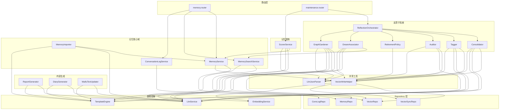

# 记忆系统架构规范

> **版本**：0.2.0（临时定稿，§10-13 暂定） · **更新时间**：2026-04-18
> **适用范围**：`packages/backend/src/services/memory/` 及其关联模块
> **依赖规范**：[04_BACKEND_ARCHITECTURE](./04_BACKEND_ARCHITECTURE.md)（三层架构 / DI 容器）

---

## 总览

PeroCore 的核心卖点是其庞大的记忆系统。本文档基于对原 Python 后端 **14 个源码文件 / ~8000+ 行** 的完整审查，定义 TypeScript 版的架构重设计方案。

> [!IMPORTANT]
> 本文档只涉及**架构重设计**（服务编排、代码边界、目录结构），**不改变现有记忆功能的业务语义**。

---

## 1. 原架构审计

### 1.1 源码全景

#### 核心服务层 (`services/memory/`)

| 原文件 | 行数 | 核心职责 |
|---|---|---|
| `memory_service.py` | **953** | 记忆 CRUD + 对话日志 CRUD + 语义检索 + 图谱可视化 + Tag Cloud |
| `reflection_service.py` | **1933** | 记忆整合 + 标注归簇 + 清理审计 + 梦境关联 + 图谱园丁 + 孤独记忆修复 + 维护撤销 |
| `scorer_service.py` | **1114** | 对话→记忆提炼 + 周报/社交日报/工作日志/桌宠日记/Waifu 台词更新 |
| `trivium_store.py` | **403** | TriviumDB 异步封装（向量 + 图谱 + 混合检索） |
| `trivium_sync_service.py` | **541** | TriviumDB 补偿同步队列（幂等去重 + 多 Store） |
| `memory_importer.py` | **155** | 故事→事件拆分→批量导入 |

#### 关联服务层

| 原文件 | 行数 | 与记忆系统的关系 |
|---|---|---|
| `embedding_service.py` | **169** | 向量编码门面（Local/API Provider 切换） |
| `embedding_provider.py` | **222** | 向量编码实现（sentence-transformers / httpx API） |
| `reindex_service.py` | **256** | 记忆→TriviumDB 全量重建 / 重索引 |
| `prompt_service.py` | **808** | 系统提示词编排（深度消费 `memory_context`） |
| `chain_service.py` | **412** | 思维链检索（消费记忆 + 向量 + 周报生成入口） |
| `session_service.py` | **296** | 工作模式管理（退出时调 ScorerService 总结） |
| `aura_vision_service.py` | **479** | 视觉感知（直接消费 `trivium_store` 做锚点匹配） |
| `social_memory_service.py` | **297** | 社交记忆（独立 TriviumDB Store `social`） |

#### MDP 提示词清单

**Scorer 提示词 (7 个)**：

| 文件 | 消费者 |
|---|---|
| `tasks/memory/scorer/summary` | `ScorerService.process_interaction()` |
| `tasks/memory/scorer/user_input` | `ScorerService.process_interaction()` |
| `tasks/memory/scorer/weekly_report` | `ScorerService.generate_weekly_report()` |
| `tasks/memory/scorer/social_daily` | `ScorerService.generate_social_daily_report()` |
| `tasks/memory/scorer/work_log` | `ScorerService.generate_work_log_summary()` |
| `tasks/memory/scorer/desktop_diary` | `ScorerService.generate_desktop_diary()` |
| `tasks/memory/scorer/waifu_text_updater` | `ScorerService.update_waifu_texts()` |

**Reflection 提示词 (10 个)**：

| 文件 | 消费者 |
|---|---|
| `tasks/memory/reflection/importance_and_cluster` | `_tag_and_cluster_memories()` |
| `tasks/memory/reflection/importance_tagger` | 独立重要性标注 |
| `tasks/memory/reflection/memory_clusterizer` | 独立归簇 |
| `tasks/memory/reflection/memory_consolidator` | `_consolidate_memories()` |
| `tasks/memory/reflection/memory_auditor` | `_clean_invalid_memories()` |
| `tasks/memory/reflection/graph_builder` | `build_ontology_graph()` |
| `tasks/memory/reflection/relation` | `_analyze_relation()` (梦境关系判定) |
| `tasks/memory/reflection/preference_extractor` | `_extract_preferences()` |
| `tasks/memory/reflection/reflection_ui` | `run_maintenance()` (维护进度广播) |
| `tasks/memory/reflection/summary` | 通用摘要 |

### 1.2 核心问题诊断

#### ① 上帝类：MemoryService 5 合 1

混合了 **5 个完全不同的领域**：

- 记忆 CRUD (`save_memory`, `delete_by_msg_timestamp`)
- 对话日志 CRUD (`save_log`, `save_log_pair`, `query_logs`)
- 语义检索 (`get_relevant_memories`, `search_memories_simple`, `logical_flashback`)
- 图谱可视化 (`get_memory_graph`)
- Tag Cloud (`get_tag_cloud`)

#### ② 上帝类：ReflectionService 7 合 1 (1933 行!)

最庞大的单文件，混合了 7 种不相关职责：反思编排、记忆整合、标注归簇、错误审计、退役清理、梦境关联、图谱园丁。

#### ③ ScorerService 记忆提炼 + 内容生成混合

核心的 `process_interaction()` 之外，还承担了周报、社交日报、工作日志、桌宠日记、Waifu 台词更新（单方法 212 行）。

#### ④ 双数据源一致性无 Repository 层

`save_memory()` 方法内部直接操作 SQLite INSERT + Embedding 生成 + TriviumDB INSERT + 图谱 Link，没有 Repository 层隔离。

#### ⑤ Copy-Paste 反模式

| 被复制的模式 | 出现次数 | 分布 |
|---|---|---|
| 向量写入 + 补偿入队 | **10+** | `reflection_service.py` 6 处, `memory_service.py` 1 处, `social_memory_service.py` 1 处, 其他 |
| 向量删除 + 补偿入队 | **6+** | `reflection_service.py` 的整合/清理/边界维护/撤销 |
| LLM 配置获取逻辑 | **3 套** | Scorer / Reflection / Social 各一套几乎相同的实现 |
| LLM JSON 鲁棒解析 | **5+** | 每个需要解析 LLM JSON 输出的方法都重复了 ````json``` 提取逻辑 |

#### ⑥ 函数级循环依赖

`from services.memory.trivium_store import trivium_store` 在 `reflection_service.py` 中以**函数内 import** 形式出现 20+ 次，说明存在严重的循环依赖隐患。

#### ⑦ 视觉锚点维度混用

`AuraVisionService` 将 384D 视觉向量零填充至 512D 后与文本记忆（1536D）共享同一个 TriviumDB 实例，是架构隐患。

---

## 2. 数据流全景

```
用户对话
    │
    ▼
┌──────────────────────────────────────────────┐
│  AgentService.chat()                          │  ← 入口
│    ├── PromptService.compose()                │  ← 注入 memory_context
│    │     └── MemorySearchService.recall()      │
│    │           └── VectorRepo.search()         │  ← 向量+图谱检索
│    │           └── EmbeddingService.embed()     │  ← 查询向量化
│    │
│    ├── ConversationLogService.savePair()       │  ← 对话日志落库
│    │
│    └── ScorerService.processInteraction()      │  ← 异步后台
│          ├── LLM → 提炼记忆                    │
│          ├── MemoryService.create()             │
│          │     ├── MemoryRepo → SQLite INSERT   │
│          │     ├── VectorWriteHelper.upsert()   │  ← 向量+补偿
│          │     └── VectorRepo.link()            │  ← 时间链
│          └── ConversationLogRepo.updateMeta()   │
└──────────────────────────────────────────────┘

    ▼ (定时/手动触发)

┌──────────────────────────────────────────────┐
│  ReflectionOrchestrator.runMaintenance()       │  ← 后台维护
│    ├── Tagger.tagAndCluster()                  │  ← LLM 标注+归簇
│    ├── Consolidator.consolidate()              │  ← LLM 记忆整合
│    ├── Auditor.audit()                         │  ← LLM 错误审计
│    ├── RetirementPolicy.enforce()              │  ← 退役策略
│    ├── GraphGardener.build()                   │  ← 图谱园丁
│    └── DreamAssociator.dream()                 │  ← 梦境关联
└──────────────────────────────────────────────┘
```

---

### 2.5 核心枚举定义

以下枚举是记忆系统的底层分类字段，定义在 `@perocore/shared` 中，**新增值必须先更新本文档**。

#### MemorySource — 记忆来源

标记记忆从哪个场景/渠道产生。

| 值 | 含义 | 说明 |
|---|---|---|
| `desktop` | 桌面端 | 日常对话产生的记忆 |
| `work` | 工作模式 | 隔离会话，退出时自动生成工作日志 |
| `social` | 社交适配器 | QQ 等外部平台接入的对话记忆 |
| `group_chat` | 群聊模式 | 多 Agent 对话产生的记忆 |
| `mobile` | 移动端 | 移动端对话产生的记忆 |
| `scheduler` | 定时任务 | 记忆秘书等后台定时任务生成的记忆 |

#### MemoryType — 记忆类型

| 值 | 含义 |
|---|---|
| `event` | 事件型记忆（日常发生的事） |
| `fact` | 事实型记忆（客观信息/知识点） |
| `preference` | 偏好型记忆（用户的喜好/习惯） |
| `promise` | 承诺型记忆（用户或 AI 做出的约定） |
| `reflection` | 反思型记忆（Reflection 系统生成的整合记忆） |
| `summary` | 总结型记忆（对话摘要、工作日志等） |

#### Sentiment — 情感极性

由 Scorer 在对话→记忆提炼时自动标注，用于宠物状态联动和检索权重加成。

| 值 | 含义 |
|---|---|
| `happy` | 开心/积极 |
| `sad` | 悲伤/低落 |
| `neutral` | 中性/无明显情感 |
| `angry` | 愤怒/不满 |
| `surprised` | 惊讶 |
| `fearful` | 恐惧/担忧 |
| `disgusted` | 厌恶 |

---

## 3. v2 目录结构

在 `04_BACKEND_ARCHITECTURE.md` 第 7 节的基础上进一步细化 `services/memory/` 内部结构：

```
packages/backend/src/
├── services/
│   ├── memory/                          # 记忆核心域
│   │   ├── index.ts                     # 桶导出
│   │   ├── memoryService.ts             # 记忆 CRUD (纯业务编排)
│   │   ├── memorySearch.ts              # 语义检索 + 逻辑闪回
│   │   ├── conversationLog.ts           # 对话日志 CRUD (独立领域)
│   │   │
│   │   ├── reflection/                  # 反思子系统
│   │   │   ├── index.ts
│   │   │   ├── reflectionOrchestrator.ts    # run_maintenance 编排
│   │   │   ├── consolidator.ts              # 记忆整合
│   │   │   ├── tagger.ts                    # 重要性 + 标签 + 归簇
│   │   │   ├── auditor.ts                   # 错误记忆清理
│   │   │   ├── retirementPolicy.ts          # 边界退役
│   │   │   ├── dreamAssociator.ts           # 梦境关联 + 孤独记忆
│   │   │   └── graphGardener.ts             # 图谱园丁 (Entity + 共现)
│   │   │
│   │   ├── scorer/                      # 记忆提炼
│   │   │   ├── index.ts
│   │   │   ├── scorerService.ts             # processInteraction + processBatch
│   │   │   └── scorerRecovery.ts            # 任务恢复 + 重试
│   │   │
│   │   ├── graph/                       # 图谱可视化
│   │   │   └── memoryGraph.ts
│   │   │
│   │   └── importer.ts                  # 故事导入
│   │
│   ├── generation/                      # LLM 内容生成 (与记忆分离!)
│   │   ├── diaryGenerator.ts                # 桌宠日记
│   │   ├── reportGenerator.ts               # 周报 + 社交日报 + 工作日志
│   │   └── waifuTextUpdater.ts              # Waifu 台词更新
│   │
│   ├── embedding/                       # 向量编码 (独立模块)
│   │   ├── index.ts
│   │   ├── embeddingService.ts              # 门面 (策略模式)
│   │   └── providers/
│   │       └── apiProvider.ts               # 远程 API 调用 (唯一实现)
│   │
│   ├── prompt/                          # 提示词系统 (MDP 迁移)
│   │   ├── templateEngine.ts                # Nunjucks/ETA 渲染引擎
│   │   ├── promptComposer.ts                # 系统提示词编排
│   │   └── templates/                       # .md 提示词文件 (复用现有目录)
│   │       └── tasks/memory/...
│   │
│   └── ...
│
├── repositories/
│   ├── memory.repo.ts                       # SQLite Memory 表 (Drizzle)
│   ├── conversationLog.repo.ts              # SQLite ConversationLog 表
│   ├── vector.repo.ts                       # TriviumDB 封装
│   ├── vectorSync.repo.ts                   # TriviumDB 补偿队列
│   └── config.repo.ts                       # Config 表
│
└── shared/                              # 共享工具
    ├── llmJsonParser.ts                     # 鲁棒 JSON 解析
    └── vectorWriteHelper.ts                 # 向量写入+补偿模式
```

### 关键拆分原则

| 原则 | 说明 |
|---|---|
| **按领域能力拆分** | 不是按技术层次（CRUD/检索/LLM），而是按"记忆"/"反思"/"提炼"/"生成"拆分 |
| **反思子系统独立** | 7 种职责拆为 7 个文件，由 `ReflectionOrchestrator` 统一调度 |
| **内容生成剥离** | 与记忆 CRUD 完全无关的日记/周报/台词更新移至 `generation/` |
| **对话日志独立** | 对话日志与记忆是不同的领域实体，必须分开 |
| **Copy-Paste 消除** | 通过 `VectorWriteHelper` 和 `LlmJsonParser` 抽象共性代码 |

---

## 4. 关键新抽象

### 4.1 VectorWriteHelper

消除 10+ 处重复的"写入-失败-补偿"模式：

```typescript
// shared/vectorWriteHelper.ts
export class VectorWriteHelper {
  constructor(
    private vectorRepo: VectorRepository,
    private vectorSyncRepo: VectorSyncRepository,
    private embeddingService: EmbeddingService,
  ) {}

  /** 生成向量 + 写入 TriviumDB，失败自动入补偿队列 */
  async upsertWithFallback(opts: {
    memoryId: number
    content: string
    tags?: string
    metadata: Record<string, unknown>
    agentId: string
    storeName?: string
  }): Promise<void> {
    const enriched = opts.tags
      ? `${opts.tags} ${opts.tags} ${opts.content}`
      : opts.content
    let vector: number[] | null = null

    try {
      vector = await this.embeddingService.embedOne(enriched)
      if (!vector?.length) throw new Error('embedding 为空')
      await this.vectorRepo.upsert(opts.memoryId, vector, {
        content: opts.content,
        ...opts.metadata,
      })
    } catch (err) {
      logger.warn(`向量写入失败，入补偿队列: ${err}`)
      await this.vectorSyncRepo.enqueueUpsert({
        memoryId: opts.memoryId,
        agentId: opts.agentId,
        embedding: vector ?? [],
        payload: opts.metadata,
        storeName: opts.storeName ?? 'memory',
      })
    }
  }

  /** 删除向量，失败自动入补偿队列 */
  async deleteWithFallback(
    memoryId: number,
    agentId: string,
  ): Promise<void> {
    try {
      await this.vectorRepo.delete(memoryId)
    } catch (err) {
      logger.warn(`向量删除失败，入补偿队列: ${err}`)
      await this.vectorSyncRepo.enqueueDelete({ memoryId, agentId })
    }
  }
}
```

### 4.2 LlmJsonParser

消除 5+ 处重复的 JSON 解析：

```typescript
// shared/llmJsonParser.ts

/** 鲁棒解析 LLM 返回的 JSON（支持 ```json 代码块、裸 {} / []） */
export function parseLlmJson<T = unknown>(raw: string): T | null {
  // 1. 直接解析
  try { return JSON.parse(raw) } catch { /* noop */ }

  // 2. ``` json ... ``` 代码块
  const codeBlock = raw.match(/```json\s*([\s\S]*?)\s*```/)
  if (codeBlock) {
    try { return JSON.parse(codeBlock[1]) } catch { /* noop */ }
  }

  // 3. 最外层 {...} 或 [...]
  const obj = raw.match(/\{[\s\S]*\}/)
  if (obj) { try { return JSON.parse(obj[0]) } catch { /* noop */ } }
  const arr = raw.match(/\[[\s\S]*\]/)
  if (arr) { try { return JSON.parse(arr[0]) } catch { /* noop */ } }

  return null
}
```

---

## 5. Embedding 服务策略

> [!IMPORTANT]
> 重构后 TS 代码**与本地推理无关**。所有向量编码均通过远程 API 服务完成。

### 5.1 策略定义

| 方式 | 说明 | 备注 |
|---|---|---|
| **外部在线 API** | 主推方式。对接 OpenAI / 硅基流动 / 火山引擎等提供商的 Embedding API | 用户自行配置 API Key + Base URL |
| **用户自部署 API** | 用户自行部署 Ollama / vLLM / Xinference 等推理服务，暴露 OpenAI 兼容 API | 从 PeroCore 角度来看本质上也是外部 API 服务 |
| **Rust 纯 CPU 推理** | 通过 `@perocore/nit-runtime` 等 Rust N-API 模块实现纯 CPU 推理 | 不涉及 GPU，仅作为可选的本地降级方案 |

### 5.2 TypeScript 侧架构

```typescript
// services/embedding/embeddingService.ts

/** Embedding Provider 接口 */
export interface EmbeddingProvider {
  embed(texts: string[]): Promise<number[][]>
  embedOne(text: string): Promise<number[]>
  getDimension(): number
}

/** Reranker Provider 接口 (可选) */
export interface RerankerProvider {
  rerank(query: string, docs: string[], topK?: number): Promise<RerankResult[]>
}

/**
 * Embedding 门面服务。
 * 
 * TS 版本只保留 API Provider，不再内嵌本地 sentence-transformers。
 * 如需本地推理，通过 Rust N-API 模块以纯 CPU 方式提供。
 */
export class EmbeddingService implements EmbeddingProvider {
  private provider: EmbeddingProvider

  constructor(config: EmbeddingConfig) {
    // 唯一的 Provider：远程 API
    this.provider = new ApiEmbeddingProvider(config)
  }

  async embed(texts: string[]): Promise<number[][]> {
    return this.provider.embed(texts)
  }

  async embedOne(text: string): Promise<number[]> {
    const [vec] = await this.embed([text])
    return vec ?? []
  }

  getDimension(): number {
    return this.provider.getDimension()
  }
}
```

### 5.3 同样适用于 Reranker 和 ASR

| 能力 | 策略 |
|---|---|
| Reranker | 用户自接外部在线 API（如 Cohere / 硅基流动 Reranker） |
| ASR (语音转文本) | 用户自接外部在线 API（如 OpenAI Whisper API / 阿里 Paraformer） |
| TTS (文本转语音) | 用户自接外部在线 API（如 OpenAI TTS / 火山引擎 TTS） |

---

## 6. MDP 提示词迁移

### 6.1 渲染引擎迁移

| 维度 | Python (现状) | TypeScript (目标) |
|---|---|---|
| 渲染引擎 | Jinja2 | **Nunjucks** (API 兼容 Jinja2) 或 **ETA** (轻量) |
| 文件格式 | YAML frontmatter + Markdown | 保持不变 ✓ |
| 目录结构 | `prompts/tasks/memory/...` | 保持不变 ✓（最大兼容） |
| Agent Override | `agents/{id}/` 目录覆盖 | 保持不变 ✓ |
| 全局单例 | `mdp = get_mdp_manager()` | DI 注入 (`TemplateEngine`) |

### 6.2 提示词文件平移

所有 `prompts/` 目录下的 `.md` 文件直接复制到 TS 项目中，不需要修改内容。Jinja2 模板语法（`{{ variable }}`）与 Nunjucks 完全兼容。

### 6.3 消费端拆分

原来 `PromptService._enrich_variables()` 的 300+ 行巨型方法应拆分为独立的 Enricher：

```typescript
// prompt/enrichers/
├── agentEnricher.ts      // Agent 配置注入
├── abilityEnricher.ts    // 能力组件加载
├── socialEnricher.ts     // 社交模式特殊处理
├── workEnricher.ts       // 工作模式特殊处理
└── toolEnricher.ts       // 工具描述生成
```

---

## 7. 依赖关系图



---

## 8. 行数控制合规检查

依据 [06_FILE_SIZE_LIMITS](./06_FILE_SIZE_LIMITS.md) 的 **500 行硬限**：

| v2 模块 | 预估行数 | 合规 |
|---|---|---|
| memoryService.ts | ~200 | ✅ |
| memorySearch.ts | ~180 | ✅ |
| conversationLog.ts | ~200 | ✅ |
| reflectionOrchestrator.ts | ~100 | ✅ |
| consolidator.ts | ~150 | ✅ |
| tagger.ts | ~120 | ✅ |
| auditor.ts | ~80 | ✅ |
| retirementPolicy.ts | ~60 | ✅ |
| dreamAssociator.ts | ~150 | ✅ |
| graphGardener.ts | ~200 | ✅ |
| scorerService.ts | ~250 | ✅ |
| scorerRecovery.ts | ~80 | ✅ |
| reportGenerator.ts | ~150 | ✅ |
| diaryGenerator.ts | ~80 | ✅ |
| waifuTextUpdater.ts | ~150 | ✅ |
| vectorWriteHelper.ts | ~60 | ✅ |
| llmJsonParser.ts | ~30 | ✅ |
| promptComposer.ts | ~400 | ✅ (仍有压力，必要时继续拆) |
| embeddingService.ts | ~100 | ✅ |
| apiProvider.ts | ~80 | ✅ |

---

## 9. 迁移检查清单

实施重构时按此清单逐项验证：

- [ ] `MemoryService` 拆分为 `memoryService` + `memorySearch` + `conversationLog`
- [ ] `ReflectionService` 拆分为 `reflection/` 子目录 7 个文件
- [ ] `ScorerService` 拆分为 `scorer/` + `generation/`
- [ ] 引入 `VectorWriteHelper`，替换所有"写入-失败-补偿"的 Copy-Paste
- [ ] 引入 `LlmJsonParser`，替换所有 JSON 解析重复
- [ ] `EmbeddingService` 仅保留 API Provider，去除本地 sentence-transformers
- [ ] MDP 提示词文件平移，验证 Nunjucks 渲染兼容性
- [ ] `PromptService._enrich_variables()` 拆分为独立 Enricher
- [ ] 所有模块接入 DI 容器 (`container.ts`)
- [ ] 验证所有文件 ≤ 500 行

---

## 10. Token 优化 — 现状诊断 (D35 ⏳暂定)

> [!WARNING]
> 第 10-13 章所有方案均处于 **暂定** 状态，方向已确认但具体实现细节待后续讨论。

核心目标：

- **降低 LLM Token 消耗**（尤其是后台 Scorer/Reflection 的调用次数）
- **记忆能力不降反升**（通过日记+图谱一体化等新功能增强）
- **提示词质量提升**（修复后台任务缺少人设注入的问题）

### 10.1 每次对话的 LLM 调用拓扑

```
用户说了一句话
    │
    ├─→ [主 LLM] compose_messages
    │     代价: ~2000-5000 tokens (system prompt) + 历史
    │     包含: 人设 + 能力 + 规则 + 思维链 + memory_context
    │           + graph_context + 周报 + 感知日志 + 压扁历史
    │
    └─→ [Scorer LLM] process_interaction（每轮异步触发 ← 问题！）
          代价: ~800 tokens (system) + 原始对话
          输出: { content, tags, clusters, importance, sentiment, type }
```

### 10.2 定期 LLM 调用

| 功能 | 频率 | Token 消耗 | 问题 |
|---|---|---|---|
| Reflection 标注归簇 | 定时 | **大量**（逐条调 LLM） | 无批处理、无频率限制 |
| Consolidator 整合 | 定时 | 大量 | 同上 |
| GraphGardener 图谱 | 定时 | 大量 | 与日记功能重复 |
| 周报/日报/日记 | 每天/每周 | 中等 | 提示词缺人设 |
| Waifu 台词更新 | 不定期 | 中等 | 提示词缺人设 |

### 10.3 核心痛点

1. **Scorer 每轮触发**：闲聊也调 LLM，大量无效消耗
2. **Reflection 逐条处理**：无批量、无频率控制
3. **图谱构建独立调用**：与日记/Scorer 重复劳动
4. **后台提示词缺人设**：摘要风格不一致（详见 §12）
5. **Prompt 门控系统混乱**：`_enrich_variables()` 450+ 行巨型方法

---

## 11. Token 优化 — 策略 (D35 ⏳暂定)

### 11.1 [P0] Scorer 攒批触发 + 余弦去重

**现有问题**：每一轮用户-助手对话立刻触发 `process_interaction()`。

**新方案**：对话不立刻处理，而是攒入缓冲区，达到阈值后批量调 Scorer 一次。

```
对话 1 → 入待处理队列 (余弦去重)
对话 2 → 入待处理队列
...
对话 N → 达到阈值（暂定 5-10 轮）
         → 批量调 Scorer LLM 一次
         → 一次性提炼记忆 + 建图谱关系
```

**关键设计点**（暂定）：

- **攒批阈值**：暂定 8 轮对话触发一次
- **最大等待时间**：暂定 30 分钟（防止对话稀疏时记忆丢失）
- **余弦去重**：入队前与 buffer 中已有对话比余弦相似度，> 0.92 跳过
- **批量上下文优势**：LLM 一次看到多轮对话，能提炼出更宏观的趋势摘要

**预估收益**：Scorer LLM 调用量 **↓ ~87%**（8 轮 = 1 次 vs 旧方案 8 次）

### 11.2 [P0] 日记系统 + 图谱一体化

**核心创新**：让 LLM 写日记的同时顺手构建图谱，不再分多次调用。

```
┌─ 旧方案（3 次 LLM 调用）─────────────────┐
│ Scorer → 提炼记忆        (LLM 调用 1)    │
│ GraphGardener → 建图谱    (LLM 调用 2)   │
│ DiaryGenerator → 写日记   (LLM 调用 3)   │
└──────────────────────────────────────────┘

┌─ 新方案（1 次 LLM 调用）─────────────────┐
│ DiaryEngine.generate()                    │
│   输入: 当日对话摘要列表                   │
│   输出: {                                 │
│     diary: "今天主人说想吃...",            │ ← 日记正文
│     entities: ["螺蛳粉","美食"],          │ ← Entity 抽取
│     relations: [                          │ ← 图谱边
│       { from:"主人", to:"螺蛳粉",        │
│         label:"likes", weight:0.8 }       │
│     ],                                    │
│     mood: "happy",                        │ ← 情感
│     highlights: [...]                     │ ← 亮点
│   }                                       │
│                                           │
│ → 日记入库                                 │
│ → Entity + Relations → TriviumDB 图谱     │
│ → highlights → 更新记忆 importance         │
└──────────────────────────────────────────┘
```

**日记本身也是图谱节点**：

```
[日记 04-18] ──(mentions)──→ [螺蛳粉]
     │                           │
     ├──(mentions)──→ [编程]     ├──(belongs_to)──→ [美食偏好]
     │
     └──(followedBy)──→ [日记 04-19]
```

日记之间通过时间链相连，日记中提到的实体直接建边。
**图谱的构建完全融入日记流程，零额外 LLM 开销。**

**预估收益**：GraphGardener 独立 LLM 调用 → 0，日记质量 ↑（有完整上下文）

### 11.3 [P1] Reflection 降频 + 攒批

**现有问题**：`_tag_and_cluster_memories()` 对所有未标注记忆逐条调 LLM。

**新方案**（暂定）：

- **批量处理**：每 10 条未标注记忆合并为 1 次 LLM 调用
- **单次上限**：每次 Reflection 最多处理 30 条
- **降低频率**：最短间隔 6 小时（暂定）

```
旧：100 条未标注 → 100 次 LLM 调用
新：100 条未标注 → 分 3 批 × 每批 10 条 = 3 次 LLM (本次上限 30 条)
                   → 剩余 70 条等下一次 Reflection
```

**预估收益**：Reflection LLM 调用量 **↓ ~90%**

### 11.4 [P1] Prompt 门控系统重构

**现有问题**：`_enrich_variables()` 是一个 450+ 行的巨型方法，内部通过 `if is_social_mode` / `if is_work_mode` 等条件混搭拼接，极难维护。

**重构方向**（暂定）：

- 拆分为独立的 Enricher 管道
- 每个 Enricher 有明确的 `shouldApply(mode)` 门控条件
- 按模式注册，互不干扰

```typescript
interface Enricher {
  name: string
  shouldApply(mode: PromptMode): boolean
  enrich(variables: Map<string, any>): Promise<void>
}

const enricherPipeline: Enricher[] = [
  new CorePersonaEnricher(),        // 所有模式
  new AbilityEnricher(),            // 桌面+工作
  new SocialRulesEnricher(),        // 仅社交
  new WorkContextEnricher(),        // 仅工作
  new ToolDescriptionEnricher(),    // 桌面+工作
  new StrongholdEnricher(),         // 仅群聊
]
```

### 11.5 [P2] RAG 数量限制

不做 token 预算截断，直接按模式限制检索数量。

```typescript
const RAG_LIMITS = {
  desktop: { memories: 8, flashback: 3 },
  social:  { memories: 0, flashback: 0 },
  work:    { memories: 5, flashback: 2 },
}
```

---

## 12. Token 优化 — 后台提示词人设注入修复 (D35 ⏳暂定)

### 12.1 现有 Bug 审计

| 功能 | 模板文件 | 是否注入人设 | 问题详情 |
|---|---|---|---|
| Scorer 记忆提炼 | `scorer/summary.md` | ❌ 没有 | **摘要风格通用化，不像角色写的** |
| 桌宠日记 | `scorer/desktop_diary.md` | ⚠️ 有 `{{ system_prompt }}` | `_enrich_variables` 注入质量存疑 |
| 周报 | `scorer/weekly_report.md` | ⚠️ 有 `{{ system_prompt }}` | 同上 |
| 社交日报 | `scorer/social_daily.md` | ❌ 注入了错误模式变量 | 走了社交分支，变量污染 |
| 工作日志 | `scorer/work_log.md` | ⚠️ | 同上 |
| Waifu 台词更新 | `scorer/waifu_text_updater.md` | ❌ 没有 | 台词风格不一致 |
| 所有 Reflection 提示词 | `reflection/*.md` | ❌ 都没有 | 图谱、整合、标注等无人设 |

### 12.2 修复方向（暂定）

- 为所有后台任务引入**精简版人设注入**（~200 tokens）
- 只注入 核心人设（名字、性格、语气），不注入能力/规则/工具等
- 通过 `TaskPromptComposer` 统一管理后台任务的提示词组装

---

## 13. Token 优化 — 预估收益与待定事项

### 13.1 预估总收益

| 优化项 | 现状 | 优化后 | 节省 |
|---|---|---|---|
| Scorer 调用频率 | 每轮 1 次 | 每 8 轮 1 次 | ~87% |
| Reflection 调用量 | 逐条 × 无上限 | 10 条/批 × 30 条/次 | ~90% |
| GraphGardener 独立调用 | 定时触发 | 融入日记，归零 | 100% |
| 后台摘要/日记质量 | 无人设，风格通用 | 注入精简人设 | 质量 ↑ |
| System Prompt 可维护性 | 450 行巨型方法 | Enricher 管道 | 可维护性 ↑ |

### 13.2 待讨论细节

以下实现细节需在后续讨论中逐一确认：

- [ ] Scorer 攒批阈值的具体数值（5? 8? 10?）
- [ ] Scorer 最大等待时间的具体数值
- [ ] 余弦去重的相似度阈值（0.90? 0.92? 0.95?）
- [ ] 日记系统的触发时机（每日固定时间？还是检测到对话间隔过长时？）
- [ ] 日记 Prompt 的结构化输出格式（JSON Schema 定义）
- [ ] 日记图谱节点在 TriviumDB 中的存储方案
- [ ] Reflection 批量处理的 Prompt 改造（如何将 10 条记忆合并为 1 个 Prompt）
- [ ] 精简人设注入的内容边界（哪些字段必须有？哪些可省？）
- [ ] Enricher 管道的注册机制和执行顺序
- [ ] 各策略的优先实施顺序

---

## 14. PEDSA v2 — 认知检索引擎 (D49)

> 本节定义 PeroCore-TS 下一代检索管线的**系统创新**，从"向量+图谱的单向流水线"进化为"上下文感知的闭环认知引擎"。

### 14.1 问题诊断

当前 PeroCore v1 的检索存在两个结构性缺陷：

**缺陷 1：向量与图谱割裂**
```
现状: query → embed → 向量找锚点 → 图谱从锚点扩散 → 返回
                ↑ 决定一切            ↑ 被动跟随

问题: 向量找的锚点错了，图谱扩散再好也白搭
      图谱的结构信息（社区、中心性）完全没有反哺向量打分
```

**缺陷 2：检索无闭环**
```
现状: 检索 → 注入 prompt → LLM 回复 → 结束（开环）
      每次检索结果一成不变，没有"这次检索好不好"的判定信号
      mark_memories_accessed() 只做 access_count++，不区分"有用"和"白检索"
```

### 14.2 三大创新模块

#### A. ContextRNN — 对话轨迹感知 (minGRU)

**核心洞察**：人的联想不是无状态的——在聊料理时想到"主人"和在聊工作时想到"主人"，应该联想到完全不同的记忆。

**方案**：引入 minGRU 维护一个持久隐状态 `h_t`，编码"对话一直在往哪个方向走"。

```
minGRU 公式（极简）:

  x_t = W_in @ query_embedding         (1536 → 256)
  z_t = σ(W_z @ x_t)                   门控
  h̃_t = W_h @ x_t                      候选状态
  h_{t+1} = (1 - z_t) ⊙ h_t + z_t ⊙ h̃_t   状态更新

参数量: ~1.6MB (256 维隐状态)
推理耗时: <2ms (纯 CPU)
隐状态持久化: 256 × f32 = 1KB / 写入磁盘
```

**隐状态如何影响检索**：
```typescript
// 伪代码 — 检索时
const contextBias = matmul(h_t, W_out)  // 256 → 1536，生成偏置向量

// 1. 调制候选记忆的打分
for (const candidate of vectorCandidates) {
  candidate.contextAffinity = dot(contextBias, candidate.embedding)
  candidate.finalScore = α * candidate.vecSim + β * candidate.contextAffinity
}

// 2. 调制图谱边权（让扩散沿语境方向走）
for (const edge of diffusionEdges) {
  const neighborBias = dot(contextBias, edge.target.embedding)
  edge.effectiveWeight = edge.weight * (1 + δ * neighborBias)
}
```

**在线学习**：与 Scorer 攒批同步触发，利用检索反馈信号（模块 C）更新 `W_in, W_z, W_h, W_out`。

| 配置 | 值 | 说明 |
|---|---|---|
| 模型 | **minGRU** | "Were RNNs All We Needed?" 论文验证 |
| 隐状态维度 | **256** | 甜点：参数 1.6MB、推理 <2ms、隐状态 1KB |
| 输入 | query embedding (1536) → 投影至 256 | W_in 投影 |
| 更新频率 | 每轮对话 | 前向推理 ~2ms |
| 在线训练频率 | 随 Scorer 攒批 | SGD 几步，~10ms |
| 持久化 | 隐状态存磁盘 (1KB) | 跨对话保留 |
| 实现位置 | `@perocore/nit-runtime` (Rust N-API) | 纯 CPU，零 GPU 依赖 |

#### B. Leiden 聚类 — 自动社区发现

**方案**：在记忆图谱上运行 Leiden 算法，自动发现主题社区（"料理"、"工作"、"感情"等）。

```
记忆图谱（~1000 节点）:

  Leiden 聚类 →

  Community A: "料理体验" (centroid_A)
  Community B: "工作讨论" (centroid_B)
  Community C: "感情事件" (centroid_C)
  Community D: "日常杂谈" (centroid_D)
  ...
```

**四重收益**：

| 收益 | 机制 |
|---|---|
| **检索多样性** | 先选 top-3 相关 clusters → 各 cluster 内取 top_k/3，结构性去重 |
| **与 ContextRNN 联动** | `cluster_affinities = softmax(h_t @ centroids)` → RNN 隐状态选择活跃社区 |
| **日记/摘要** | 按 cluster 组织日记内容、周报按 cluster 统计 |
| **可解释性** | 检索结果附带 cluster 标签："来自 [料理体验]×2 + [周末活动]×1" |

| 配置 | 值 | 说明 |
|---|---|---|
| 算法 | **Leiden** | 比 Louvain 更好（保证社区连通性） |
| 触发时机 | **随 Reflection 周期性维护一起** | 避免额外调度 |
| 输出 | 每个节点 → cluster_id + cluster_label | 写入 payload metadata |
| Centroid | 每个 cluster 的成员 embedding 均值 | 缓存，用于 RNN 亲和度计算 |
| 实现位置 | **TriviumDB Rust 层** | 直接访问邻接表，性能最优 |

#### C. 检索反馈闭环 — 隐式信号采集

**方案**：LLM 回复后，通过简单文本匹配判断注入的记忆是否被使用，反馈给 ContextRNN 和权重系统。

```
检索 → 注入 3 条记忆到 prompt → LLM 回复

分析:
  记忆 #1 "主人喜欢吃拉面" → LLM 回复中提到了"拉面" → ✅ positive
  记忆 #2 "主人上周去了超市" → LLM 完全没提到         → ❌ negative
  记忆 #3 "主人讨厌香菜"    → LLM 提到了"香菜"       → ✅ positive

信号写回:
  #1: retrieval_quality += 0.1, 与 query 之间加强 semantic 边
  #2: retrieval_quality -= 0.05
  #3: retrieval_quality += 0.1

积累后触发 minGRU 在线训练:
  输入: (h_t, query_embedding)
  标签: [1, 0, 1]  (positive/negative)
  → 更新 W_proj 权重，让 RNN 下次更准地偏向有用的方向
```

| 配置 | 值 | 说明 |
|---|---|---|
| 信号采集方式 | **Jaccard / 共现词匹配** | 零 Token 开销 |
| positive 判定 | 记忆关键内容出现在 LLM 回复中 | 不需要 LLM 二次判定 |
| negative 判定 | 完全未被引用 | 弱负信号，衰减小 |
| 信号写回位置 | Memory 表新增 `retrieval_quality` 字段 | 影响后续检索排序 |
| RNN 训练触发 | 积累 N 条反馈信号后 | 随 Scorer 攒批 |

### 14.3 统一管线：PEDSA v2

```
                ┌── 离线 (随 Reflection 触发) ──────────────┐
                │                                           │
                │  Leiden 聚类更新 → cluster_ids + centroids │
                │  RNN 在线微调 → W 权重更新                 │
                │  多层次边构建 → semantic/entity/causal      │
                └───────────────────────────────────────────┘

                ┌── 实时 (每轮对话) ───────────────────────────────────┐
                │                                                      │
  用户输入 ──→  │  Step 1: RNN 更新                                    │
                │    h_{t+1} = minGRU(h_t, project(query_embedding))   │
                │                                                      │
                │  Step 2: Cluster 路由                                │
                │    affinities = softmax(h_t @ cluster_centroids)     │
                │    active_clusters = top-3                           │
                │                                                      │
                │  Step 3: Cluster 内向量召回 (超召回 3x)               │
                │    candidates = TriviumDB.search(                    │
                │      query_vec, filter=active_clusters               │
                │    )                                                 │
                │                                                      │
                │  Step 4: Context-aware 重排                          │
                │    score = α × vec_sim                               │
                │          + β × rnn_context_affinity                  │
                │          + γ × graph_centrality                      │
                │          + δ × retrieval_quality_bonus                │
                │                                                      │
                │  Step 5: 图谱扩散 (边权受 h_t 调制)                  │
                │    PEDSA diffusion with modulated edge weights        │
                │                                                      │
                │  Step 6: DPP 去冗余 → 最终 top_k                    │
                │                                                      │
                │  Step 7: 注入 prompt → LLM → 反馈采集               │
                │                                                      │
                └──────────────────────────────────────────────────────┘
```

### 14.4 实现拆分

| 模块 | 位置 | 语言 | 说明 |
|---|---|---|---|
| minGRU 前向推理 | `@perocore/nit-runtime` | Rust (N-API) | 纯 CPU，~200 行 |
| minGRU 在线训练 | `@perocore/nit-runtime` | Rust (N-API) | SGD，~150 行 |
| Leiden 聚类 | TriviumDB | Rust | 直接访问邻接表 |
| Cluster 路由 + 重排 | `packages/backend` | TypeScript | `ContextualRetriever` 服务 |
| 反馈信号采集 | `packages/backend` | TypeScript | `RetrievalFeedback` 服务 |
| 隐状态持久化 | `packages/backend` | TypeScript | 读写 1KB 文件 |

### 14.5 与现有系统的关系

| 现有模块 | PEDSA v2 的影响 |
|---|---|
| `trivium_store.search()` | 新增 `cluster_filter` 和 `bias_vector` 参数 |
| `TriviumDB.search_advanced()` | Rust 层新增边权调制入口 |
| `memory_service.get_relevant_memories()` | 重构为调用 `ContextualRetriever` |
| `scorer_service` (攒批触发) | 同步触发 Leiden + RNN 训练 |
| `reflection_service` (周期维护) | 同步触发 Leiden 全量重算 |
| `mark_memories_accessed()` | 替换为 `RetrievalFeedback` 的精细信号 |

### 14.6 Scorer / Reflection → Leiden 闭环

Leiden 聚类的质量取决于**图谱边的丰富度和准确度**。当前只有 `associative`（时间相邻）边，结构太薄。需要 Scorer 和 Reflection 生产更丰富的边建材，形成正反馈循环。

#### 14.6.1 闭环流向

```
  Scorer 攒批 → 提取记忆 + 实体/因果/主题 → 写入记忆 + 建初始边
       │                                              │
       │                                              ▼
       │                                   Reflection 周期维护
       │                                   ├─ pairwise → semantic 边
       │                                   ├─ 共享实体 → entity 边
       │                                   ├─ 因果拼接 → causal 边
       │                                   ├─ 弱边修剪
       │                                   └─ Leiden 聚类 → clusters
       │                                              │
       │              轻量反哺 (~50 tokens)             │
       └──────────────────────────────────◄────────────┘
```

#### 14.6.2 Scorer 新增产出字段

Scorer 攒批提炼记忆时，LLM **顺带**输出以下额外字段（不增加独立调用）：

```typescript
interface ScorerOutput {
  // ── 现有 ──
  content: string
  tags: string[]
  importance: number
  sentiment: string
  memory_type: string

  // ── 新增：Leiden 边建材 ──

  /** 实体提取：提到的人名/地名/物品 */
  entities: Array<{ name: string, type: 'person' | 'place' | 'item' | 'concept' }>

  /** 因果引用：这条记忆延续或源于哪条已有记忆 */
  causal_refs: number[]   // memory_id 列表

  /** 主题关键词：2-4 个核心主题词 */
  topic_keys: string[]

  /** 最接近的已有 cluster（可选，Scorer 根据注入的 cluster 列表判断） */
  nearest_cluster?: string
}
```

#### 14.6.3 Reflection 多类型边建设

| 边类型 | 建设者 | 权重 | 建材来源 |
|---|---|---|---|
| `temporal` | save_memory (自动) | 0.2 | 时间相邻 |
| `semantic` | Reflection (pairwise) | 0.5-1.0 | batch 内余弦 > 0.75 |
| `entity` | Reflection (共享实体) | 0.3-0.5 | Scorer 提取的 entities |
| `causal` | Scorer (LLM 标注) | 0.5-0.8 | causal_refs |
| `thematic` | Leiden (cluster 内) | 0.3 | 聚类结果 |

#### 14.6.4 轻量化聚类反哺

> **核心约束**：Scorer 本身工作已经很重（攒 8 轮对话 + 提炼记忆 + 建图谱），聚类信息注入**必须极轻量**。

**反哺策略**：仅注入 **cluster 名称列表**，不注入详细内容。约 **~50 tokens**：

```
// Scorer Prompt 中追加的唯一上下文（固定模板，不随 cluster 数量线性增长）

当前已有的记忆主题：料理体验 / 工作讨论 / 感情互动 / 日常杂谈 / 兴趣爱好
请在 nearest_cluster 字段标注最接近的主题（或写"新"）。
```

**严格不做**：
- ❌ 不注入 cluster 内的具体记忆列表
- ❌ 不注入 cluster 的 centroid 向量
- ❌ 不注入 cluster 的详细描述
- ❌ 不让 Scorer 做 cluster 间的对比分析

**效果**：LLM 只需要做一个简单的**分类判断**（"这条新记忆属于哪个主题"），几乎不增加认知负担，但足以让后续 Leiden 聚类更准确。

#### 14.6.5 正反馈循环

```
Round 1: 无先验 → Scorer 只输出 tags → 边只有 temporal
         → Leiden 勉强聚出粗糙 clusters

Round 2: 注入 cluster 名称列表 (~50 tokens)
         → Scorer 输出更准的 topic_keys + nearest_cluster
         → Reflection 建 semantic/entity 边
         → Leiden 聚出更清晰的 clusters

Round N: cluster 越来越稳定，边越来越丰富
         → 检索的 cluster 路由越来越精准
         → PEDSA v2 的整体质量持续提升
```

---

## 15. 三层记忆隔离架构 (D50)

### 15.1 问题诊断

当前 PeroCore 的记忆隔离存在三个结构性问题：

**问题 1：社交记忆与主记忆完全割裂**
```
现状: memory_service.py 在 query_logs / get_relevant_memories 中
      硬编码 WHERE source != "social" 排除社交日志
      → Pero 在 QQ 群聊到"主人最近在学画画"
      → 桌面端 Pero 完全不知道这件事
```

**问题 2：记忆隔离靠 SQL WHERE，非物理隔离**
```
现状: 所有 Agent 的记忆共享同一个 TriviumDB 文件
      仅靠 payload.agent_id 过滤
      → 数据泄漏风险、向量空间互相稀释
```

**问题 3：日记图谱与事件记忆图谱的关系未定义**
```
现状: 日记系统（桌宠日记、社交日报、工作日志）各自独立生成
      未作为一个统一的知识层参与检索
```

### 15.2 三层架构

```
┌─ Layer 3: 日记层 (共享，跨模式可读) ─────────────────────────────┐
│  shared_diary.tdb                                                │
│  - 桌宠日记 + 社交日报 + 工作日志 → 统一写入                     │
│  - LLM 通过 NIT 工具主动查询（详细背景补充）                      │
│  - 各模式的"安全记忆中转站"                                      │
│  - Leiden 聚类提供主题导航                                        │
└──────────────────────────────────────────────────────────────────┘
         ↕ 实体桥接 (间接传递，不直接共享)
┌─ Layer 2: 事件记忆层 (Store 级物理隔离) ─────────────────────────┐
│  agent_pero/main.tdb   │  agent_pero/social.tdb  │  agent_neko/  │
│  主模式事件记忆          │  社交模式事件记忆        │  其他角色      │
│  PEDSA v2 自动检索      │  独立检索空间            │  完全隔离      │
│  → 注入 prompt          │  → Scorer → 社交日报    │               │
│                         │  → 日报写入 Layer 3     │               │
└──────────────────────────────────────────────────────────────────┘
         ↕ ContextRNN 隐状态 (每个 Agent × 模式 独立维护)
┌─ Layer 1: 对话层 (会话级，易失) ─────────────────────────────────┐
│  ConversationLog (按 source + agent_id + session_id)             │
│  滑动窗口 / 摘要 → 注入 prompt → Scorer 攒批 → Layer 2          │
└──────────────────────────────────────────────────────────────────┘
```

### 15.3 日记作为跨模式安全中转

**为什么不直接共享记忆？**

| 直接共享（危险） | 日记中转（安全） |
|---|---|
| 社交群聊每条消息都进主记忆 | 只有日报摘要进入日记 |
| 大量无关闲聊污染向量空间 | Scorer 已过滤+提炼，噪声极低 |
| 隐私风险（群友对话进主记忆） | 日记是 Pero 视角的总结，天然脱敏 |
| 碎片化消息稀释检索精度 | 日记节点少而精 |

**信息流向**：

```
社交模式 ─Scorer──→ 社交日报 ─write──→ 日记层 (Layer 3)
                                          ↑ read (NIT)
主模式 ──Scorer──→ 桌宠日记 ─write──→ 日记层 (Layer 3)
                                          ↑ read (NIT)
                                     LLM 通过 NIT 查询日记
                                     → 间接获知社交侧信息
                                     → 不直接污染事件记忆图谱
```

**实体桥接**（Scorer 标注的 entities 跨模式关联）：

```typescript
// 社交日报写入日记时的实体桥接逻辑
async function writeSocialDailyToDiary(report: SocialReport, agentId: string) {
  // 1. 结构化写入日记 Store
  const entry: DiaryEntry = {
    date: report.date,
    content: report.summary,
    sources: ['social'],
    entities: report.entities,   // Scorer 提取的人名/地名/事件
    topic_keys: report.topics,
    agent_id: agentId,
  }
  await diaryStore.insert(entry)

  // 2. 实体桥接（可选）
  // 如果社交日报提到了主记忆中已有的实体，建立跨模式 entity 边
  // 边存在日记 Store 中，不侵入主记忆 Store
  for (const entity of entry.entities) {
    const mainMemoryHits = await mainStore.searchByEntity(entity.name)
    if (mainMemoryHits.length > 0) {
      await diaryStore.link(entry.id, mainMemoryHits[0].id, 'cross_mode_entity', 0.3)
    }
  }
}
```

### 15.4 Store 级物理隔离

当前（SQL WHERE 过滤）→ 改为（TriviumDB Store 实例隔离）：

```typescript
// packages/backend/src/services/memory/storeRegistry.ts
class MemoryStoreRegistry {
  private stores = new Map<string, TriviumMemoryStore>()

  /** Agent 专属事件记忆 (物理隔离) */
  getAgentMainStore(agentId: string): TriviumMemoryStore {
    return this.getOrCreate(`agent_${agentId}_main`)
    // → data/agent_pero/main.tdb
  }

  /** Agent 专属社交记忆 (物理隔离) */
  getAgentSocialStore(agentId: string): TriviumMemoryStore {
    return this.getOrCreate(`agent_${agentId}_social`)
    // → data/agent_pero/social.tdb
  }

  /** 共享日记 Store (所有模式读写) */
  getDiaryStore(): TriviumMemoryStore {
    return this.getOrCreate('shared_diary')
    // → data/shared/diary.tdb
  }

  /** 按 Agent + 模式获取 ContextRNN 隐状态 */
  getContextState(agentId: string, mode: 'main' | 'social'): ContextRnnState {
    // 每个 Agent × 模式有独立的 h_t
    return this.loadState(`${agentId}_${mode}`)
  }
}
```

**文件结构**：

```
data/
├── agent_pero/
│   ├── main.tdb           ← 主模式事件记忆 (PEDSA v2)
│   ├── social.tdb         ← 社交模式事件记忆
│   ├── rnn_main.bin       ← 主模式 ContextRNN 隐状态 (1KB)
│   └── rnn_social.bin     ← 社交模式 ContextRNN 隐状态
├── agent_neko/
│   ├── main.tdb
│   └── rnn_main.bin
└── shared/
    └── diary.tdb          ← 共享日记 (所有 Agent 可读写)
```

### 15.5 NIT 日记查询工具

让 LLM "查得舒服、查得准"：

```typescript
// packages/backend/src/nit/tools/diary/diaryQuery.ts
const diaryTools = {
  /** 按日期精确查询 */
  diary_by_date: {
    params: { date: 'string' },                    // "2026-04-18"
    handler: (date) => diaryStore.getByDate(date),
  },

  /** 按主题语义搜索 */
  diary_by_topic: {
    params: { topic: 'string', limit: 'number?' }, // "旅行", 3
    handler: async (topic, limit = 3) => {
      const vec = await embed(topic)
      return diaryStore.search({ queryVector: vec, topK: limit })
    },
  },

  /** 按人物/实体查询 */
  diary_by_entity: {
    params: { name: 'string' },                    // "小明"
    handler: (name) => diaryStore.searchByKeyword(`entity_${name}`),
  },

  /** 时间范围摘要 */
  diary_summary: {
    params: { start: 'string', end: 'string' },    // 上周一 ~ 上周日
    handler: async (start, end) => {
      const entries = await diaryStore.getRange(start, end)
      return summarizeEntries(entries)              // 本地拼接，不调 LLM
    },
  },
}
```

**设计原则**：
- 日记查询 **不消耗 LLM Token**（纯本地检索 + 格式化返回）
- 返回格式紧凑（日期 + 摘要 + 关键实体，100-200 字/条）
- LLM 自行决定是否需要查日记、查什么——通过 NIT 工具描述即可

### 15.6 各层职责边界

| 层 | 写入者 | 读取者 | 检索方式 | 隔离级别 |
|---|---|---|---|---|
| **Layer 3 日记** | Scorer (所有模式) | LLM (NIT 工具) | 向量+BM25+日期索引 | 共享（跨 Agent） |
| **Layer 2 事件记忆** | Scorer (per mode) | 系统自动 (PEDSA v2) | PEDSA v2 全管线 | Store 级物理隔离 |
| **Layer 1 对话** | 用户/LLM | Enricher / Scorer | SQL + 滑动窗口 | session_id + source |

### 15.7 社交→主模式的信息闭环

```
1. 用户在 QQ 和朋友聊到"最近在学画画"
2. 社交 Scorer 攒批 → 提取记忆"主人在学画画" → 存入 social.tdb
3. 社交 Scorer 生成社交日报 → 写入 diary.tdb
4. 次日桌面聊天，用户说"我有点累"
5. PEDSA v2 检索 main.tdb → 不包含"画画"（正确，不污染）
6. LLM 决定查日记 → NIT diary_by_topic("最近生活") → 找到社交日报
7. 日报提到"主人在学画画"
8. LLM 回复："是不是画画太辛苦了？我记得你最近在学呢~"

→ 信息从社交→日记→主模式，间接传递，安全且自然
```

---

## 16. TriviumDB 接入规范 (D51)

> **TriviumDB** 是 PeroCore 的核心嵌入式数据库，**向量 + 图谱 + 关系型三位一体**，单 `.tdb` 文件封装。
> 本节定义 TS 后端对 TriviumDB 的使用规范，确保正确、高效地利用其所有能力。

### 16.1 API 完整清单

#### CRUD 操作

| API | 签名 | 用途 | 使用位置 |
|---|---|---|---|
| `insertWithId` | `(id, vector, payload) → void` | 写入节点 (以 SQLite 记忆 ID 为 key) | `VectorRepository.upsert()` |
| `get` | `(id) → JsNodeView \| null` | 获取节点 (含向量 + payload + 边数) | `VectorRepository.get()` |
| `updatePayload` | `(id, payload) → void` | 更新 payload (不影响向量和边) | `VectorRepository.upsert()` |
| `updateVector` | `(id, vector) → void` | 更换特征向量 | `VectorRepository.upsert()` |
| `delete` | `(id) → void` | **三层原子联删**: 向量 + payload + 所有边 | `VectorRepository.delete()` |

> [!IMPORTANT]
> `delete(id)` 是**三层原子联删**，会同时抹除向量、清空 payload、断开关联图谱的所有边。
> 因此在退役/审计/整合时**不需要**手动 `unlink()` 清理悬挂边。

#### 图谱操作

| API | 签名 | 用途 |
|---|---|---|
| `link` | `(src, dst, label?, weight?) → void` | 建立有向带权边 |
| `unlink` | `(src, dst) → void` | 移除边 (当前未使用, 因联删已覆盖) |
| `neighbors` | `(id, depth?) → number[]` | N 跳广度优先邻居 |

#### 检索操作

| API | 签名 | 用途 |
|---|---|---|
| `search` | `(vec, topK?, expand?, min?) → JsSearchHit[]` | 向量锚定 + 图谱扩散 |
| `searchAdvanced` | `(vec, config?) → JsSearchHit[]` | 认知管线 (FISTA + PPR + DPP) |
| `searchHybrid` | `(vec, text, ...) → JsSearchHit[]` | 向量 + BM25 双路检索 |
| `indexText` | `(id, text) → void` | 建立 BM25 文本索引 |
| `indexKeyword` | `(id, keyword) → void` | 建立 AC 自动机关键词索引 |
| `buildTextIndex` | `() → void` | **重编译**文本索引 (必须调用才生效!) |
| `filterWhere` | `(condition) → JsNodeView[]` | MongoDB 风格条件查询 |
| `query` | `(cypher) → QueryRow[]` | Cypher 图谱查询 |

#### 生命周期

| API | 签名 | 用途 |
|---|---|---|
| `flush` | `() → void` | 强制落盘 |
| `enableAutoCompaction` | `(secs?) → void` | 后台定期压缩 |
| `disableAutoCompaction` | `() → void` | 关闭自动压缩 |
| `setMemoryLimit` | `(mb) → void` | 设置内存上限 |
| `setSyncMode` | `(mode) → void` | WAL 同步模式 (`full`/`normal`/`off`) |
| `estimatedMemory` | `() → number` | 估算内存占用 (Bytes) |
| `nodeCount` | `() → number` | 活跃节点数 |
| `allNodeIds` | `() → number[]` | 所有节点 ID |
| `migrate` | `(newPath, newDim) → number[]` | 维度迁移 |

### 16.2 初始化最佳实践

```typescript
// MemoryStoreRegistry.getOrCreate()
const store = new TriviumDB(tdbPath, dim, 'f32', 'normal')

// 必须配置:
store.enableAutoCompaction(300)  // ① 每 5 分钟自动压缩
store.setMemoryLimit(512)       // ② 内存上限 512MB, 防止 OOM
```

> [!CAUTION]
> 不配置 `enableAutoCompaction()` 会导致高频写入时内存持续膨胀。
> 不配置 `setMemoryLimit()` 在极端情况下可能 OOM。

### 16.3 文本索引生命周期

TriviumDB 的 `indexText()` 是**增量追加**，不会立即生效于检索。
必须调用 `buildTextIndex()` 重编译后，`searchHybrid()` 的 BM25 通道才能命中新文本。

**策略**：
- `MemoryService.create()` → 每次 `indexText()`
- `BackgroundScheduler` → 每 10 分钟调 `StoreRegistry.rebuildAllTextIndexes()`
- 手动 API → `POST /api/admin/rebuild-text-index`

### 16.4 三层联删与记忆退役

```
TriviumDB.delete(id) 触发:
 ├── ① 向量层: 从 HNSW/BQ 索引中移除
 ├── ② Payload 层: 清空 JSON 数据
 └── ③ 图谱层: 断开所有入边和出边

→ 不会产生孤立边、孤立向量、悬挂指针
→ 退役/审计/整合时只需调 delete()，无需额外清理
```

### 16.5 代码约束

1. **仅 Repository 层直接调 TriviumDB API** (`vector.repo.ts` + `storeRegistry.ts`)
2. **Service 层通过 `VectorRepository` 间接访问** → 不 import `triviumdb`
3. **ID 一致性**: 始终使用 `insertWithId(sqliteId, ...)` 确保 SQLite ↔ TriviumDB 节点 ID 一一对应
4. **写入容错**: 所有写入通过 `VectorWriteHelper` 走"writing → fallback → compensate → retry"流
5. **不调用不存在的 API**: v1 的 `has_link()` 在 TriviumDB 中不存在，用 `neighbors()` 判断连通性

### 16.6 容量监控

```typescript
// StoreRegistry.getStoreStats()
[
  { path: 'data/agent_pero/main.tdb', nodeCount: 1234, memoryMB: 45.2 },
  { path: 'data/agent_pero/social.tdb', nodeCount: 567, memoryMB: 12.8 },
  { path: 'data/shared/diary.tdb', nodeCount: 89, memoryMB: 3.1 },
]
```

通过 `GET /api/admin/store-stats` 暴露给前端 Dashboard。

### 16.7 性能优化 Tips

| 场景 | 推荐做法 |
|---|---|
| 批量导入 | `setSyncMode('off')` → 批量写入 → `flush()` → `setSyncMode('normal')` |
| 语义边构建 | 用 `search(vec, topK, 0, threshold)` 替代手动 O(n²) 余弦 |
| 图谱遍历 | 用 `neighbors(id, 2)` 替代多次 `neighbors(id, 1)` + 递归 |
| 混合检索 | 确保 `buildTextIndex()` 已执行，否则 BM25 路不生效 |
| embedding 换模型 | 用 `migrate(newPath, newDim)` 迁移后重新 `updateVector()` |

---

*本文档由 Carola 整理，适用于 PeroCore-TS 记忆系统架构规范。*

