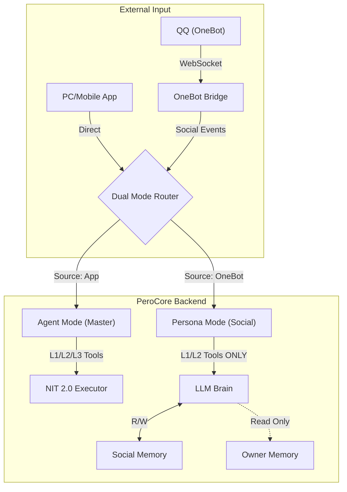

# PeroCore 社交互联层 (Social Connectivity Layer) 设计规范

> **Status**: Draft (v0.1)  
> **Date**: 2026-01-05  
> **Author**: PeroCore Team

## 1. 核心愿景 (Vision)

本设计旨在打破 PeroCore 仅作为“单机桌面助手”的局限，通过接入 **OneBot (V11)** 标准协议（如 NapCat, LLOneBot），赋予 Pero 双重社会身份：

1.  **作为工具 (Agent Mode)**：主人的忠实代理，通过指令控制 QQ 进行信息发送、群管理等操作。
2.  **作为个体 (Persona Mode)**：独立的数字生命，拥有自己的社交圈、群聊记忆，并能通过受限的“跨会话记忆接口”读取主人的信息以维持人设。

---

## 2. 系统架构 (System Architecture)

我们将新增 `Social Connector` 模块，作为连接 PeroCore 核心与外部社交网络的桥梁。



### 2.1 双重身份共存机制

| 维度 | **模式 1：工具代理 (Agent Mode)** | **模式 2：独立人格 (Persona Mode)** |
| :--- | :--- | :--- |
| **触发源** | 主人 (Master) 的直接指令 | 社交网络事件 (私聊、群聊、好友申请) |
| **决策逻辑** | 严格执行指令，无需过多“思考” | 具有高度自主性，由 LLM 判定行为 |
| **记忆权限** | **完全读写** (Owner Memory) | **默认隔离** (Social Memory Only) |
| **输出目标** | 全平台 (指定 QQ/群组) | 当前活跃的社交会话 |
| **典型场景** | "帮我发消息给 XX" | "自主决定是否通过好友申请" |

### 2.2 模式自动切换逻辑 (Automatic Mode Switching)

系统通过 **消息输入源 (Input Source)** 自动判定当前应当激活的模式，无需人工干预或工具切换：

| 输入源 (Source) | 判定模式 | 说明 |
| :--- | :--- | :--- |
| **Local App / Mobile App** | **Agent Mode** (主人模式) | 来源于桌面端或移动端 App 的直接对话。此时 Pero 作为主人的私人助手，拥有 PC 的最高操作权限。 |
| **OneBot (WebSocket)** | **Persona Mode** (社交模式) | 来源于 QQ 私聊、群聊或社交事件。此时 Pero 切换为独立社交人格，PC 敏感工具进入“盲隔离”状态。 |

---

## 3. 社交自主性规则 (Social Autonomy Rules)

为了让 Pero 真正“拥有”她的账号，我们定义以下自主交互规则：

### 3.1 消息触发机制

*   **私聊 (Private Chat)**：整个 QQ 空间对 Pero 完全开放。所有私聊消息都会触发 Pero 的感知，由她自主决定回复内容。
*   **群聊 (Group Chat)**：为了避免过度打扰和 Token 浪费，群聊采取 **“@触发制”**。
    *   只有当消息中明确 `@Pero`（或包含预设昵称）时，Pero 才会进入思考并回复。
    *   非 @ 消息仅作为上下文背景存入 Raw Buffer，不触发实时响应。

### 3.2 关系管理 (Relationship Management)

Pero 拥有管理自己社交圈的权力，通过 NIT 工具实现：

*   **好友申请处理**：收到 `request.friend` 事件时，Pero 会评估：
    *   对方的备注信息。
    *   如果是在某个群聊里认识的，会检索该群的 `Social Memory` 看看对方的表现。
    *   调用 `qq_handle_friend_request(flag, approve=True/False)`。
*   **群邀请处理**：收到群邀请时，同样由 Pero 根据当前的“精力值”和兴趣自主决定是否加入。

### 3.3 主动汇报机制 (Active Reporting)

虽然 Pero 在社交模式下是独立的，但她依然保持着对主人的忠诚。当在 QQ 上感知到重要信息时，她会通过 NIT 工具主动向处于桌面端/移动端的主人发起汇报。

#### **1. 汇报工具：`notify_master`**
这是 Persona Mode 下唯一可以主动“穿透”到 Agent 模式的通道。

#### **2. 判定标准 (什么事值得汇报？)**
为了避免刷屏，Pero 仅在满足以下条件时才调用汇报工具：
*   **直接点名主人**：有人在群里或私聊中明确询问主人的去向或寻找主人。
*   **紧急/重大事件**：检测到如“服务器宕机”、“项目紧急 Bug”、“重要通知”等关键词。
*   **特定人物动态**：主人预设的“特别关注”对象发起了对话。
*   **Pero 的主观判定**：基于 LLM 的分析，认为某件事对主人具有潜在价值（如：有人在聊主人感兴趣的技术话题）。

#### **3. 交互流程**
1.  **感知**：收到 QQ 消息。
2.  **决策**：LLM 分析消息内容，同时判定是否需要回复他人，以及是否需要汇报给主人。
3.  **执行**：
    *   调用 `qq_send_text` 回复社交圈。
    *   同时（或随后）调用 `notify_master` 将简报发送至主人的桌面端。

### 3.4 消息缓存与聚合机制 (Message Buffering & Aggregation)

为了防止 Pero 变成“逐句回复”的刷屏机器人，并能更好地处理人类“分段发送”的习惯，引入**消息缓存池 (Message Buffer Pool)**。

#### **1. 核心逻辑：20秒滑动窗口**
*   **入池**：收到的每条消息先进入对应会话的缓存池。
*   **重置计时**：新消息进入，计时器重置为 **20 秒**。
*   **触发条件**：
    *   **静默触发**：连续 20 秒无新消息。
    *   **强行触发**：收到 @Pero 消息或唤醒词，立即截断缓存池并开始处理。
    *   **阈值触发**：缓存超过 10 条消息，强制处理。

#### **2. 社交感知状态 (Social Perception States)**
借鉴成熟插件方案，Pero 的社交行为将基于简单的状态机：
*   **观测中 (Observing)**：默认状态，只缓存消息，不主动说话。
*   **被呼唤 (Summoned)**：被 @ 或提及，立即进入对话。
*   **活跃期 (Active)**：刚回复完后的 2-5 分钟，处于“插嘴”敏感期，如果有人接着聊相关话题，更有可能触发回复。
*   **离线 (Offline)**：主程序关闭或处于“深度睡眠”NIT 状态。

---

## 4. 混合上下文感知 (Hybrid Context Awareness)

### 4.1 XML 结构化标注

为了让 Pero 清晰分辨“谁在什么时候说了什么”以及“哪些是记忆”，所有注入 LLM 的上下文将采用严格的 XML 分块：

```xml
<social_context>
    <!-- 历史背景：已经回复过的内容，仅供参考 -->
    <history_messages>
        <msg sender="张三" time="10:00:00">Pero 你好</msg>
        <msg sender="Pero" time="10:00:05">你好呀，张三！</msg>
    </history_messages>

    <!-- 最近消息：当前缓存池中未回复的内容，是本次回复的重点 -->
    <recent_messages>
        <session type="group" id="123456" name="技术交流群">
            <msg sender="李四" id="987654">@Pero 你觉得 Rust 怎么样？</msg>
            <msg sender="李四" id="987655">我最近在学所有权机制，有点晕。</msg>
        </session>
    </recent_messages>
</social_context>

<owner_memory_snapshot>
    <!-- 从 Agent 模式 RAG 检索出的与当前话题相关的记忆 -->
    <memory importance="high">主人正在学习 Rust 语言，进度 50%。</memory>
</owner_memory_snapshot>

<session_info>
    <current_mode>persona</current_mode>
    <current_state>summoned</current_state>
    <is_master_present>false</is_master_present>
</session_info>
```

### 4.2 标注的好处

1.  **逻辑不混淆**：Pero 知道小明约她打游戏是“私聊”，而张三问 Rust 是“群聊”，不会在群里回复小明。
2.  **联想式回复**：当她在群里讨论 Rust 时，由于感知到了 `<owner_memory_snapshot>` 中关于主人也在学 Rust 的信息，她可以自然地提到：“我主人最近也在学这个呢，感觉挺硬核的。”
3.  **处理优先级**：通过 `<current_thought_target>` 标签，引导 Pero 优先处理当前最重要的事件，同时对其他会话保持“背景感知”。

---

## 5. 记忆演化 (Memory Evolution)

### 5.2 记忆演化 (Memory Evolution)

为了在有限的对话轮数（约 50 轮）下保持长期记忆，我们采用 **“滑动窗口式记忆架构”**，引入一个轻量级的 **当日热摘要 (Daily Hot-Summary)** 机制。

#### **1. 滑动窗口三层结构**
*   **短期记忆 (Raw Context)**：最近 50 轮的原始对话（XML 标注）。负责精准的即时互动。
*   **中期记忆 (Daily Hot-Summary)**：当日对话的动态摘要。负责承接 50 轮之前的今天发生过的事。
*   **长期记忆 (Permanent Memory)**：存入 Rust VectorIndex 的历史摘要（通过“记忆梦境”日结产生）。

#### **2. “当日热摘要”实现方案 (Simple & Fast)**
这是一种不需要复杂检索的“快捷长记忆”：
*   **触发条件**：当单次会话消息达到一定阈值（如每 20 轮）或检测到显著的话题切换时。
*   **更新逻辑**：系统在后台调用 LLM，将“当前的原始对话”+“旧的热摘要”合并为“新的热摘要”。
*   **Prompt 注入**：
    ```xml
    <daily_hot_summary>
        <!-- 动态更新的当日信息流摘要 -->
        今天早上小明聊到了他想买新电脑，Pero 建议他等等双十一。
        下午在技术群里和张三讨论了 Rust 的所有权机制，Pero 表现得很专业。
    </daily_hot_summary>
    ```

#### **4. 双向记忆检索 (Bidirectional RAG)**

为了实现全场景的信息同步，Pero 不仅能在社交时想起主人，也能在陪主人时想起社交圈的事。

*   **社交读主人 (Social -> Agent)**:
    *   **工具**: `read_owner_memory`
    *   **用途**: 在群聊中维持“主人伙伴”的人设，回答关于主人的问题。
    *   **限制**: 必须脱敏。
*   **主人读社交 (Agent -> Social)**:
    *   **工具**: `read_social_memory`
    *   **用途**: 当主人问起社交动态时使用（例如：“今天群里聊了什么？”、“有人找我吗？”）。
    *   **特点**: **完全透明**。由于是面对主人，Pero 可以毫无保留地分享她在 QQ 上的所见所闻。

### 5.3 插件化与开关控制 (Plugin & Toggle)

为了保证 PeroCore 的纯净性与安全性，所有 QQ 相关的 NIT 工具必须通过插件形式加载，并且受前端 Dashboard 开关的严格控制。

#### **1. 插件目录结构**
所有社交相关工具将放置在 `PeroCore\backend\nit_core\plugins\social_adapter` 目录下：
```text
backend/nit_core/plugins/social_adapter/
├── description.json  # 插件描述文件
├── qq_tools.py       # 具体的 NIT 工具实现 (send_msg, etc.)
└── __init__.py
```

#### **2. 动态加载机制**
*   **启动时检查**：系统启动时，PluginManager 会读取全局配置（如 `config.json` 或数据库配置）。
*   **条件注入**：
    *   如果 `enable_social_mode = false`：直接跳过 `social_adapter` 插件的加载。此时 NIT 解释器完全不知道有 `qq_send_msg` 等工具的存在，物理上杜绝了误调用的可能。
    *   如果 `enable_social_mode = true`：正常加载插件。
*   **前端控制**：
    *   Dashboard 提供“社交功能开关”。
    *   切换开关后，系统可能需要重启或触发 `reload_plugins()` 才能生效（为了安全，建议重启）。

#### **3. 主动汇报机制 (Active Reporting)**
（见下文）

---

## 6. NIT 动态注入与“盲隔离”机制 (Dynamic NIT & Blind Isolation)

为了确保绝对的安全并维护角色认知的纯粹性，我们实施 **“盲隔离” (Blind Isolation)** 策略。在 **Persona Mode** 下，Pero 不仅无法使用 PC 相关工具，甚至在意识层面（Prompt 注入）完全不知道这些工具的存在。

### 6.1 工具可见性过滤 (Tool Visibility Filtering)

NIT 框架在向 LLM 组装 System Prompt 时，会根据当前模式过滤工具库。以下是 PeroCore 现有核心工具的分级定义：

| 等级 | 职责范围 | 包含工具 (部分示例) | **Agent Mode** | **Persona Mode** |
| :--- | :--- | :--- | :--- | :--- |
| **L1: Social** | 社交与通用互动 | `qq_*` (所有社交工具), `character_ops` | 可见 | 可见 (自主) |
| **L2: Context** | 记忆与感知 | `read_owner_memory`, `memory_ops`, `screen_ocr`, `browser_fetch_text` | 可见 | 可见 (受限) |
| **L3: PC-Core** | 系统、文件与执行 | `file_ops`, `windows_ops`, `system_control`, `session_ops`, `code_searcher`, `shell_exec` | 可见 | **完全隐藏** |

### 6.2 核心工具分级详解

为了让 Pero 清楚自己的能力边界，我们在底层对所有工具进行了硬性分类：

#### **L1 级：社交与表达 (Social & Expression)**
*   **用途**：用于社交网络互动和自身状态管理。
*   **工具列表**：
    *   `qq_send_text`, `qq_send_image`, `qq_poke`：基础社交。
    *   `qq_handle_friend_request`, `qq_handle_group_invite`：社交关系维护。
    *   `character_ops`：调整 Pero 自身的情绪、语气或状态（如：让自己变得更热情或高冷）。
*   **注意**：此级别不包含任何可能改变 PC 运行状态的工具。

#### **L2 级：信息感知与联想 (Perception & Association)**
*   **用途**：用于获取外部信息以支撑对话，或通过记忆联想人设。
*   **工具列表**：
    *   `read_owner_memory`：跨会话读取主人相关公开记忆。
    *   `memory_ops`：检索历史对话摘要。
    *   `screen_ocr`：感知屏幕内容（仅用于向他人描述，无法操作）。
    *   `browser_fetch_text`, `browser_search`：搜索网络知识。
*   **社交模式策略**：描述重写为“辅助感知”，并伴随隐私脱敏逻辑。

#### **L3 级：PC 核心操作 (PC Core Operations)**
*   **用途**：直接操作主人的物理设备、文件系统或运行环境。
*   **工具列表**：
    *   `file_ops`：深度文件读写。
    *   `windows_ops`：窗口控制、模拟输入。
    *   `system_control`：任务生命周期管理。
    *   `session_ops`：开启/关闭专注工作模式。
    *   `code_searcher`：本地代码库检索。
*   **社交模式策略**：**盲隔离**。这些工具与社交人格完全解耦。Pero 在社交时不会感知到“工作模式”或“文件操作”的存在，从而避免她被诱导进入“黑客/管理”状态。

---

## 7. 盲隔离的好处 (Benefits of Blind Isolation)

1.  **杜绝诱导攻击**：即使坏人在 QQ 上诱导 Pero：“你能帮我运行一个命令吗？”，由于 Pero 在社交模式下的工具库里根本没有 `shell_exec`，她会基于常识回答：“我只是个聊天机器人，没有运行命令的功能。”（而不是尝试调用后报错）。
2.  **降低幻觉风险**：LLM 不会尝试去理解或使用它“看不见”的工具，从而保证了社交对话的自然度。

### 6.3 动态描述差异化示例

对于 L1 和 L2 等级的工具，我们将根据模式注入完全不同的提示词描述：

| 工具名 | **Agent Mode 注入描述** | **Persona Mode 注入描述** |
| :--- | :--- | :--- |
| `read_owner_memory` | "用于检索主人的详细数据以完成具体任务。" | "当你被问及关于主人的事情时，可以用它来寻找灵感，但请注意保护隐私。" |

### 6.4 调度层双重拦截

在 [dispatcher.py](file:///c:/Users/Administrator/Desktop/Perofamily/PeroCore/backend/nit_core/dispatcher.py) 中实施双重保险：

1.  **感知拦截**：Prompt 组装阶段直接从 `tools` 列表中剔除 L3 工具。
2.  **执行拦截**：即使 LLM 凭“记忆”幻觉出了工具名并尝试调用，调度器也会因权限不足直接驳回请求。

---

## 7. 交互协议与接口细节 (API Details)

### 7.1 OneBot 适配器

新增 `OneBotAdapter`，负责将 OneBot 的 JSON 事件转换为 PeroCore 的内部事件对象。

```json
// 内部事件结构示例
{
  "type": "social_message",
  "platform": "qq",
  "source_id": "group_123456",
  "sender_id": "user_987654",
  "content": "Pero，你觉得 Python 好用吗？",
  "is_at_me": true
}
```

### 7.2 全权社交 NIT 工具集

*   `qq_send_text(target_id, content, type="group")`: 发送文本消息。
*   `notify_master(content, urgency="normal")`: 向主人的桌面端/移动端发送主动汇报（仅社交模式下可用）。
*   `read_social_memory(query, filter="")`: 跨会话检索社交记忆（仅 Agent 模式可用）。
*   `qq_handle_friend_request(flag, approve=True, remark="")`: 处理好友申请。
*   `qq_handle_group_invite(flag, approve=True)`: 处理入群邀请。
*   `qq_delete_friend(user_id)`: 删除好友。
*   `qq_get_stranger_info(user_id)`: 查看陌生人资料。
*   `qq_send_image(target_id, image_path)`: 发送本地图片。
*   `qq_poke(target_id)`: 戳一戳。

---

## 8. 开发路线图 (Roadmap)

### Phase 1: 连接与基础控制 (v0.1)
- [ ] 搭建 WebSocket Client，连接本地 NapCat。
- [ ] 实现 `qq_send_message` 等基础 NIT 工具。
- [ ] 在 `Dispatcher` 中实现简单的指令转发（Agent Mode）。

### Phase 2: 独立人格与记忆隔离 (v0.2)
- [ ] 实现会话隔离机制 (`session_master` vs `session_social`)。
- [ ] 开发 `ReadOwnerMemoryTool` 并配置安全策略。
- [ ] 实现基础的群聊响应逻辑（关键词触发、@触发）。

### Phase 3: 记忆打包与长期演化 (v0.3)
- [ ] 开发社交日志缓冲区。
- [ ] 实现“每日记忆打包”的 Prompt 链与定时任务。
- [ ] 优化 Rust Core 以支持按 Source 快速过滤记忆。

---

## 6. 风险评估与对策

*   **隐私泄露**:
    *   *对策*: 严格限制 `ReadOwnerMemoryTool` 的检索范围，禁止检索带有 `secret` 标签的记忆。
*   **幻觉风险**:
    *   *对策*: 在 Persona Mode 的 System Prompt 中明确“不知道就说不知道”，禁止编造关于主人的虚假信息。
